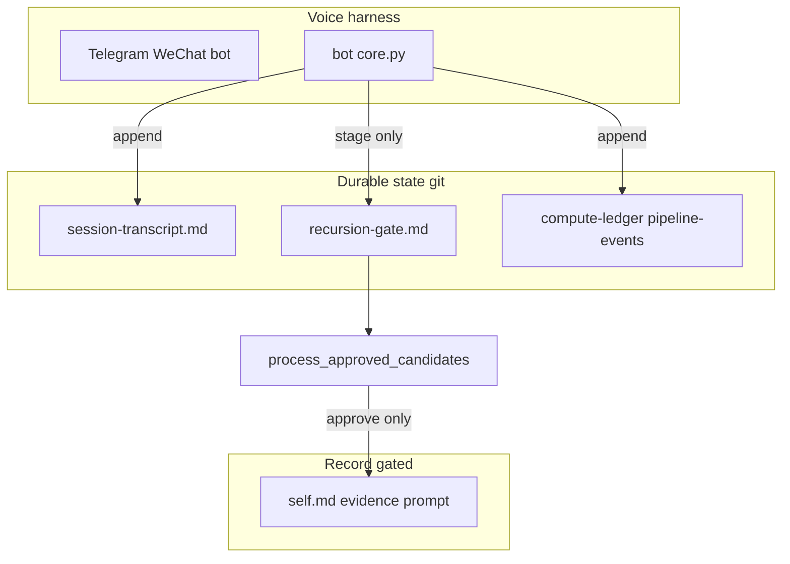

# Harness inventory (Grace-Mar)

Single place for **what each component owns**, **where state lives**, and **what may write** — aligned with industry “harness > model” practice (orchestration, verification, minimal tool surface). See [architecture § System boundaries](architecture.md#system-boundaries-and-harness), [harness-handoff](harness-handoff.md).

---

## Two doors, one book

**Book** = canonical files in git: `recursion-gate.md` (queue), then after merge `self.md`, `self-evidence.md`, `bot/prompt.py`, PRP. Chat threads are **not** the ledger — they are a **keyhole**. Anything that matters must land in a file the companion approves.

| Door | Who | How |
|------|-----|-----|
| **Agent door** | Voice, Cursor, OpenClaw | Read book; **stage** to the gate (or suggest). No silent merge into SELF. |
| **Human door** | Companion + operator | Edit gate (approve/reject), run merge, diff git. Optional **visual scan**: [pending dashboard](#pending-candidates-dashboard-human-door) |

Same rows, same truth: the gate markdown is the single source for “what’s waiting.” No sync layer between chat and queue — if it isn’t in `recursion-gate.md`, it isn’t staged.

### Exportable lanes

Grace-Mar now names four portable harness lanes:

| Lane | Role | Canonical status | Primary surfaces |
|------|------|------------------|------------------|
| **record** | Companion-owned truth | Canonical | `self.md`, `skills.md`, `self-evidence.md`, `self-library.md`, PRP |
| **runtime** | Live-session continuity | Non-canonical | `memory.md`, `session-transcript.md`, warmup output, session-log tail |
| **audit** | Replay, integrity, provenance | Append-only operational history | `pipeline-events.jsonl`, `merge-receipts.jsonl`, `compute-ledger.jsonl`, `harness-events.jsonl`, `fork-manifest.json` |
| **policy** | Intent and constitutional constraints | Canonical policy, not identity | `intent.md`, `intent_snapshot.json`, manifest-declared rules |

This naming matters for portability: a runtime can carry `runtime` and `audit` lanes with it, but only the `record` lane defines identity.

---

## Pending candidates dashboard (human door)

Read-only HTML generated from `recursion-gate.md` so you can **scan** pending IDs, WAP vs Companion, age, and channel — without scrolling infinite chat.

```bash
python scripts/generate_gate_dashboard.py -u grace-mar
open users/grace-mar/gate-dashboard.html   # or double-click in Finder
```

Regenerate after any gate change. Does not write the gate; does not merge. Safe to host statically (no secrets in file — only gate excerpts you already have locally).

---

## Diagram



---

## Component table

| Component | Trust boundary | Primary state (paths) | Allowed writes | Must NOT write |
|-----------|----------------|------------------------|----------------|----------------|
| **Telegram / WeChat bot** (`bot/core.py`) | Network + OpenAI API | Per-channel chat RAM | See **bot write audit** below | SELF, EVIDENCE, prompt.py |
| **Analyst (async)** | OpenAI | — | RECURSION-GATE (insert before `## Processed`) | Approved blocks without human |
| **Operator Cursor / agents** | Operator machine | Working tree | Any file per git | Should not bypass gate for Record |
| **process_approved_candidates** | CLI + receipt | — | SELF, EVIDENCE, prompt, gate Processed, SELF-ARCHIVE, PRP, merge-receipts | Only after receipt / quick |
| **OpenClaw export** | Local / hook | USER.md copy | External dir only | Not SELF directly |
| **OpenClaw stage** | HTTP to bot | — | RECURSION-GATE (append) | Merge |
| **Runtime memory plugin** | Local runtime memory store | Runtime lane only | Runtime continuity state, runtime-memory audit | SELF, EVIDENCE, prompt.py, gate approvals |
| **governance_checker / validate-integrity** | CI local | — | None (read-only) | — |
| **counterfactual harness** | CI local | — | None | — |

---

## bot/core.py write audit (Voice harness)

| Path | Operation | Purpose |
|------|-----------|---------|
| `users/<id>/compute-ledger.jsonl` | append | Token usage |
| `users/<id>/pipeline-events.jsonl` | append | staged, rejected, applied, etc. |
| `users/<id>/session-transcript.md` | create + append | Raw chat log (not Record) |
| `users/<id>/recursion-gate.md` | read + replace | Stage candidates; debate packets; approve/reject status |
| `users/<id>/homework-ledger.jsonl` | append | Homework probe ledger |
| Temp file | write + delete | Whisper transcription only |

**Read-only from bot for Record context:** `self.md`, `self-evidence.md`, `self-library.md`, `memory.md` (lookup / library / conflict checks). **No direct write** to SELF, EVIDENCE, or `bot/prompt.py` from core.py.

---

## Scripts that write Record (whitelist mindset)

| Script | Writes |
|--------|--------|
| `process_approved_candidates.py` | SELF, EVIDENCE, prompt, recursion-gate, self-archive, PRP, merge-receipts |
| `export_prp.py` | PRP file |
| Operator scripts staging | RECURSION-GATE only (parse_we_did, calibrate_from_miss) |

Anything else writing SELF/EVIDENCE/prompt should be treated as **policy violation** unless explicitly added to AGENTS.

---

## Harness events (audit stream)

Optional append-only **`users/<id>/harness-events.jsonl`**: merge applied, OpenClaw export, etc. — Cursor-style replay without chat. See `scripts/harness_events.py`; emitted by merge hook and OpenClaw hook when configured.

Recommended generic action vocabulary:
- `runtime_bundle_export`
- `runtime_compat_export`
- `runtime_handback_stage`
- `runtime_memory_retain`
- `runtime_memory_recall`
- `merge_applied`
- `validation_failed`
- `review_feedback`

### Runtime memory placement

If Grace-Mar adopts a Hindsight-style memory engine in a downstream harness, that engine belongs to the `runtime` lane only:

- it may improve continuity
- it may be audited
- it may not become identity truth

Any Record-relevant lesson still has to be staged through RECURSION-GATE. See [hindsight-adoption.md](hindsight-adoption.md).

### Repo hygiene for generated runtime state

To keep the working tree readable, treat the following as **local operational artifacts**, not routine committed surfaces:

- `users/<id>/harness-events.jsonl`
- `users/<id>/runtime-bundle/runtime/*`
- `users/<id>/runtime-bundle/audit/*.jsonl`
- `users/<id>/user.md` when generated as a local compatibility export

Canonical truth still lives in the source files those artifacts come from. Commit these generated runtime files only when you intentionally want to refresh an example or compatibility snapshot.

---

## Handoff + fresh judge

- **Cross-harness:** [harness-handoff.md](harness-handoff.md) + `harness_warmup.py`
- **Clean context:** `harness_warmup.py --fresh-judge` — tells the new thread canonical state is on disk, not prior chat

---

## References

- [design-notes §11.11](design-notes.md#1111-harness-convergence--decompose-parallelize-verify-iterate) — decompose / verify / iterate
- [implementable-insights §11](implementable-insights.md#11-harness-lock-in-and-compound-workflows)
- [AutoHarness](https://arxiv.org/abs/2603.03329) — synthesized guards around agents (analogy: governance + gate)
- [Cursor scaling agents](https://cursor.com/blog/scaling-agents) — planner / worker / judge
