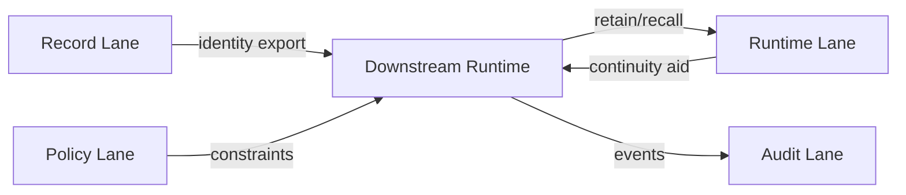

# Hindsight-Style Runtime Memory Adoption

**Purpose:** Define how Grace-Mar may safely adopt Hindsight-style runtime memory without weakening the sovereign Record.

**Scope:** This document governs **runtime memory plugins** and **runtime memory adapters** only. It does **not** change the Record, the gated pipeline, or merge authority.

---

## Core Rule

**Hindsight-style memory belongs in the `runtime` lane, not the `record` lane.**

Grace-Mar may use automatic retain/recall systems to improve **session continuity inside a downstream runtime**, but those systems must never become the canonical source of identity, knowledge, curiosity, personality, or evidence.

The git-backed Record remains canonical:

- `self.md`
- `skills.md`
- `self-evidence.md`
- `self-library.md`
- approved prompt/PRP surfaces

Runtime memory may assist the Voice. It may not redefine the Record.

---

## Why This Matters

Hindsight-style systems are useful because they:

- retain context after each turn
- recall relevant context automatically before the next turn
- improve continuity without relying on the model to remember to call a memory tool

Those are strong runtime properties. But by default they optimize for **usefulness**, not for **identity sovereignty**.

Grace-Mar's difference is that memory is not just "what helps next turn." Memory is partitioned:

- **record** = companion-owned truth
- **runtime** = continuity aid
- **audit** = replay and provenance
- **policy** = intent and constitutional constraints

This document prevents runtime usefulness from being mistaken for documented truth.

---

## Safe Uses

These uses are compatible with Grace-Mar:

- automatic retain of recent conversation for **runtime continuity**
- automatic recall of relevant runtime memory into downstream sessions
- memory-bank isolation by `agent`, `channel`, `user`, or `provider`
- configurable retain/recall budgets
- stripping recalled memory markers before re-retaining content
- local-first runtime memory deployment
- runtime-memory observability and audit logs

All of the above belong to the `runtime` and `audit` lanes.

---

## Unsafe Uses

These uses are **not** compatible with Grace-Mar:

- treating runtime-retained summaries as canonical Record truth
- auto-writing extracted facts into `self.md`, `self-evidence.md`, or `bot/prompt.py`
- letting recalled runtime memory silently bypass the knowledge boundary
- using runtime memory as evidence for SELF claims without staging and approval
- shared or remote runtime memory becoming the de facto owner of companion identity
- treating background extraction output as equivalent to human-approved Record entries

Compressed rule: **runtime memory may support continuity; it may not author identity.**

---

## Placement In Grace-Mar Architecture

Runtime memory sits here:

Interpretation:

- `record` tells the runtime **who Grace-Mar is**
- `policy` tells the runtime **what constraints apply**
- `runtime` helps the runtime **remember recent continuity**
- `audit` records **what happened operationally**

Only `record` is identity truth.

---

## Minimum Safe Adoption Pattern

If Grace-Mar adopts a Hindsight-style memory engine in a downstream runtime, the minimum safe pattern is:

1. **Bind it to the `runtime` lane only**
2. **Label recalled memory as non-canonical runtime context**
3. **Keep the canonical identity source as Grace-Mar export surfaces**
4. **Emit audit events for retain/recall and runtime export usage**
5. **Do not stage Record changes automatically from runtime memory extraction**
6. **Route any identity-relevant inference through normal RECURSION-GATE review**

---

## Suggested Bank Segmentation

If a downstream runtime supports memory banks, Grace-Mar should prefer explicit segmentation such as:

- per `agent`
- per `channel`
- per `user`
- per `provider`

This reduces accidental cross-context bleed and keeps continuity local to the runtime context where it was produced.

Use shared banks only when the operator explicitly wants cross-context continuity and understands the provenance tradeoff.

---

## Provenance Rule

If a runtime memory system recalls something relevant, that recall may:

- help the agent answer better in the moment
- help the operator decide whether to stage something
- trigger a manual "we did X" or calibration action

It may **not** be treated as self-authenticating evidence.

To become Record truth, the content still needs:

- a stageable candidate
- provenance
- companion approval
- merge through the normal gate

---

## Relationship To The Runtime Bundle

The runtime bundle is the correct place to carry Hindsight-style memory support:

- `record/` provides identity
- `policy/` provides constraints
- `runtime/` provides continuity aids
- `audit/` provides replay and freshness

If future runtime-memory adapters are added, they should consume the runtime bundle rather than inventing a separate identity contract.

---

## Recommendation

Grace-Mar **should** adopt Hindsight-style memory only as:

- a downstream runtime continuity layer
- local-first when possible
- audited
- explicitly non-canonical

Grace-Mar **should not** adopt it as:

- a replacement for the Record
- a shortcut around RECURSION-GATE
- an ungated source of identity truth

---

## See Also

- [openclaw-integration.md](openclaw-integration.md)
- [portability.md](portability.md)
- [harness-inventory.md](harness-inventory.md)
- [openclaw-rl-boundary.md](openclaw-rl-boundary.md)
