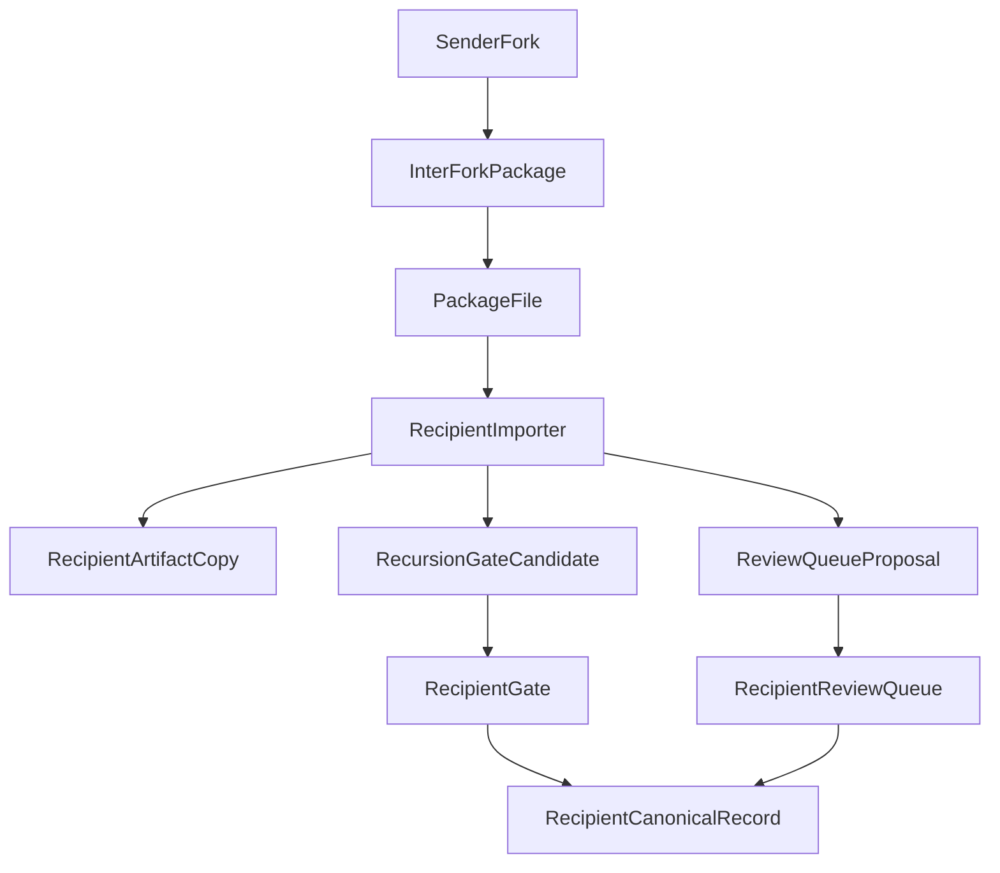

# Inter-fork collaboration

**Purpose:** Define a repo-compatible collaboration pattern between sovereign forks without creating shared writable state or weakening recipient-side merge authority.

**Authority:** Complements [fork-isolation-and-multi-tenant.md](fork-isolation-and-multi-tenant.md), [cross-instance-boundary.md](cross-instance-boundary.md), and [identity-fork-protocol.md](identity-fork-protocol.md).

---

## Core rule

Treat inter-fork collaboration as **recipient-gated package exchange**, not shared live state.

- the sender may export a bounded package or pointer bundle
- the recipient must explicitly import that package into the recipient fork's own review flow
- no design should let fork A write directly into fork B's canonical surfaces
- no design should bypass fork B's recursion gate or change-review queue

This keeps collaboration additive while preserving the existing **Sovereign Merge Rule**.

---

## Why this exists

Grace-Mar already has:

- strong **fork isolation** under `users/<fork_id>/`
- strong **single-fork governance** through `recursion-gate.md` and the change-review queue
- a **cross-instance boundary** doctrine for separate repos

What it did not yet have was a compact in-repo pattern for **bilateral package exchange** between forks that still respects those same boundaries.

---

## What inter-fork collaboration is

Inter-fork collaboration means one fork can prepare a bounded package for another fork containing:

- a short summary
- declared package kind
- optional body text or pointers
- routing guidance for the recipient
- supporting refs
- a boundary notice that the package has **no** recipient-side merge authority

The package itself is **not** canonical Record truth. It is transport material that must be reviewed after import.

---

## What it is not

Inter-fork collaboration is **not**:

- a shared writable queue across forks
- a second proposal ontology
- a way to let one fork merge changes into another fork
- a way to bypass `recursion-gate.md`
- a justification for cross-fork reads or writes outside bounded import/export actions

---

## Package kinds

Suggested package kinds:

- `evidence_share` — light evidence or notes that may become a reviewed candidate
- `strategy_peer_review` — comments, critique, or directional guidance that remain recipient-reviewed
- `pointer_bundle` — references or pointers without heavy inline payloads
- `change_proposal_review` — material change recommendation that should enter the recipient change-review queue

These kinds help routing and triage. They do **not** create authority by themselves.

---

## Recipient routing

Inter-fork packages route into one of two existing recipient-owned paths.

### 1. Candidate import

Use this for lighter material that should become a pending gate candidate in the recipient fork.

Typical fits:

- evidence share
- pointer bundle
- non-material strategy note

Recipient-owned destination:

- `users/<recipient>/recursion-gate.md`

### 2. Change Proposal review

Use this when the incoming package represents a **material** governed change that deserves structured review.

Typical fits:

- major identity revision
- cross-surface relocation
- policy or memory-governance recommendation

Recipient-owned destination:

- `users/<recipient>/review-queue/proposals/`
- plus queue / event-log updates inside the recipient review queue

This path must reuse [schema-registry/change-proposal.v1.json](../schema-registry/change-proposal.v1.json), not invent a second proposal format.

---

## Transport envelope

The inter-fork package envelope should describe transport and routing only:

- sender fork id
- intended recipient fork id
- package kind
- routing hint
- summary
- payload
- supporting refs
- boundary notice
- `humanReviewRequired: true`
- `canonicalSurfacesTouched: false`

If the routing hint is `change_proposal_review`, the payload should provide enough information to scaffold a valid recipient-side Change Proposal v1 object.

---

## Scripts

The current inter-fork package flow uses:

- `scripts/export_inter_fork_package.py`
- `scripts/import_inter_fork_package.py`

The sender writes a package under the sender fork's own artifact tree by default. The recipient importer then copies that package into the recipient fork's artifact tree and performs the recipient-owned review routing.

---

## Guardrails

Inter-fork collaboration must preserve these constraints:

1. **No cross-fork live writes** outside the explicit recipient import action.
2. **No shared writable queue** between forks.
3. **No merge shortcut** — recipient merge authority stays local.
4. **No second proposal schema** when Change Proposal v1 already applies.
5. **No silent canonical mutation** — imported material remains non-canonical until reviewed.

---

## Example flow

---

## Examples

See:

- [`../bridges/inter-fork/README.md`](../bridges/inter-fork/README.md)
- [`../bridges/inter-fork/evidence-share.example.json`](../bridges/inter-fork/evidence-share.example.json)
- [`../bridges/inter-fork/change-proposal-review.example.json`](../bridges/inter-fork/change-proposal-review.example.json)

---

## Related

- [fork-isolation-and-multi-tenant.md](fork-isolation-and-multi-tenant.md)
- [cross-instance-boundary.md](cross-instance-boundary.md)
- [identity-fork-protocol.md](identity-fork-protocol.md)
- [state-proposals.md](state-proposals.md)
