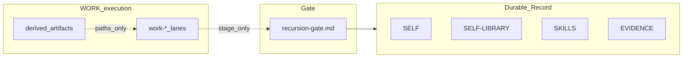

# Operator mental model (Grace-Mar)

**Audience:** Operators and contributors who drive the repo, scripts, and WORK lanes — not default companion-facing chat copy.

---

## One diagram

- **Durable Record** — merged only after companion approval through the gate.
- **WORK lanes** — analysis, strategy, dev plans; they **stage** proposals, they do not silently become Record.
- **Derived artifacts** — skill cards, active-lane markdown under `artifacts/` — **rebuildable**; always cite source paths ([runtime-vs-record.md](runtime-vs-record.md)).

---

## Fast paths

| I need to… | Open |
|------------|------|
| See what is canonical vs scratch | [runtime-vs-record.md](runtime-vs-record.md) |
| Shrink one WORK lane for a session | [active-lane-compression.md](skill-work/active-lane-compression.md) |
| Shrink portable skills for context | [skill-card-spec.md](skills/skill-card-spec.md) |
| Understand paste caps vs semantic compression | [context-efficiency-layer.md](skill-work/context-efficiency-layer.md) + [config/context_budgets/README.md](../config/context_budgets/README.md) |

---

## 5-minute re-entry

Use this when the repo feels too large. Do not inspect everything.

1. **Check the tree:** `git status --short` and note whether work is staged, unstaged, or mixed.
2. **Check the gate:** pending candidates matter only if the next lane is Steward / gate.
3. **Name the current lane:** choose one primary lane for this session (`work-dev`, `work-strategy`, `work-coffee`, etc.).
4. **Name the commit arc:** if the tree is dirty, group files by work arc before adding more content.
5. **Pick one next command:** run `coffee`, choose a conductor, run a validator, or stage one clean arc. Stop there.

The operator goal is not full awareness. It is enough orientation to avoid accidental merges, arc collapse, or needless sprawl.

---

## What to trust / what to ignore

| Surface | Trust it for | Do not treat it as |
|---------|--------------|--------------------|
| **Record** (`users/<id>/self*.md`, `self-archive.md`) | Canonical companion state after approval | A place for ad-hoc operator notes |
| **Gate** (`recursion-gate.md`) | Pending proposed Record changes | Approval, rejection, or merge by itself |
| **WORK docs** (`docs/skill-work/work-*`) | Operator planning, execution, strategy, lane doctrine | Companion identity truth |
| **Runtime / MEMORY** | Continuity, handoff, session weather | Durable Record authority |
| **Artifacts** (`artifacts/`) | Rebuildable summaries, receipts, dashboards, derived views | Source of truth without source links |
| **Old or broad docs** | Background and lineage | Mandatory reading before every session |

When surfaces disagree: follow Record for identity, gate rules for promotion, current lane docs for execution, and recent receipts for what actually ran.

---

## Critique translated into operator moves

| Risk | Operator move |
|------|---------------|
| **Complexity / cognitive load** | Start from this map, then one lane. Do not open every doctrine surface before acting. |
| **Paper architecture** | Prefer one executable check, generated artifact, or receipt after a doc change. |
| **Gate friction** | Keep staging and merging separate. Batch reviews, but never blur approval authority. |
| **Portability friction** | Record the boundary: what is instance-specific, what is template-safe, what is derived. |
| **Over-engineering** | Use Kleiber discipline: one hotspot, explicit non-goals, no new dashboard unless a missing workflow proves it. |

Follow-up lanes can address pruning, demos, and test hardening. This page exists to reduce re-entry cost first.

---

## Authority

Policy: [AGENTS.md](../AGENTS.md). Instance modes: `users/<id>/instance-doctrine.md`.
