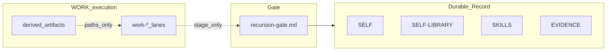

# Operator mental model (Grace-Mar)

**Audience:** Operators and contributors who drive the repo, scripts, and WORK lanes — not default companion-facing chat copy.

---

## One diagram

- **Durable Record** — merged only after companion approval through the gate.
- **WORK lanes** — analysis, strategy, dev plans; they **stage** proposals, they do not silently become Record.
- **Derived artifacts** — skill cards, active-lane markdown under `artifacts/` — **rebuildable**; always cite source paths ([runtime-vs-record.md](runtime-vs-record.md)).

---

## Fast paths

| I need to… | Open |
|------------|------|
| See what is canonical vs scratch | [runtime-vs-record.md](runtime-vs-record.md) |
| Shrink one WORK lane for a session | [active-lane-compression.md](skill-work/active-lane-compression.md) |
| Shrink portable skills for context | [skill-card-spec.md](skills/skill-card-spec.md) |
| Understand paste caps vs semantic compression | [context-efficiency-layer.md](skill-work/context-efficiency-layer.md) + [config/context_budgets/README.md](../config/context_budgets/README.md) |

---

## Authority

Policy: [AGENTS.md](../AGENTS.md). Instance modes: `users/<id>/instance-doctrine.md`.
