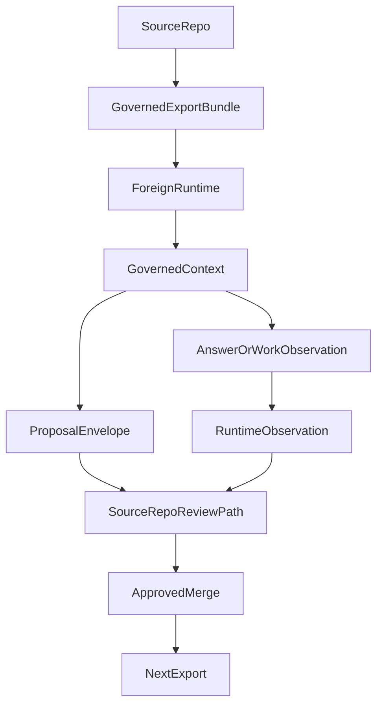

# Portable Emulation Layer

This document is the technical contract for Grace-Mar portable emulation.

It is a **contract layer over the existing emulation-ready export**, not a second portability stack.

Primary implementation surfaces:

- [`../../../scripts/export_emulation_bundle.py`](../../../scripts/export_emulation_bundle.py)
- [`../../../schema-registry/emulation-bundle-envelope.v1.json`](../../../schema-registry/emulation-bundle-envelope.v1.json)
- [`../../../schema-registry/change-proposal.v1.json`](../../../schema-registry/change-proposal.v1.json)
- [`../../../config/authority-map.json`](../../../config/authority-map.json)

---

## Problem

Foreign runtimes need enough governed context to emulate Grace-Mar
behavior, but they must not gain authority to mutate the source repo's
canonical state.

Without a contract, downstream runtimes are likely to:

- blur Record and WORK
- overclaim local observations as approved truth
- invent their own merge or contradiction rules
- emit under-specified proposals

---

## Design Principle

Portable emulation is a **read-governed, write-bounded** portability layer.

The source repo exports enough context for a foreign runtime to emulate
behavior, but the foreign runtime remains subordinate to source-repo
sovereignty.

The foreign runtime may **propose** durable change.
The foreign runtime may **not** decide durable change.

---

## Bundle Contents

The portable-emulation contract assumes these bundle elements:

- metadata
- source repo reference
- fork id
- exported timestamp
- bundle version
- record snapshot or fork export reference
- runtime bundle lanes
- Portable Record Prompt (PRP)
- behavior specs
- governance references
- authority block
- proposal schema reference
- audit manifest
- checksums

The current exporter already emits a **narrower operational envelope**.
The richer contract described here is the docs-facing reference for
downstream runtimes and later exporter tightening.

---

## Runtime Authority Model

| Capability | Status |
|---|---|
| Record read | allowed |
| Record write | forbidden |
| WORK write | allowed as local, non-canonical observation |
| proposal emission | allowed |
| gate staging | source-repo import only |
| contradiction resolution | proposal-only |
| merge | forbidden |

Required authority interpretation:

- `recordAuthority: none`
- `gateEffect: none`
- `canonicalRecordAccess: read-only`
- `mergeAuthority: none`
- `proposalAuthority: stage-only`
- `contradictionAuthority: proposal-only`
- `workLaneAuthority: local-runtime-only`

---

## Emulation Lifecycle

Operationally:

1. source repo exports governed bundle
2. foreign runtime loads bundle
3. foreign runtime constructs governed context
4. foreign runtime produces answer, WORK note, runtime observation, or proposal envelope
5. contradictions remain visible until reviewed
6. durable change returns through the source repo's review path
7. only approved source-repo merges alter canonical state

---

## Proposal Return Contract

Portable emulation must return durable change through the existing governed path:

- [`../../../schema-registry/change-proposal.v1.json`](../../../schema-registry/change-proposal.v1.json)
- [`../../state-proposals.md`](../../state-proposals.md)
- [`../../identity-fork-protocol.md`](../../identity-fork-protocol.md)

The foreign runtime may emit:

- proposal envelopes
- contradiction proposals
- WORK observations with source bundle metadata

The foreign runtime may **not** treat emitted proposals as approved changes.

---

## Contradiction Handling

Contradictions must be surfaced rather than silently resolved.

The foreign runtime may:

- detect possible contradiction
- cite old claim and new claim
- attach evidence refs or source refs
- recommend review action

The foreign runtime may **not**:

- decide canonical truth
- silently drop the older claim
- rewrite the Record as if contradiction were already resolved

---

## Audit Expectations

Portable emulation should preserve auditability by carrying:

- bundle metadata
- checksum or manifest references
- exporter identity
- proposal schema reference
- warnings when context is stale or incomplete

Returned observations or proposal envelopes should retain source bundle
metadata so the source repo can understand what state the foreign
runtime reasoned from.

---

## Failure Modes

Portable emulation fails when any of the following happens:

- foreign runtime treats WORK as Record
- foreign runtime claims merge authority
- foreign runtime silently rewrites identity
- foreign runtime resolves contradiction without proposal
- stale bundle is treated as current truth
- checksum or manifest information is missing
- proposal is emitted without source or evidence
- target surface is overbroad or unspecified

These are contract violations, not minor quality issues.

---

## Non-goals

This PR does **not**:

- add an executable emulator
- add a GitHub Action
- publish bundles
- modify canonical Record files
- modify `recursion-gate.md`
- create a second portability ontology

---

## Future PR Sequence

Likely follow-on sequence:

1. formalize the contract docs and behavior specs
2. decide whether the exporter should converge toward the richer contract schema
3. add narrow validation or conformance checks for emitted bundles
4. improve downstream adapter examples
5. only later consider stronger ecosystem integration
