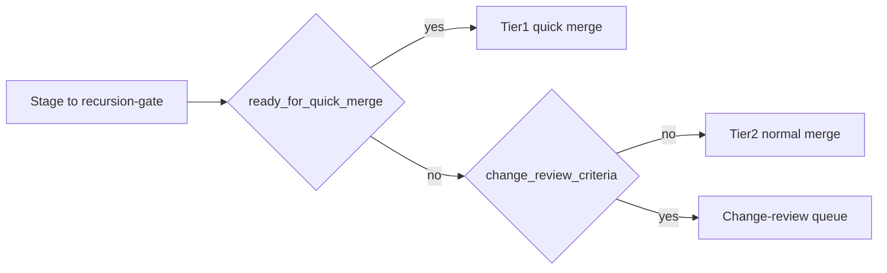

# Recursion-gate — three-tier traffic pattern (Grace-Mar)

**Purpose:** Operator-facing spec for **how traffic moves through** `recursion-gate.md` without changing the **Sovereign Merge Rule**: the companion (or delegated human) approves; `process_approved_candidates.py` is the merge boundary. This doc names **lanes** (Tier 1–3); it does not replace [gate-vs-change-review.md](gate-vs-change-review.md) or [identity-fork-protocol.md](identity-fork-protocol.md).

---

## Constitutional invariants

- **Human merge authority** — no autonomous merge path; [AGENTS.md](../AGENTS.md) § Gated Pipeline.
- **Bronze mode (reference implementation)** — per [identity-fork-protocol.md](identity-fork-protocol.md) §9.3, **Bronze** = manual approval **every change**. Low-friction Tier 1 below is **optimized UX inside Bronze**, not a different authority model.
- **Silver / Gold (future IFP modes)** — **Silver** = human pre-authorized batch policy; **Gold** = staged batch approval weekly. They are **not** current reference behavior and are **not** the same thing as “fast lane” / Tier 1. Cite §9.3 only when discussing those futures.

---

## Machine risk tiers (implemented)

[scripts/recursion_gate_review.py](../scripts/recursion_gate_review.py) assigns each pending candidate:

| `risk_tier` value | Meaning |
|-------------------|---------|
| **`quick_merge_eligible`** | Passes `_ready_for_quick_merge` (see Tier 1 below). |
| **`review_batch`** | Default remainder — needs normal review, not quick-merge. |
| **`manual_escalate`** | Conflicts/advisory pipeline flag/duplicate hints — **still on the gate** until resolved or rejected; heavier UI attention, not automatically change-review. |

Tier labels in this doc **map to** these values where noted.

---

## Tier 1 — Fast (Bronze, quick-merge eligible)

**Machine definition — `ready_for_quick_merge`:**

- `status == pending`
- **Not** `has_multi_target`, **not** `has_conflict_markers`, **not** `advisory_flagged`
- **`profile_target` must match** `^IX-[ABC]\.` — **IX-A, IX-B, or IX-C only** (not EVIDENCE-only rows, SKILLS-only, or prompt-only targets without that pattern)
- **Not** `duplicate_hints` (overlap with existing Record text / duplicate signals)

**Important:** Candidates can be “low risk” informally but **fail** Tier 1 if they are not IX-[ABC]-targeted as above. Extending quick-merge to other surfaces would require **code + governance** change.

**UX:** `/approve`, Telegram /review ✅, `process_approved_candidates.py --quick` — **no receipt step** for eligible candidates per [feedback-loops.md](feedback-loops.md) § Low-friction approval.

**Label in UI copy:** **LOW** / `quick_merge_eligible`.

---

## Tier 2 — Normal (Bronze, `review_batch`)

Single pending candidate, Record-safe, needs a short human read — **not** `ready_for_quick_merge`.

**UX:** Optional **operator checklist** (evidence linkage, target surface, contradiction, “stay in gate vs change-review”) — **discipline**, not fully enforced in code. Approve → **normal** merge flow (receipt / `/merge` pattern for higher-risk paths per [feedback-loops.md](feedback-loops.md)).

**Edit then approve:** Edit YAML in `recursion-gate.md`, then approve and run the merge script — there is no separate atomic “approve-with-edit” command today.

---

## Tier 3 — Escalation (two kinds)

Do **not** conflate **`manual_escalate`** with “must leave the gate.” Escalation **adds process**; [gate-vs-change-review.md](gate-vs-change-review.md).

| Situation | Where it lives | Typical action |
|-----------|----------------|----------------|
| **Gate-heavy** — `manual_escalate`, contradictions, duplicate hints, advisory | Still **`recursion-gate.md`** | Resolve, reject, or defer; use gate review UI / dashboard filters ([apps/gate-review-app.py](../apps/gate-review-app.py)) as available. |
| **Change-review** — cross-surface, policy/prompt shifts, proposal-scale, audit trail | **`users/<id>/review-queue/`** | Export via CLI (below); validate queue. |

**Open change-review (grace-mar CLI):**

```bash
python3 scripts/export_gate_to_review_queue.py --user <fork_id> --candidate-id CANDIDATE-XXXX
python3 scripts/validate-change-review.py users/<fork_id>/review-queue --allow-empty
```

There is **no** `/escalate` Telegram command in the reference bot; use the CLI (or Operator Console / review surfaces that call the same tooling) until a dedicated command exists.

**Reject:** `/reject CANDIDATE-XXXX [reason]` per [rejection-feedback.md](rejection-feedback.md).

---

## Decision table: gate vs change-review

| Question | Stay on gate (Tier 2 / gate-heavy Tier 3) | `export_gate_to_review_queue` |
|----------|---------------------------------------------|----------------------------------|
| Routine IX-A/B/C line, evidence-linked | Yes | No |
| Wording-only refinement | Usually yes | Rarely |
| Cross-surface (SELF vs SELF-LIBRARY vs CIV-MEM) | Only after classification | Often yes |
| Prompt / policy behavior change | Risky on gate alone | Prefer change-review |
| Needs before/after diff + decision record | Prefer change-review | Yes |

---

## Work-politics territory vs tier lanes

**Orthogonal:** `process_approved_candidates.py --territory work-politics` (aliases `wap`, `wp`) filters **which** pending candidates merge in a batch — companion vs work-politics queue. That is **batch scope**, not Tier 1/2/3. A candidate can be Tier 2 and work-politics; tier routing is about **review depth**, territory is about **which queue** you merge.

---

## Metrics

| Metric | How to get it today |
|--------|---------------------|
| **Median decision time by tier** | **Not automatic** — requires instrumentation (e.g. pipeline JSONL timestamps) or manual timing. |
| **% Tier 1 (quick-merge eligible)** | Derive from `parse_review_candidates` / gate dashboard over pending snapshot. |
| **Escalation rate to change-review** | Count `export_gate_to_review_queue` runs or review-queue events (operational logging). |
| **Rejection rate by tier** | From gate status + optional `/reject` reasons ([rejection-feedback.md](rejection-feedback.md)). |
| **Merge feedback helpful rate** | **Manual** — [feedback-loops.md](feedback-loops.md) `emit_pipeline_event.py merge_feedback` after merge. |

Treat **merge_feedback** as **manual quality signal**, not a substitute for instrumented latency metrics.

---

## Traffic pattern (conceptual)



---

## Optional runtime provenance (YAML extension)

Candidates may include optional keys linking **runtime observations** (e.g. `source_observation_ids`, `timeline_anchor`, `lane_origin`) when staged via `scripts/runtime/stage_candidate_from_observations.py`. These keys **do not** change merge authority; they document lineage for review. Schema sketch: `schema-registry/recursion-gate-provenance.v1.json`.

---

## See also

- [governance/comprehension-envelope-gate.md](governance/comprehension-envelope-gate.md) — Comprehension Envelope (`envelope_class`) vs traffic `risk_tier` (orthogonal)
- [gate-vs-change-review.md](gate-vs-change-review.md) — default gate vs material escalation
- [feedback-loops.md](feedback-loops.md) — low-friction approval, merge feedback
- [operator-brief.md](operator-brief.md) — session continuity and gate habits
- [identity-fork-protocol.md](identity-fork-protocol.md) §9.3 — Bronze / Silver / Gold (future)
