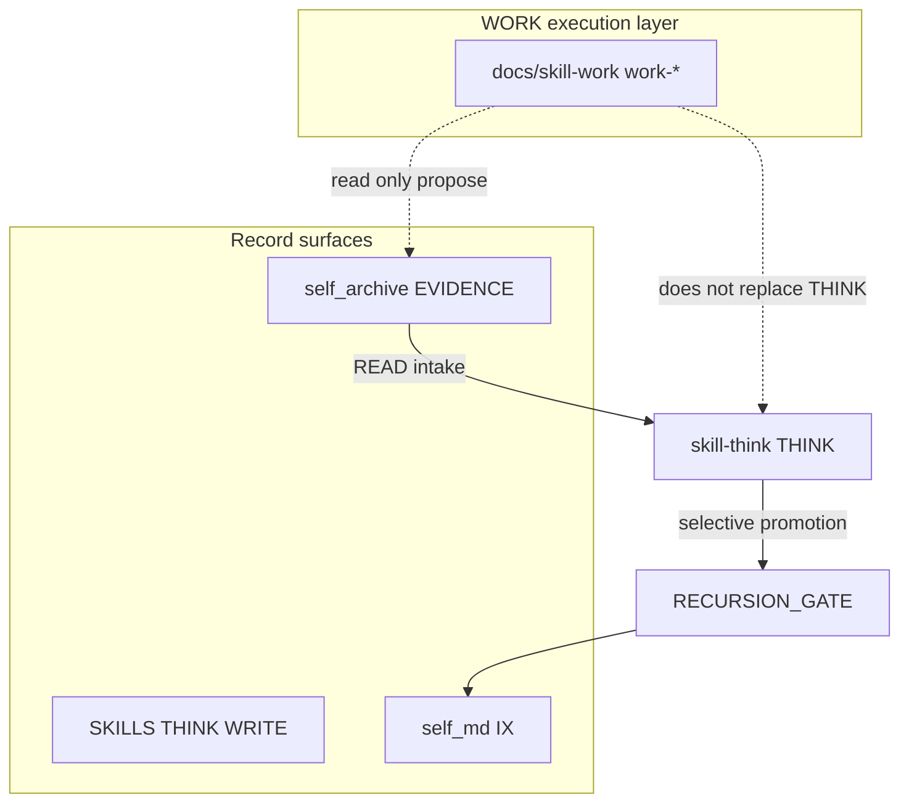

# THINK vs SELF vs WORK

## One-line distinctions

| Layer | Answers |
|-------|---------|
| **EVIDENCE** | What happened? (dated READ/ACT, artifacts) |
| **THINK** | What can the fork evidence about learning and reasoning *as capability*? |
| **SELF (IX)** | Who is she / what does she know *in character* after approval? |
| **WORK** | What is the operator building, drafting, or executing this week? |

## Cross-links

- [we-read-think-self-pipeline.md](../we-read-think-self-pipeline.md)
- [docs/skill-work/README.md](../skill-work/README.md) — WORK is adjacent, not inside SKILLS
