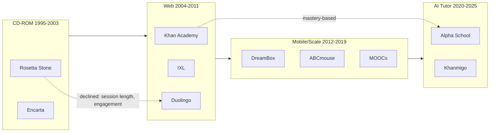

# Educational Software History (1995–2025): Insights for Grace-Mar Skill-Work

**Purpose:** Synthesize the history of educational software since 1995, extract cross-platform insights, and map them to Grace-Mar skill-work objectives (alpha-school, human-teacher, curate-library, health-fitness, lesson generator).

**Scope:** Rosetta Stone, Duolingo, Khan Academy, IXL, Alpha School, DreamBox, ABCmouse, MOOCs, Anki, Quizlet, Khanmigo, Formative.com, and related platforms. Pedagogical shifts: CD-ROM → web → mobile → AI tutor.

**Design principles (Grace-Mar):** Meet where they are, gated pipeline, knowledge boundary, companion sovereignty, evidence-based.

---

## Executive Summary

- **Mastery-based progression** (Bloom 2 Sigma, Alpha, IXL, Khan) underpins 90% thresholds and edge-at-ZPD design. Grace-Mar aligns: teach just above current, 80–85% in-lesson, 90% mastery to advance.
- **Formative loop** (Black & Wiliam, DreamBox, IXL) — evidence must adapt teaching. Grace-Mar: "We did X" → pipeline → Record → next prompt. Skill-work-human-teacher Phase 4 is central.
- **Session design** (Alpha 2-hour block, Duolingo 5–15 min, MOOCs 3–10 min videos) — short activities, clear structure, cognitive load limits. Grace-Mar: 10–15 min activities, one prompt per day.
- **Engagement** (Duolingo streaks, Deci & Ryan SDT) — autonomy, competence, relatedness. 4-option rule supports autonomy. Avoid extrinsic overload; meet where they are (AGENTS rule 7).
- **AI tutor pattern** (Khanmigo) — guide, do not give answers. Grace-Mar prompt encodes tutor-as-guide; knowledge boundary = Record only.
- **Vocabulary in context** (Beck, NRP) — differentiator vs drill apps. Curate-library supplies texts at edge Lexile.
- **No universal solution** (Cornell MOOC study, Tomlinson) — differentiate by readiness, interest, profile. IX-A/B/C + edge implement this.
- **Platform evolution** — CD-ROM → web → mobile → AI. Delivery-agnostic prompt design future-proofs Grace-Mar.
- **Rosetta Stone vs Duolingo** — bite-sized, low-friction, formative loop, engagement mechanics matter more than immersion alone.

---

## 1. Timeline (1995–2025)

### Era 1: CD-ROM and Multimedia (1995–2003)

| Platform | Launch | Approach | Notes |
|----------|--------|----------|-------|
| **Rosetta Stone** | 1992 (CD-ROM 1990s) | Image-based immersion; match photos to language; minimal feedback | Criticized as "prettiest flashcards"; lacked depth. CD-ROM delivery; 30–60 min sessions. |
| **Encarta, Magic School Bus** | 1990s | Multimedia reference, interactive maps, offline | CD-ROM dominant; schools had limited bandwidth. Web (2000) and Wikipedia (2001) eventually undercut paid reference. |

**Pedagogical themes:** Immersion, visual association, static content, no real-time adaptation.

### Era 2: Web and Early Adaptive (2004–2011)

| Platform | Launch | Approach | Notes |
|----------|--------|----------|-------|
| **Khan Academy** | 2008 | Mastery-based learning; videos + practice; personalized paths | Rooted in Bloom 2 Sigma; mastery before advance; Course Challenges for acceleration. |
| **IXL** | 2007 | SmartScore (0–100 mastery); adaptive difficulty; 8,500+ skills | Real-time diagnostic; recommendations wall; unlimited retries. |
| **Duolingo** | 2012 | Gamification, spaced repetition, 5–15 min sessions | Half-Life Regression for forgetting curves; streaks, leaderboards; free tier. |

**Pedagogical themes:** Mastery learning, spaced repetition, gamification, bite-sized sessions, adaptive algorithms.

### Era 3: Mobile, Gamification, and Scale (2012–2019)

| Platform | Launch | Approach | Notes |
|----------|--------|----------|-------|
| **DreamBox** | 2006 (acquired 2023) | Intelligent adaptive learning; real-time sequencing; no separate assessments | 4x more effective than average math interventions; ~1 hr weekly. |
| **ABCmouse / Age of Learning** | 2010 | Learning Paths by age/skill; sequential lessons; parent dashboard | Ages 2–8; reading, math, science; 11,000+ activities. |
| **Quizlet** | 2005 | Flashcards, Learn mode | Dropped true spaced repetition (2020); manual scheduling. |
| **Anki** | 2006 | SM-2 spaced repetition; algorithmic scheduling | Medical students score 6–13% higher with Anki. |
| **Coursera / edX (MOOCs)** | 2012 | Short videos (3–10 min); practice in first week; graded assignments early | Completion low; no single intervention works for all; frequent learning across days > total time. |

**Platform shift:** CD-ROM → web → mobile. Subscription and freemium models replace one-time purchase. Rosetta Stone declined vs Duolingo: session length (30–60 vs 5–15 min), engagement mechanics, free tier.

### Era 4: AI Tutors and Personalization (2020–2025)

| Platform | Approach | Notes |
|----------|----------|-------|
| **Alpha School** | 2-hour block; AI tutors; 90% mastery to advance | Top 1–2% outcomes; ~20–30 hrs per grade level; Guides vs teachers. |
| **Khanmigo** | AI tutor; guides, does not give answers; integrated with Khan content | GPT-4; questions over answers; rubric generator for teachers. |
| **Duolingo Max** | AI features; conversation practice | Faces AI competition and margin pressure. |
| **Formative.com, Education Perfect** | Real-time feedback; AI marking | Immediate feedback increases re-engagement; hybrid human + AI. |

**Pedagogical themes:** AI as tutor (guide, not oracle); immediate feedback; formative loop; learner agency vs extrinsic personalization.

---

## 2. Cross-Platform Insights

### A. Mastery-Based Progression

- **Bloom 2 Sigma (1984):** 1-on-1 tutoring + mastery → ~2 sigma gain. Mastery alone ~1 sigma; add family support → approaches 2 sigma.
- **Alpha School:** 90% mastery to advance; 80–85% in-lesson success.
- **IXL:** SmartScore 100 = mastery; 80 = proficiency.
- **Khan Academy:** Mastery Challenges = spaced review; Course Challenges = acceleration.

**Insight for Grace-Mar:** Alpha-school 90% threshold and sample prompt (80–85% in-lesson) align with Bloom and industry practice. Edge = ZPD; teach just above current.

### B. Formative Loop and Evidence

- **Black & Wiliam (1998):** Formative assessment = evidence used to adapt teaching. High effect size (Hattie).
- **DreamBox / IXL:** Continuous formative data; no separate assessments; real-time adjustment.
- **Grace-Mar pattern:** "We did X" → pipeline → Record → next prompt. Explicit handback.

**Insight for Grace-Mar:** The "We did X" handback is the formative loop. Skill-work-human-teacher Phase 4 (formative loop) is central. Evidence must adapt the next prompt.

### C. Session Design and Cognitive Load

- **Alpha School:** 4 segments of 25–30 min; 2-hour ceiling.
- **Duolingo:** 5–15 min daily.
- **DreamBox:** ~1 hr weekly effective.
- **MOOCs:** Short videos (3–10 min); 4–13 videos in first week optimal.
- **Sweller (CLT):** Working memory limits; short steps, clear structure.

**Insight for Grace-Mar:** 2-hour design and 10–15 min activities (sample prompt) match Alpha and cognitive load research. One prompt per day reduces friction.

### D. Gamification and Engagement

- **Duolingo:** Streaks, leaderboards, cracked skills (visual forgetting curve); churn reduced from 47% → 28%.
- **Deci & Ryan (SDT):** Autonomy, competence, relatedness drive engagement.
- **Risk:** Extrinsic personalization can reduce agency; child-led vs algorithm-driven path.

**Insight for Grace-Mar:** 4-option rule (A/B/C/D) supports autonomy. Competence via evidence-linked progress. Avoid extrinsic overload; meet where they are (AGENTS rule 7).

### E. Spaced Repetition

- **Duolingo HLR:** 45% lower prediction error; 12% higher engagement.
- **Khan Mastery Challenges:** Spaced review of prior skills.
- **Anki:** True SM-2; 50–80% retention vs 10–25% without.

**Insight for Grace-Mar:** No automated SRS yet. Formative loop + "We did X" creates implicit spacing when generator consumes updated Record. Future: explicit review prompts for prior topics.

### F. AI Tutor Pattern

- **Khanmigo:** Asks questions, guides; does not give answers.
- **Grace-Mar sample prompt:** "One question at a time"; "hint from Record when stuck"; "4 MC options when stuck."
- **Extrinsic vs intrinsic personalization:** Child-first; tech should not lead. Grace-Mar: companion sovereign; proposals, not prescriptions.

**Insight for Grace-Mar:** Record-derived prompt encodes tutor-as-guide. Knowledge boundary = LLM uses only Record. No leakage.

### G. Vocabulary and Lexile

- **Beck et al. (2002/2013):** Vocabulary in context; student-friendly definitions.
- **NRP (2000):** Comprehension, vocabulary pillar.
- **Duolingo:** Weak on vocabulary-in-context; drill-heavy.
- **Grace-Mar:** Lexile 600L output; "one new word in context"; hint from Record.

**Insight for Grace-Mar:** Vocabulary-in-context at edge is a differentiator vs drill apps. Curate-library can supply texts at edge Lexile.

### H. Personalization and "No Universal Solution"

- **Cornell MOOC study:** No single intervention works for all learners. Target by circumstance.
- **Tomlinson (differentiation):** Readiness, interest, learning profile.
- **Grace-Mar:** IX-A (readiness), IX-B (interest), IX-C (profile). Edge = readiness.

**Insight for Grace-Mar:** Record-driven personalization (IX-A/B/C, edge) implements differentiation. Human-teacher modulates; agentic proposals (Phase 5) support, do not compel.

### I. Platform Evolution and Delivery

- **CD-ROM → web → mobile:** Content moved from packaged to cloud; session length shortened; engagement mechanics (gamification, streaks) matter.
- **Grace-Mar:** Prompt + any LLM; no proprietary stack. Portable; human pastes into ChatGPT/Grok.

**Insight for Grace-Mar:** Delivery-agnostic design (prompt-based) future-proofs. Alpha School uses proprietary AI tutors; Grace-Mar uses Record as context for any LLM.

### J. Rosetta Stone vs Duolingo

- **Rosetta Stone decline:** 30–60 min sessions, no gamification, premium price, weak feedback loop.
- **Duolingo rise:** 5–15 min, streaks/leaderboards, free tier, spaced repetition, mobile-first.

**Insight for Grace-Mar:** Bite-sized, low-friction sessions; engagement through competence and autonomy (not necessarily gamification); formative loop matters more than immersion alone.

### K. AI-Era Insights (All-In synthesis)

Synthesized from market and agent-orchestration discourse (All-In podcast, 2025):

- **Agent maestro as skill** — The person who creates agents, trains them, and manages them (not a developer) is an emerging high-leverage role. Change management and leading adoption of new tools create career opportunity. Grace-Mar: human-teacher is the maestro; the lesson prompt structures what the agent does; the Record documents outcomes.
- **Record as skills file** — Agents have a "skills file" refined weekly from external sources; the Record parallels this: IX-A/B/C + EVIDENCE grow each cycle. "We did X" feeds back; the next prompt reflects what was done. Recursive refinement.
- **Evidence over narrative** — AI discourse is "dueling science fiction narratives." Serious analysis favors observed outcomes over speculative takes. Grace-Mar: EVIDENCE and "We did X" over abstract claims; analyst and prompts prefer observable evidence.
- **Jevons paradox** — When the cost of something supply-constrained falls, demand rises. AI augments; it doesn't replace. Tutor + agent = leverage, not elimination. Grace-Mar: human-teacher + LLM = augmentation; Record documents growth.
- **Structure + execution** — Human provides structure (what to do, when, how); agent executes. Lesson prompt = structure; LLM = execution. Human-teacher modulates; system runs the session.
- **Time and room to learn** — "Batten down and give room to figure it out." Bounded sessions; no pressure to master in one go. Grace-Mar: meet where they are; formative loop over time.

**Insight for Grace-Mar:** Skill-work aligns with centaur/maestro model. Human-teacher objectives doc and lesson generator should encode structure+execution, evidence-first, and augmentation framing.

---

## 3. Mapping to Skill-Work Modules

| Skill-Work Module | Relevant Insights |
|-------------------|-------------------|
| **alpha-school** | 2-hour design (Alpha, DreamBox); 90% mastery (Bloom, Alpha, IXL); screen time ceiling; optional benchmarks. |
| **human-teacher** | Formative loop (Black & Wiliam, "We did X"); one prompt per day; tutor-as-guide (Khanmigo); 4-option autonomy; meet where they are (Deci & Ryan, agency). |
| **curate-library** | Vocabulary-in-context (Beck, NRP); texts at edge Lexile; LIBRARY as lookup source for lessons. |
| **health-fitness** | Meet where they are; no compulsion; agency. |
| **lesson generator** | IX-A/B/C + edge = differentiation (Tomlinson); short activities (CLT); mastery threshold in rules. |

**alpha-school:** Benchmarks and 2-hour design are informed by Alpha School, DreamBox, and Bloom. Optional comparison targets; not verified. See [alpha-school-reference](skill-work-alpha-school/alpha-school-reference.md).

**human-teacher:** The formative loop ("We did X" → Record → next prompt) is the core feedback mechanism. One prompt per day reduces friction; 4-option rule supports autonomy. Tutor-as-guide aligns with Khanmigo; knowledge boundary = Record only. See [skill-work-human-teacher roadmap](skill-work-human-teacher/roadmap.md).

**curate-library:** LIBRARY holds books and videos for lookup. Vocabulary-in-context at edge Lexile differentiates from drill apps; curate-library supplies texts and media for lesson prompts. See [skill-work-curate-library](skill-work-curate-library/README.md).

**health-fitness:** Meet where they are; no compulsion. Agency and autonomy apply across skill-work. See [skill-work-health-fitness](skill-work-health-fitness/README.md).

**lesson generator:** IX-A/B/C + edge implement Tomlinson-style differentiation. Short activities and mastery threshold in rules align with CLT and Bloom. See [skill-work-lesson-generation-walkthrough](skill-work-lesson-generation-walkthrough.md).

---

## 4. Design Implications

Actionable principles distilled from the history and insights:

1. **Preserve the formative loop.** "We did X" → pipeline → Record → next prompt. Evidence must adapt the next lesson. Skill-work-human-teacher Phase 4 is central.
2. **One prompt per day.** Reduces friction; one paste, one thread, full day context. Fits 2-hour design and cognitive load limits.
3. **4-option rule.** When asking what to do next or when learner might not know how to respond, offer A/B/C/D choices. Supports autonomy; learner never gets stuck.
4. **Tutor-as-guide, not oracle.** Encoded in lesson prompt: one question at a time; hint from Record when stuck; do not give answers. Knowledge boundary = Record only.
5. **Teach at the edge (ZPD).** Use THINK/MATH/WORK edge from Record. 90% mastery to advance; 80–85% in-lesson success.
6. **Short activities.** 10–15 min per activity; 4 segments of 25–30 min; 2-hour ceiling. Respects cognitive load (Sweller).
7. **Vocabulary in context.** One new word per reading; student-friendly definition; hint from Record. Curate-library supplies texts at edge Lexile.
8. **Differentiate by IX-A/B/C + edge.** Readiness = edge; interest = IX-B; profile = IX-C. No universal solution; personalize from Record.
9. **Delivery-agnostic.** Prompt + any LLM; no proprietary stack. Future-proofs against platform shifts.
10. **Meet where they are.** Avoid extrinsic overload; companion sovereign; proposals, not prescriptions (AGENTS rule 7).

---

## 5. References

**Academic / reports**

- Black, P., & Wiliam, D. (1998). Inside the black box: Raising standards through classroom assessment. *Phi Delta Kappan* 80(2), 139–148.
- Bloom, B. (1984). The 2 sigma problem: The search for methods of group instruction as effective as one-to-one tutoring. *Educational Researcher* 13(6), 4–16.
- National Reading Panel. (2000). *Report of the National Reading Panel: Teaching Children to Read.* NIH/NICHD.
- Beck, I. L., McKeown, M. G., & Kucan, L. (2013). *Bringing Words to Life: Robust Vocabulary Instruction* (2nd ed.). Guilford Press.
- Hattie, J. (2009). *Visible Learning.* Routledge.
- Tomlinson, C. A. (2014). *The Differentiated Classroom* (2nd ed.). ASCD.
- Deci, E. L., & Ryan, R. M. (2000). Intrinsic and extrinsic motivations. *Contemporary Educational Psychology* 25(1), 54–67.
- Sweller, J. (2011). Cognitive load theory. *Psychology of Learning and Motivation* 55, 37–76.
- Vygotsky, L. S. (1978). *Mind in Society.* Harvard University Press.

**Platforms / industry**

- Wikipedia: Rosetta Stone (software), Anki (software), Khan Academy, Duolingo.
- Khan Academy: Why Mastery Learning; Khanmigo (blog.khanacademy.org).
- Duolingo: Gamification design; Half-Life Regression (research.duolingo.com).
- IXL: SmartScore, competency-based learning (blog.ixl.com).
- DreamBox: Intelligent adaptive learning; research outcomes (dreambox.com).
- Alpha School: 2-hour learning model; Moonshots #233.
- Cornell Chronicle: No single solution helps all students complete MOOCs.
- ERIC/EDUCAUSE: Twenty Years of Edtech; historical evolution of educational software.

**Related Grace-Mar docs**

- [skill-work-alpha-school/academic-literature-elementary-pedagogy](skill-work-alpha-school/academic-literature-elementary-pedagogy.md) — Top 10 influential papers, mapped to skill-work.
- [skill-work-alpha-school/alpha-school-reference](skill-work-alpha-school/alpha-school-reference.md) — Alpha benchmarks, 2-hour design, Record-driven prompts.
- [skill-work-human-teacher/roadmap](skill-work-human-teacher/roadmap.md) — Phases 1–5, formative loop, agentic proposals.
- [skill-work-lesson-generation-walkthrough](skill-work-lesson-generation-walkthrough.md) — Flow, prompt shape, IX-A/B/C usage.
