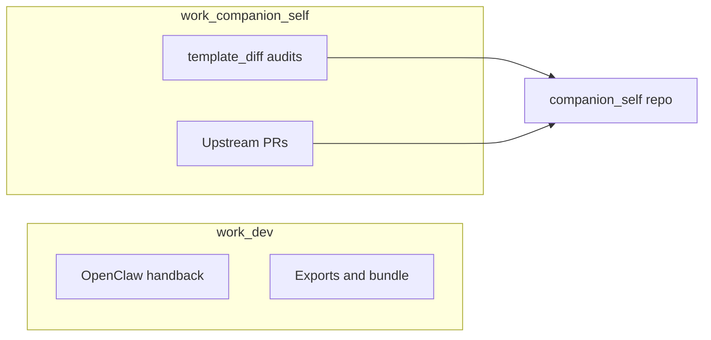

# Operator repo platform index (WORK, not Record)

One-page map of two **separate** WORK territories: **integration / OpenClaw** vs **template sync**. This doc does not add process law beyond what each territory’s README already states.

| Territory | Entrypoint | Primary scripts / docs |
|-----------|------------|-------------------------|
| **work-dev** | [work-dev/workspace.md](work-dev/workspace.md) | [INTEGRATION-PROGRAM.md](work-dev/INTEGRATION-PROGRAM.md); repo root [`integrations/openclaw_hook.py`](../../integrations/openclaw_hook.py), [`integrations/openclaw_stage.py`](../../integrations/openclaw_stage.py) |
| **work-companion-self** | [work-companion-self/README.md](work-companion-self/README.md) | [MERGING-FROM-COMPANION-SELF](../merging-from-companion-self.md); [`scripts/template_diff.py`](../../scripts/template_diff.py) |

**Audits that touch both tooling and docs:** use [coffee](../../.cursor/skills/coffee/SKILL.md) **A** (legacy hey **A** still works) and the **reconciliation code** checklist in [work-companion-self/README.md — Reconciliation code audit](work-companion-self/README.md#reconciliation-code-audit-upstream-and-downstream).
