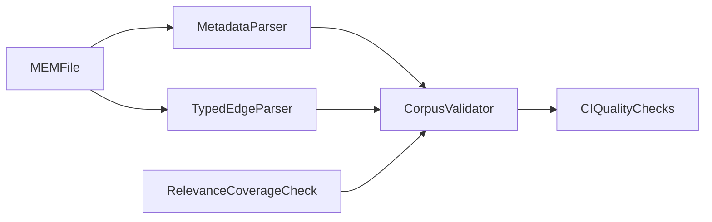

# CIV-MEM Schema PR0 Blueprint (design-only, upstream-targeted)

**Status:** Design proposal only (no upstream edits in this pass)  
**Scope:** Metadata/schema hardening for `civilization_memory` to improve search/routing efficiency for Grace-Mar and other consumers.

---

## Objective

Make CIV-MEM materially easier to search and route by standardizing:

- MEM metadata extraction surfaces
- typed MEM connection edges
- MEM-relevance coverage expectations

without requiring immediate corpus-wide rewrites.

---

## Current Anchors (already present)

- MEM template/header contract: `research/repos/civilization_memory/docs/templates/CIV–MEM–TEMPLATE.md`
- Typed connection registry: `research/repos/civilization_memory/docs/governance/CONNECTION–TYPES.md`
- Typed connection example: `research/repos/civilization_memory/docs/templates/EXAMPLE–MEM–TYPED–CONNECTIONS.md`
- Relevance expectation (state grounding): `research/repos/civilization_memory/.cursor/rules/cmc-state-mem-grounding.mdc`
- Corpus validator: `research/repos/civilization_memory/tools/cmc-validate-corpus.py`
- Legacy compatibility policy: `research/repos/civilization_memory/docs/governance/LEGACY–HEADER–COMPATIBILITY.md`

---

## 1) Normalized MEM metadata contract

### Required fields

- `mem_id`
- `civilization`
- `subject`
- `dates`
- `status`
- `version`
- `class`
- `last_updated`

### Recommended fields (search/routing)

- `themes[]`
- `regions[]`
- `entities[]`
- `era_start`
- `era_end`
- `subject_type`
- `keywords[]`

### Design rule

Allow either:

1. machine-readable normalized metadata block, or
2. legacy header that can be parsed into normalized fields.

Compatibility remains additive: legacy format is valid in PR0.

### Suggested normalized block shape

```yaml
mem_meta:
  mem_id: MEM–ROME–PAPACY
  civilization: ROME
  subject: The Papacy
  dates: "c. 30 AD–Present"
  status: ACTIVE
  version: "2.0"
  class: MEM
  last_updated: "January 2026"
  themes: [legitimacy, church-state, continuity]
  regions: [italy, mediterranean]
  entities: [papacy, vatican, holy-see]
  era_start: 30
  era_end: 2026
  subject_type: institution
  keywords: [papacy, latin, schism]
```

---

## 2) Typed MEM CONNECTIONS contract

Move to **typed-by-default** for all new/edited MEMs.

### Required edge fields

- `type` (must exist in `CONNECTION–TYPES`)
- `target_mem_id`
- `rationale` (one-line explanation)

### Optional edge fields

- `confidence` (example: `low|medium|high` or numeric)

### Warning classes (PR0)

- `connections_untyped_legacy`
- `connections_target_missing`
- `connections_type_unknown`
- `connections_rationale_missing`

### Example edge block

```yaml
mem_connections:
  - type: DEPENDS_ON
    target_mem_id: MEM–ROME–LATIN
    rationale: Papal legal-administrative continuity depends on Latin transmission.
    confidence: high
```

---

## 3) MEM–RELEVANCE completeness contract

Per civilization with active MEM corpus:

- file exists: `MEM–RELEVANCE–<CIV>.md`
- each MEM appears under at least one dimension
- include a generated summary line:
  - `coverage: <mapped>_of_<total>`

### Warning classes (PR0)

- `relevance_file_missing`
- `relevance_coverage_incomplete`
- `relevance_orphan_mem`

---

## 4) Validator-first rollout (warning -> error)

Target script: `tools/cmc-validate-corpus.py`

### Phase A (PR0)

- parse normalized metadata block if present
- parse legacy headers into normalized fields when block absent
- validate typed connections when present
- emit warnings for:
  - missing normalized block (legacy tolerated)
  - untyped legacy connection lists
  - missing relevance file / incomplete coverage

### Phase B (PR1)

- typed connections required for all touched MEM files
- relevance file required when civilization adds new MEMs
- selected PR0 warnings promoted to errors after migration threshold

---

## 5) Migration strategy (backward compatible)

1. Do not bulk rewrite entire corpus.
2. Apply normalized metadata and typed edges on-touch (new/edited files first).
3. Generate per-civ coverage reports for relevance gaps.
4. Promote warnings to errors after explicit threshold decision.
5. Keep legacy compatibility policy authoritative until migration closeout.

---

## 6) CI and reporting

CI should print warning summary grouped by class (not just raw file errors), so maintainers can track migration progress.

Suggested counters:

- `metadata_legacy_count`
- `connections_untyped_legacy_count`
- `relevance_file_missing_count`
- `relevance_orphan_mem_count`

---

## 7) Approval criteria (measurable)

- Explicit compatibility with legacy header policy remains documented.
- No corpus-wide rewrite required to adopt PR0.
- Typed connection schema and warning classes are defined.
- Relevance completeness contract includes measurable coverage output.
- Validator rollout has Phase A warning behavior and Phase B promotion rules.
- CI warning summary is specified.

---

## 8) Open design decisions for maintainers

- Normalized block format: YAML frontmatter vs delimited key-value block.
- `confidence` type system for edges.
- PR1 migration threshold (time-based vs percentage-based).
- Whether to require `themes[]` on all new MEM files.

---

## Architecture sketch



---

## Boundary note (this pass)

This blueprint is authored in Grace-Mar as a design proposal artifact. No `civilization_memory` files were modified in this pass.
