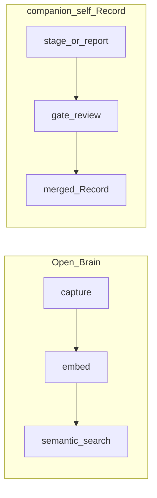

# companion-self for Open Brain users

**Audience:** People who already know **Open Brain**–style systems (Slack or MCP **capture**, **embeddings**, **semantic search** in a database, Nate B Jones stack, etc.) and are starting **companion-self** as a **cognitive fork** template.

**What this is:** WORK-only orientation in **grace-mar** — not the Record, not Voice knowledge. It **maps** concepts so you do **not** treat “searchable memory” and “governed identity” as the same thing.

**Canonical template:** [github.com/rbtkhn/companion-self](https://github.com/rbtkhn/companion-self) — use your clone’s `docs/seed-phase.md` and related files for formation.

---

## Comparison — one screen

Open Brain here means the common pattern: **capture → embed → retrieve** (e.g. `thoughts` table, MCP `search_thoughts` / `capture_thought`). **Record** means **`self.md`**, **EVIDENCE**, IX, and the **gated pipeline** in a companion-self **instance**. **MEMORY** is **`self-memory.md`** (continuity, not authoritative vs SELF). **WORK** is **`docs/skill-work/**`** and operator staging — not the triad seat “Voice.”

| | **Open Brain** | **companion-self Record** | **MEMORY** (`self-memory.md`) | **WORK / operator docs** |
|---|----------------|----------------------------|-------------------------------|---------------------------|
| **What it is for** | Fast **find** and **store** of notes for AI retrieval | **Who the companion is** — durable, approved identity and evidence | **Session / continuity** — pointers, tone, open loops | **Plans, mirrors, drafts** — instrumental layer |
| **Who owns “truth”** | You; database is **source** for captured rows | **Companion** (human) via **approval**; SELF is authoritative | **Operator** rotatable prose; **loses** to SELF if they conflict | **Operator**; not identity truth |
| **How something becomes official** | Insert / capture pipeline (config + keys) | **Stage** → **`recursion-gate.md`** → **approve** → merge script (SELF, EVIDENCE, prompt, etc.) | Write in MEMORY file; **never** bypasses gate into SELF | Commit WORK markdown; **no** automatic promotion to Record |
| **How AI is supposed to use it** | **Tools** (MCP) **search** and **add** rows | **Voice** **reads** merged profile; **abstains** outside boundary; lookup when offered | **Continuity** for sessions — not a fact source for identity | **Assistants** draft; **stage** to gate — **not** merge |
| **Typical mistake** | Assuming **retrieval rank** = **importance** or **consent** | **Hand-editing** `self.md` or skipping gate | Treating MEMORY as **substitute Record** | Pasting **instance A** `users/` into **instance B** |
| **Tooling seat (optional)** | MCP server + client connectors | **Voice** (emulation) + **bot** prompts; merge **scripts** | N/A | **Cursor / work agents** — [AGENTS.md](../../../AGENTS.md) “WORK execution layer” vs triad |

---

## Same shape, different job (rhyme)

Both systems care **what the AI can rely on**. Open Brain optimizes **volume and recall** of captures. companion-self optimizes **explicit, human-approved identity** and **evidence** so the Voice does not silently absorb unvetted text as “self.”

Parallel **pipelines**, not interchangeable: **search** does not replace **gate**.

---

## What not to do

If you are used to “everything searchable is fair game for the model,” **pause** — companion-self **splits** **capture** from **identity**.

- Do **not** **bulk-import** notes or chat exports straight into **`self.md` / IX** as if **searchability** or **embedding** meant **approval**.
- Do **not** treat **embedding similarity** or **RAG** hits as **consent** to merge **facts** or **personality** into the Record.
- Do **not** **replace** the **recursion gate** with “the AI **remembered** it from a vector database.”
- Do **not** connect **MCP**, **Cursor**, or other tools to **silent writes** into **SELF**, **EVIDENCE**, or **`bot/prompt.py`** — use staging + companion-approved merge per [AGENTS.md](../../../AGENTS.md).
- Do **not** **copy** another instance’s **`users/<id>/`** tree into yours (e.g. grace-mar into a new companion). See [LEAKAGE-CHECKLIST.md](../work-xavier/LEAKAGE-CHECKLIST.md) for advisor-side wording.

---

## Where to go next

- **In your template clone:** `docs/seed-phase.md`, `docs/seed-phase-readiness.md`, `docs/seed-phase-validation.md` (paths on [companion-self](https://github.com/rbtkhn/companion-self) `main`).
- **Gate and fork semantics (grace-mar copy):** [conceptual-framework.md](../../conceptual-framework.md), [identity-fork-protocol.md](../../identity-fork-protocol.md).
- **Template sync / contributing this doc upstream:** [work-companion-self/README.md](README.md), [MERGING-FROM-COMPANION-SELF.md](../../merging-from-companion-self.md).

---

## Revision log

| Date | Note |
|------|------|
| 2026-04-05 | Initial bridge: table, anti-patterns, mermaid; grace-mar `work-companion-self`. Upstream: branch `docs/open-brain-bridge` on `rbtkhn/companion-self` (open compare/PR); replace this line with **merge SHA** when `main` absorbs it. |
