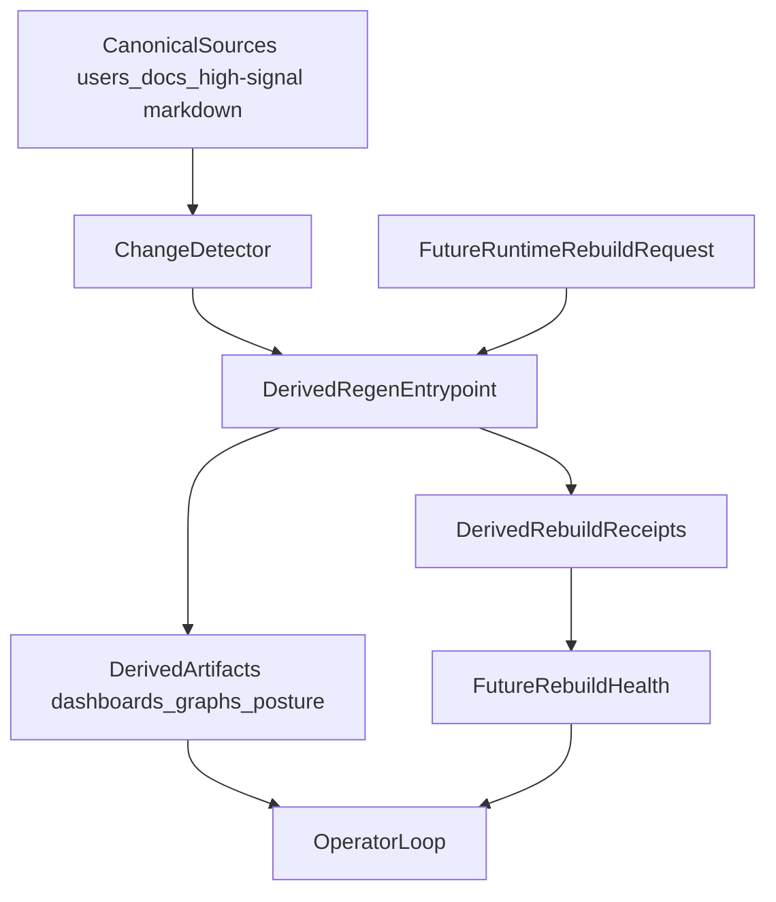

# Derived regeneration (work-dev roadmap)

**Status:** Phase 1 foundation — **partial** and intentionally small.

This doc turns the current rebuildability line into a repo-owned `work-dev` surface:

- **repo-owned change detection**
- **repo-owned derived regeneration entrypoint**
- **derived rebuild receipts**

It does **not** change canonical Record authority. All regeneration remains on the **derived** side of the membrane in [../../runtime-vs-record.md](../../runtime-vs-record.md).

It also does **not** rename this layer. Primary repo language stays **derived / rebuildable / non-canonical**. Any `shadow layer` phrasing is optional shorthand only.

## What exists now

### Phase 1 foundation

Current scripts:

- `python3 scripts/canonical_change_detector.py`
- `python3 scripts/regenerate_all_derived.py`
- `python3 scripts/build_derived_regeneration_manifest.py`
- `python3 scripts/report_rebuild_health.py`

Current receipt home:

- `artifacts/work-dev/rebuild-receipts/`

Current manifest:

- `artifacts/work-dev/derived-regeneration-manifest.json`

Current health summary home:

- `artifacts/work-dev/rebuild-health/`

Current initial target set:

- derived-regeneration manifest
- library index
- work-lanes dashboard JSON
- lane dashboards
- review dashboard
- gate board
- governance posture
- strategy-notebook graph

This is a **small initial set**, not a claim that all rebuildable surfaces are already orchestrated.

## Canonical commands

Inspect changed paths and impacted rebuild targets:

```bash
python3 scripts/canonical_change_detector.py
```

Dry-run the repo-owned regeneration path:

```bash
python3 scripts/regenerate_all_derived.py --changed --dry-run
```

Incremental ordering with downstream expansion:

```bash
python3 scripts/regenerate_all_derived.py --changed --incremental --dry-run
```

Build the current target manifest:

```bash
python3 scripts/build_derived_regeneration_manifest.py
```

Refresh rebuild-health telemetry:

```bash
python3 scripts/report_rebuild_health.py
```

Run all currently-wired targets:

```bash
python3 scripts/regenerate_all_derived.py --all
```

Run a specific target:

```bash
python3 scripts/regenerate_all_derived.py --target governance-posture
```

## Ranked roadmap

### 1. Rebuildability foundation

Keep this first.

Next wedges:

- expand target coverage only where source -> artifact mapping is clear
- deepen the generated dependency manifest
- strengthen topological incremental ordering and downstream expansion
- keep optional git hooks as wrappers later, not the primary contract

### 2. Reliability completion immediately after the foundation

Once the foundation is stable, keep the next `work-dev` reliability order explicit:

1. **BUILD-AI-GAP-005** — deeper factorial tail packs
2. **BUILD-AI-GAP-006** — staged-risk alignment and narrative/risk coherence
3. **BUILD-AI-GAP-007** — operator-facing autonomy habit friction

Why this order:

- rebuildability reduces drift in derived surfaces
- GAP-005/006/007 reduce trust debt in the active operator loop
- together they compound rather than compete

See [known-gaps.md](known-gaps.md) and [workspace.md](workspace.md).

### 3. Rebuild health after telemetry exists

Do **not** build a rebuild-health dashboard first.

Only add it after the foundation produces real telemetry:

- rebuild duration
- changed-input count
- rebuilt target count
- skips / failures
- cache hit rate if incremental rebuild lands

Likely artifact home:

- `artifacts/rebuild-health/` or a sibling `work-dev` derived dashboard path

### 4. Runtime rebuild requests later

Runtime-triggered rebuild requests are a **later phase**.

Rule:

- a runtime may request a **derived rebuild** only
- it must never imply a canonical edit, policy judgment, or merge path

Only add this after rebuild targets and receipts are stable enough that the runtime is calling into a clear, inspectable contract.

This is exactly where the revised shadow proposal stops for now: no runtime-triggered rebuild mechanics until the local derived-regeneration contract is mature.

### 5. Rebuild kits and environment pinning last

Fork-portable rebuild kits belong after the local stack is proven.

Do not freeze packaging too early. First prove the local abstraction, then package it.

### 6. OB1 chunking stays conditional

OB1 chunking remains a demand-triggered spike for bridge/exporter work, not the default next move for `work-dev`.

## Guardrails

- Do not let rebuildability become a second orchestration platform with implicit authority.
- Do not collapse receipt families unless their fields and authority model really align.
- Do not treat regenerated files as canonical truth because they are fresh.
- Keep `workspace.md`, `known-gaps.md`, and related status docs honest as the rebuild layer grows.

## Relationship model



## Why this exists

`work-dev` already depends on rebuildable, non-canonical outputs across dashboards, posture reports, workbench surfaces, and notebook views. The point of this doc is to make the next phase explicit:

**canonical change should deterministically regenerate the derived surfaces that depend on it, with minimal human friction and zero expansion of authority.**
