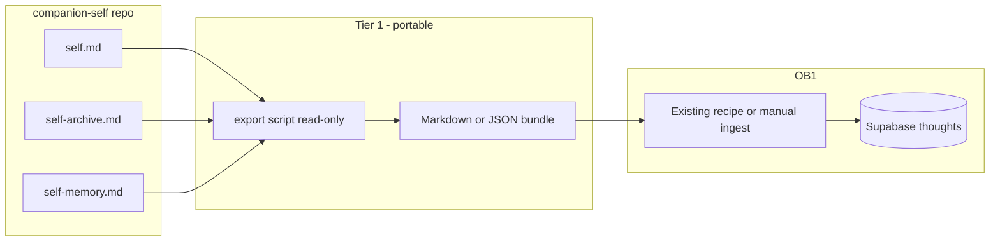
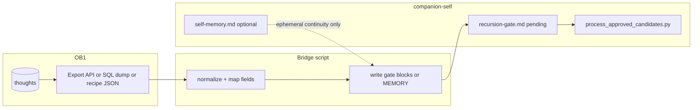

# Companion-self ↔ Open Brain (OB1) bridge — consolidated plan

**Purpose:** Single reference for bidirectional integration between a **companion-self** instance (git, gated Record) and an **OB1** deployment (Supabase, thoughts, MCP).  
**Status:** Planning / feasibility — not an implementation commitment.  
**Scope:** Operator and template-maintainer audience; not Record truth.

**Related:** [openclaw-integration.md](../../openclaw-integration.md) (other runtime exports). **Upstream OB1:** [NateBJones-Projects/OB1](https://github.com/NateBJones-Projects/OB1).

---

## Table of contents

1. [Executive summary](#1-executive-summary)
2. [System context](#2-system-context)
3. [Direction A: companion-self → OB1](#3-direction-a-companion-self--ob1)
4. [Direction B: OB1 → companion-self](#4-direction-b-ob1--companion-self)
5. [Script placement](#5-script-placement)
6. [Implementation deliverables](#6-implementation-deliverables)
7. [Technical feasibility study](#7-technical-feasibility-study)
8. [Supporting artifacts](#8-supporting-artifacts)
9. [Document bundle](#9-document-bundle)
10. [Open questions](#10-open-questions)
11. [Implementation checklist (from plan)](#11-implementation-checklist-from-plan)

---

## 1. Executive summary

**Feasibility:** Both directions are **possible**, with different safety profiles.

| Direction | Safe default | Hard part |
|-----------|----------------|-----------|
| **companion-self → OB1** | Markdown/JSON **export bundle** + OB1 **recipe** ingest | Chunking, embeddings, OB1 schema version |
| **OB1 → companion-self** | **Stage to RECURSION-GATE** (or append-only MEMORY/work docs) | **Cannot** auto-merge Record — `AGENTS.md` / companion-self: merge only via approved pipeline |

**Bottom line:** **Populate OB1 from companion-self** = export + OB1 recipes (safest). **Populate companion-self from OB1** = **stage to gate** (or MEMORY/work), then **existing pipeline** — the only approach consistent with companion sovereignty and the gated Record.

---

## 2. System context

| System | Canonical shape (relevant here) |
|--------|----------------------------------|
| **companion-self** | Git repo: `users/<id>/self.md`, `self-archive.md`, `recursion-gate.md`, `session-log.md`, `bot/prompt.py`, optional `self-memory.md` — **human-gated Record** in markdown. |
| **OB1** | **Supabase + thoughts** (and related), vector search, MCP — exports/recipes produce **portable dumps** (JSON, markdown) depending on upstream tooling. |

Grace-mar already has **read-only exports** for other runtimes (`docs/openclaw-integration.md`); there is **no** current bidirectional OB1 script in this repo.

---

## 3. Direction A: companion-self → OB1

### Architecture (two tiers)

**Tier 1 — Export bundle + OB1-native ingest (best first ship)**

- Script walks `users/<id>/`, emits deterministic files + metadata sidecars (source path, ACT-/READ- ids, git hash).
- User runs an OB1 **recipe** (or adapted Obsidian-style importer) so embeddings stay in OB1’s pipeline.

**Tier 2 — Direct Supabase insert**

- Pinned OB1 schema; handles embeddings, RLS, dedup — higher maintenance.

### Governance (CS → OB1)

- **`--include` / `--exclude`** flags so session-log, pending gate, or sensitive MEMORY are not leaked by default.
- **One-way convenience:** OB1 is a **downstream consumer** of exports; it does not own the Record.

---

## 4. Direction B: OB1 → companion-self

The Record is **companion-owned** and merges **only after approval** through **RECURSION-GATE** (`process_approved_candidates.py`). There is **no** supported pattern of dumping thoughts straight into `self.md` without breaking the pipeline contract.

### Architecture

**Tier 1 — Stage-only import (correct default)**

1. **Extract** from OB1: official export path (backup, recipe output, or Supabase `select` with service role — **operator-local**, secrets not committed).
2. **Transform** into **`CANDIDATE-XXXX` YAML blocks** matching `recursion-gate.md`: `summary`, `profile_target`, `source_exchange` (OB1 id + text), `channel_key: operator:ob1-import`.
3. **Append** under `## Candidates` with `status: pending` → companion approves → `process_approved_candidates.py`.
4. **Never** write `self.md` / `self-archive.md` / `bot/prompt.py` directly from this script.

**Optional — MEMORY / WORK (non-Record)**

- Append to **`self-memory.md`** only per `docs/memory-template.md` (ephemeral, non-authoritative); OB1-sourced lines are **pointers**, not new SELF facts.
- **WORK** markdown (e.g. `users/<id>/work-*.md`) can hold methodology mirrors — not Record until gated.

**Tier 2 — Suggest EVIDENCE-shaped entries**

- Emit files under `staging/ob1-import/` for manual gate creation — more friction, clearer audit.

### Governance (OB1 → CS) — non-negotiables

- **Canonical truth:** **companion-self Record wins** for identity; OB1 is **source material**.
- **Knowledge boundary:** OB1 text may include model fluff — apply the same **grounded** checklist as any candidate (`users/<id>/recursion-gate.md`).
- **No automatic loop:** No unattended OB1 ↔ git sync — avoids drift and merge pain.

---

## 5. Script placement

- **Primary:** **companion-self** template — e.g. `scripts/export_open_brain_bundle.py`, `scripts/import_ob1_to_gate.py`, or `scripts/ob1_bridge.py` with `export` / `import-stage`.
- **Grace-mar:** Doc links + optional thin wrappers; avoid duplicating logic without `template_diff` discipline.

---

## 6. Implementation deliverables

**CS → OB1**

1. Spec: SELF/EVIDENCE → chunk mapping, excludes, idempotency.
2. Tier 1 export CLI + README for OB1 recipe.
3. Optional Tier 2: direct Supabase to OB1.

**OB1 → CS**

1. Spec: OB1 thought fields → gate YAML; IX-A/B/C mapping vs reject-as-raw.
2. Tier 1: `import-stage` CLI → appends gate blocks + prints next steps (review / approve / `process_approved_candidates.py`).
3. Optional: MEMORY-only flag with explicit banner.

**Cross-cutting:** Technical feasibility study (section 7) before large build.

---

## 7. Technical feasibility study

**Recommendation:** Produce before heavy engineering — turns “possible” into **scoped** go/no-go. Target **10–20 pages max** or one dense memo.

| Section | Purpose |
|---------|---------|
| **Goals / non-goals** | Tier 1 only first; no bidirectional cron; minors / redaction. |
| **OB1 surface audit** | Pin an OB1 **release/tag**: thought table, recipes, embeddings, RLS. Spike: sample export or local run. |
| **Companion-self contract** | Files touched, gate YAML, `process_approved_candidates` invariants. |
| **Mapping matrices** | CS→OB1 chunks; OB1→CS → `profile_target` / reject rules. |
| **Risk register** | Schema drift, secrets, duplicates on re-import, KB leakage into gate. |
| **Go / no-go** | Tier 1 vs Tier 2; pilot (one user, one direction first). |

**Outcome:** Go with Tier 1, go with listed spikes, or defer until OB1 export stabilizes.

---

## 8. Supporting artifacts

| Artifact | Why |
|----------|-----|
| **Pilot protocol** | Metrics: time-to-first-thought in OB1; gate review time; zero accidental SELF edits. |
| **Threat / privacy one-pager** | What never leaves the repo; cloud DB implications. |
| **OB1 version pin policy** | Renovation rhythm; breaking-change response. |
| **Single-direction MVP** | Ship **CS→OB1** *or* **OB1→CS** first. |
| **Grace-mar pointer** | Link from `work-dev-sources.md` once bridge lives in companion-self. |
| **Template PR checklist** | Scripts, tests, no secrets in repo. |

---

## 9. Document bundle

**Must-have**

| Doc | Contents |
|-----|----------|
| **Technical feasibility study** | Go/no-go, OB1 pin, risks, spikes. |
| **Bridge architecture overview** | Diagrams, truth path, no auto-merge for OB1→CS. |
| **Mapping specification** | `MAPPING-cs-to-ob1` + `MAPPING-ob1-to-cs` (or one doc, two parts). |
| **Operator runbooks** | Export + import-stage. |
| **Governance addendum** | `AGENTS.md`, gate, merge script, companion approval. |

**Should-have:** Security & secrets; privacy / data classification; OB1 version policy; ADR (stage-only; Tier 1 first); troubleshooting / FAQ.

**Nice-to-have:** Pilot report template; glossary; minimal companion-facing FAQ if ever needed.

**Where:** Authoritative copy in **companion-self** (e.g. `docs/integrations/open-brain/` or `docs/ob1-bridge/`). **Grace-mar:** this file is a **consolidated mirror**; prefer linking to companion-self when the bundle lands there.

---

## 10. Open questions

- **Chunking (CS→OB1):** Per ACT vs monthly rollup?
- **OB1 export format:** Pin JSON/SQL shape to a specific OB1 release for import-stage.
- **Credentials:** Both directions = **operator machine**, not CI, for Supabase keys.

---

## 11. Implementation checklist (from plan)

| ID | Task |
|----|------|
| spec-mapping-cs-to-ob1 | Mapping spec: SELF/EVIDENCE/MEMORY → OB1 bundle chunks, excludes, idempotency |
| tier1-export-script | `export_open_brain_bundle.py` (companion-self) + OB1 recipe README |
| tier2-optional | Optional: direct Supabase ingest to OB1 (env + OB1 version pin) |
| spec-mapping-ob1-to-cs | Mapping spec: OB1 → gate YAML / MEMORY; never-auto-merge rules |
| tier1-import-script | OB1 export → gate candidate blocks + approve workflow README |
| feasibility-study-doc | Technical feasibility study (spikes, risks, OB1 pin, go/no-go) |

---

## Source

Consolidated from the Cursor plan **Companion-self to OB1 population** (grace-mar planning). When the authoritative bundle ships in **companion-self**, replace or narrow this file to a pointer + fork-specific notes.
