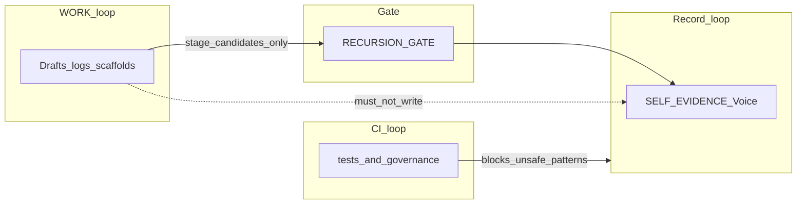

# Three compounding loops

**Status:** Operator/process discipline. WORK + architecture note. **Not** SELF truth unless merged via RECURSION-GATE.

Grace-Mar has **three** places where value can **compound** over time. Each has its own kind of memory, rhythm, and risk. Treating them as one undifferentiated “the AI remembers” causes drafts to become false canon or CI green to be mistaken for political correctness.

---

## Why three?

| Loop | What “compounds” | Typical rhythm |
|------|------------------|----------------|
| **Record** | Approved identity and evidence | Conversation → signals → gate → merge |
| **WORK** | Drafts, methodology, operator logs | Daily/weekly habits, Cursor sessions, cron that writes files only under WORK |
| **Repo / CI** | Tests, governance checks, script behavior | Push, PR, local pytest |

---

## Loop 1 — Record (companion truth)

**What compounds:** `self.md`, `self-evidence.md`, approved IX entries, gated updates to the Voice prompt.

**Shape:** Signals are **staged** in `recursion-gate.md`; on approval, **`process_approved_candidates.py`** merges across the declared files. EVIDENCE entries are append-only once captured.

**Point:** Slow, **sovereign** memory—the fork’s documented self. Contradictions may be preserved with provenance (see [conceptual-framework.md](../../conceptual-framework.md)).

**Invariant:** The companion is the gate. Nothing enters from LLM habit alone.

---

## Loop 2 — WORK (operator, campaign, integration drafts)

**What compounds:** Work-politics / work-strategy / work-dev markdown, america-first-ky scaffolds and `loop-history.md`, daily brief outputs, `pipeline-events.jsonl` as **operator audit**, integration notes. Optional scheduled commands that **write WORK files** or append pipeline events—not merges.

**Shape:** Same templates (e.g. stress-test, three lenses), repeated runs, logs that the **next** session can read. **Compounding** here is **draft quality and process muscle**, not automatic truth in SELF.

**Point:** Speed and iteration without claiming “this is who the companion is.”

**Coding-agent shape:** For a structured Plan → Execute → Review → Compound → **Gate** loop and WORK-only compound notes, see [compound-loop.md](compound-loop.md).

**Risk:** Treating WORK as Record—e.g. merging campaign voice into `bot/prompt.py` or inserting unvetted facts into SELF without the gate.

---

## Loop 3 — Repo / CI / harness (engineering truth)

**What compounds:** Tests, `governance_checker.py`, canonical path checks, git history, harness scripts.

**Shape:** Each fix + test **tightens** behavior of the **machinery** (no direct SELF writes except via whitelist, paths resolve, etc.).

**Point:** **Regression resistance** for repo rules—not validation of real-world political or ethical claims.

**Risk:** Confusing **green CI** with “the copy is safe to publish” or “the stance is correct.” CI checks **code and declared policies**, not external facts.

---

## How the loops interact

- **WORK → Record:** Only through **RECURSION-GATE** + companion approval + **`process_approved_candidates.py`**. No direct merge from cron or “loop” scripts into SELF/EVIDENCE/prompt.
- **CI → Record:** Indirect—CI does not merge; it can **fail** a change that would violate governance.
- **Record → WORK:** Read-only **excerpts** for context in sessions; [knowledge-boundary-framework.md](../../knowledge-boundary-framework.md) still governs what the Voice may assert.

---

## Common confusions

| Phrase | Often means | Actually check |
|--------|-------------|----------------|
| “The repo remembers” | SELF grew | May be **git history** or **WORK files** only. |
| “The loop ran” | Safe to ship | May be **scaffold + RSS**; still needs **human** review for public or Member-facing copy. |
| “Tests passed” | Substance is correct | Only that **automation** matches repo rules. |

---

## Vendor chat memory vs these loops

**Outcome-agent framing:** Tools often sell **persistent memory**, **inspectability**, and **compounding** inside their product. That memory is **Loop 2 at best** (drafts, operator convenience) unless the same facts cross **RECURSION-GATE** and merge into **Loop 1**.

- **Vendor thread “compounding”** is **not** Record compounding. Treat it like a **scratchpad** until staged and companion-approved.
- **Inspectable surfaces** in-repo beat chat-only: if the only artifact is a polished message, you inherit **black-box risk** for anything that should become SELF or EVIDENCE.
- **Persistent memory** in a SaaS is **not** the Sovereign Merge Rule. The **test suite** for Record truth remains the companion (and explicit binary checks at the gate).

See [persistence-and-memory-surfaces.md](persistence-and-memory-surfaces.md) and [delegation-spec-external-agents.md](delegation-spec-external-agents.md).

---

## Related

- [README.md](README.md) — work-dev objective (OpenClaw, gate, exports)
- [workspace.md](workspace.md) — operator entrypoint
- [../work-politics/america-first-ky/proactive-loop.md](../work-politics/america-first-ky/proactive-loop.md) — scheduled WORK habit without autonomous Record merge
- [../../conceptual-framework.md](../../conceptual-framework.md) — Record vs Voice, gate
