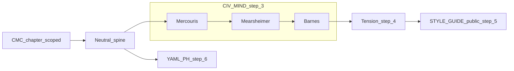

# History Notebook — polyphonic drafting workflow (operator)

Operator-only procedure: separate **private** three-voice (CIV-MIND) processing from **public** chapter prose. Public chapters must follow [STYLE-GUIDE.md](STYLE-GUIDE.md) — no `CIV-*` IDs, mind file paths, or agent infrastructure in markdown. Metadata stays in [book-architecture.yaml](book-architecture.yaml) and [cross-book-map.yaml](cross-book-map.yaml).

**Upstream corpus:** [civilization_memory](https://github.com/rbtkhn/civilization_memory) (CMC). Full governance templates: [research/repos/civilization_memory/docs/templates/](../../../../research/repos/civilization_memory/docs/templates/). **Default voice stubs for passes:** [strategy-notebook/minds/](../strategy-notebook/minds/) (`CIV-MIND-*.md` trimmed for notebook use).

**Parallel framing:** Month-level polyphony in strategy-notebook [meta.md](../strategy-notebook/chapters/YYYY-MM/meta.md) § Polyphony; Jiang operator layer: [operator-polyphony.md](../../../../research/external/work-jiang/operator-polyphony.md). Patterns: [MINDS-SKILL-STRATEGY-PATTERNS.md](../minds/MINDS-SKILL-STRATEGY-PATTERNS.md).

---

## Where CIV-MIND runs

CIV-MIND processing happens **only in step 3** — after a **neutral spine**, before the tension paragraph and before STYLE-GUIDE translation.

| Phase | What happens | CIV-MIND? |
|--------|----------------|-----------|
| 1–2 | Scope CMC + **neutral spine** | No — prepare input |
| **3** | **Mercouris → Mearsheimer → Barnes** on the spine | **Yes — only here** |
| 4 | Unresolved **tension** paragraph | No — synthesizes voice outputs |
| 5–6 | Public chapter + YAML / PH cross-check | No — translation and metadata |

**Input rule:** Voice passes take the **spine only**, not raw CMC dumps and not already-public chapter text.

**Output rule:** Step 3 produces three short in-voice blocks (operator draft). Step 5 **translates** spine + tension into the six public sections — it is not another CIV-MIND pass.



---

## Steps (per chapter)

1. **Scope** — From `book-architecture.yaml`: `source_refs`, `pattern_tags`, `cross_refs`. Pull targeted CMC nodes (CORE + selected MEM), not the whole corpus.
2. **Neutral spine (≤ one page)** — Timeline, facts, and stated patterns; strip governance IDs for paste safety. This is the **sole** upstream input to step 3.
3. **CIV-MIND passes** — Fixed order **M → Me → B**. Each pass: ~8–15 lines, in-voice per stubs. Optional: two-lens only for routine work ([strategy-minds-granular.mdc](../../../../.cursor/rules/strategy-minds-granular.mdc)); add the third lens when the chapter’s open question is explicitly three-plane.
4. **Tension** — One paragraph: what conflicts between narrative legitimacy, structural power, and material liability — **do not resolve**.
5. **Translate to STYLE-GUIDE** — Map into Sources → Axioms → Formation → Narrative → Contradictions → Strategy relevance. Optional operator-only tags (`[legit]`, `[power]`, `[liability]`, `[verify]`) in draft; strip before public commit (see MINDS patterns §8).
6. **PH / Jiang** — Update `cross-book-map.yaml`; use [STRATEGY-NOTEBOOK-ARCHITECTURE.md](../strategy-notebook/STRATEGY-NOTEBOOK-ARCHITECTURE.md) **Jiang resonance** as slow corpus check (not a fourth voice).

---

## Spine template (copy)

```markdown
## Neutral spine — [chapter_id]

**Scope:** [source_refs from book-architecture.yaml]

**Timeline / facts (no CIV IDs in paste to public):**
- ...

**Patterns named here:** [pattern_tags]

**Open question for voices:** one line
```

---

## STYLE-GUIDE mapping (voices → public sections)

| Voice plane | Typical public home |
|-------------|---------------------|
| Mercouris (legitimacy, narrative grammar) | Formation dimensions; Contradictions (source tensions) |
| Mearsheimer (power, incentives, structure) | Compressed narrative (proximate vs structural cause) |
| Barnes (liability, mechanism, clocks) | Strategy relevance (strategic case; verify-before-ledger discipline) |
| Unresolved tension | Contradictions (conceptual + source tensions) |

---

## Maintenance

When History Notebook arc emphasis or Predictive History queue shifts in a serious way, align **both** [operator-polyphony.md](../../../../research/external/work-jiang/operator-polyphony.md) and the active month [meta.md](../strategy-notebook/chapters/YYYY-MM/meta.md) § Polyphony in the same session (parallel to PH maintenance).

---

## Pilot example

See [operator-drafts/hn-i-persia-polyphony-pilot.md](operator-drafts/hn-i-persia-polyphony-pilot.md) (operator-only; legacy civ-centric pilot — Vol I chapter IDs are now `hn-i-v1-*`; mine into problem chapters as needed).
