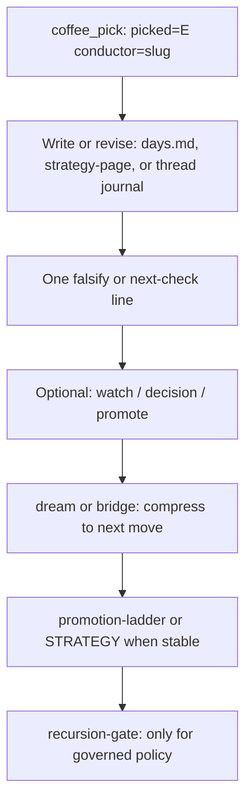

# Conductor — operator improvement loop (SSOT)
<!-- word_count: 558 -->

**Status:** WORK (operator discipline). **Not** Record. **Not** a merge or gate substitute. **Not** a second strategy pipeline beside [STRATEGY-NOTEBOOK-ARCHITECTURE.md](STRATEGY-NOTEBOOK-ARCHITECTURE.md).

**Purpose:** Name the **closed loop** from a **Conductor** stance (`coffee` hub **E** / `coffee_pick` with **`picked=E` `conductor=`** or **`picked=conductor`**) to **durable, testable** notebook output and optional promotion. Append-only [cadence lines](../../work-cadence/work-cadence-events.md) record *that* a pick happened; they do **not** by themselves store **what changed** in the work.

**Related:** [CONDUCTOR-CLOSE-TEMPLATE.md](CONDUCTOR-CLOSE-TEMPLATE.md) (paste block) · [COFFEE-CADENCE-CONDUCTOR-PROTOCOL.md](COFFEE-CADENCE-CONDUCTOR-PROTOCOL.md) (ritual) · [CONDUCTOR-PASS.md](../../work-coffee/CONDUCTOR-PASS.md) (menu) · [promotion-ladder.md](../promotion-ladder.md) · [NOTEBOOK-PREFERENCES.md](NOTEBOOK-PREFERENCES.md#escalation-marker-preference) · [AGENTS.md](../../../../AGENTS.md) (governance boundary) · [`.cursor/skills/coffee/SKILL.md`](../../../../.cursor/skills/coffee/SKILL.md) (Cursor ritual).

---

## 1. Layer map (where each kind of “memory” lives)

| Layer | What it is | Where in this repo |
|-------|------------|----------------------|
| **Signal / stance** | Which conductor; continuity | [work-cadence-events.md](../../work-cadence/work-cadence-events.md) — `coffee_pick` with `picked=D` `conductor=<slug>`; optional `focus=` / `arc=` |
| **Machine / extraction** | Ingest, transcript echoes, page refs | Expert `thread.md` **machine layer**; `raw-input/`; [STRATEGY-NOTEBOOK-ARCHITECTURE.md](STRATEGY-NOTEBOOK-ARCHITECTURE.md) |
| **Journal / judgment** | Synthesis, stakes, open seams | `strategy-page` in `experts/<id>/thread.md`, **`chapters/YYYY-MM/days.md`**, journal layer prose |
| **Test / falsify** | What would change your mind next | **`days.md` Judgment** or a line on the page; optional **expert prediction** / falsifier rows where you already run that discipline |
| **Escalation** | Intake only until you act | `[watch]`, `[decision]`, `[promote]` per [NOTEBOOK-PREFERENCES](NOTEBOOK-PREFERENCES.md#escalation-marker-preference) |
| **Structure / promotion** | Reusable, staged objects | [promotion-ladder.md](../promotion-ladder.md) → [STRATEGY.md](../STRATEGY.md) when **stable** |
| **Governance** | Durable **companion** or **merge** policy | [AGENTS.md](../../../../AGENTS.md) / `users/.../recursion-gate.md` — only when the lesson is **policy**, not a notebook preference |
| **Compression** | Turn many moves into one next motion | **dream** / **bridge**; optional **`coffee_conductor_outcome`** (see § 3) |

**Rule:** A **conductor run without** a same-day (or same-session) **anchor in the notebook or an outcome line** is **orientation-only** for chat — fine for a sip, but **not** a complete loop for recursive improvement.

---

## 2. The loop (mermaid)



**Minimum “closed” pass:** **pick** + **at least one** of: (a) a **Conductor close** in `chapters/YYYY-MM/days.md` for that day (use [CONDUCTOR-CLOSE-TEMPLATE.md](CONDUCTOR-CLOSE-TEMPLATE.md)), or (b) a **`coffee_conductor_outcome`** line with `verdict=` (§ 3).

**Full pass:** the same, plus an explicit **test** line and, when the arc deserves it, **ladder** / **STRATEGY**; **gate** only when the update is **governed** behavior.

---

## 3. Optional cadence closure — `coffee_conductor_outcome`

After the conductor **orientation** and **notebook** touch (or explicit choice to **shelf** with no file edit that day), you may append a **single** line via:

```bash
python3 scripts/log_cadence_event.py --kind coffee_conductor_outcome -u grace-mar --ok \
  --kv verdict=watch
```

**`verdict=`** (examples): `watch` · `promote` · `shelf` · `no_action` — see [work-cadence-events.md header](../../work-cadence/work-cadence-events.md).

**Documented optional `kv` (no script schema required; keep values short, token-safe):**

| Key | Use |
|-----|-----|
| `notebook_ref` | Path or fragment pointer, e.g. `chapters/2026-04/days.md` or a `strategy-page` `id=` |
| `falsify` | One line: what observation would **contradict** the pass |
| `conductor` | Slug if not obvious from the immediately preceding `coffee_pick` |

Example:

```bash
python3 scripts/log_cadence_event.py --kind coffee_conductor_outcome -u grace-mar --ok \
  --kv verdict=watch conductor=kleiber \
  --kv "notebook_ref=chapters/2026-04/days.md" \
  --kv "falsify=If Hormuz commercial traffic returns without commensurate IRI comms, revisit narrow thread choice."
```

(Use quoting if `falsify` contains spaces; [`log_cadence_event.py`](../../../../scripts/log_cadence_event.py) parses `--kv key=value` pairs.)

---

## 4. What this is not

- **Not** automatic promotion from cadence; **not** a substitute for **EOD** `strategy page` when the day’s substance needs a full compose.
- **Not** the **BrewMind / Cici** governed-state pipeline — keep boundaries unless you **explicitly** bridge.
- **Not** Record truth; companion-facing authority stays on-disk per **AGENTS** and the gate.

---

## 5. See also

- [COFFEE-CADENCE-CONDUCTOR-PROTOCOL.md](COFFEE-CADENCE-CONDUCTOR-PROTOCOL.md) — five movements, seeds only.
- [FOLD-LEARNING.md](FOLD-LEARNING.md) — optional weave learning stream (separate from this loop).
