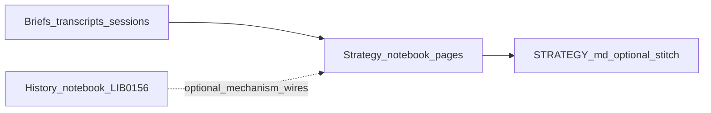
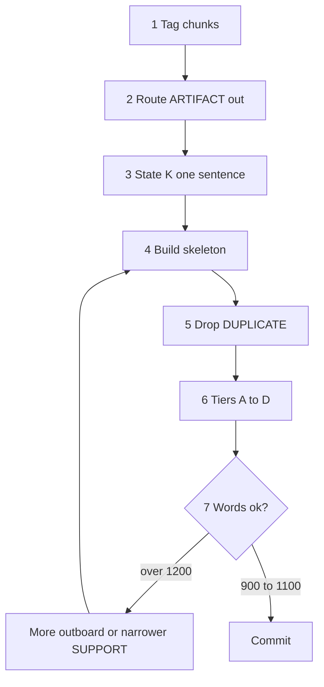

# strategy-codex — architecture
<!-- word_count: 11759 -->

**Project:** Operator strategy-codex (grace-mar work-strategy)

**Relation to `skill-strategy`:** [`.cursor/skills/skill-strategy/SKILL.md`](../../../../.cursor/skills/skill-strategy/SKILL.md) is the **activation surface** for **`strategy`**. **This document**, [NOTEBOOK-PREFERENCES.md](NOTEBOOK-PREFERENCES.md), and [daily-strategy-inbox.md](daily-strategy-inbox.md) (paste-ready line SSOT) are **incorporated by reference** into that skill — **one contract**, split across files for readability and maintenance, **not** a parallel “architecture-only” track beside the skill.

**Search tooling note:** use `rg` for notebook scans when possible. If the WindowsApps `rg.exe` path is blocked in this workspace, use the workspace-local copy at [`.codex-tmp/rg.exe`](../../../../.codex-tmp/rg.exe) instead; future strategy-codex sessions should treat that local binary as the default search path.

**Doctrine pointer:** [Civilizational-memory doctrine](README.md#civilizational-memory-doctrine) in the hub README captures the verification / register / graph / routing rules that now shape strategy-codex public surfaces.

## Civilizational-memory doctrine

strategy-codex borrows a formal memory doctrine for its public surfaces:

- **Never invent or assume structured IDs, references, lanes, or files.**
- **Verify against the canonical index and the file system before treating a thing as real.**
- **Hub and index files are authoritative registers.** Use them as ground truth, not as loose prose.
- **The notebook is a graph.** Volumes, books, chapters, pages, and lanes should be linked and cross-referenced.
- **Recency matters.** Make carry-forward, consolidation, and age visible in the scaffold.
- **Route by task type.** Factual, temporal, and interpretive work may need different paths, prompts, or indexes.

The concrete examples for this doctrine are already in the public notebook:
- the **octet** stream lattice for lanes
- the **template quartet** for volume/book/chapter/page files
- the **volume-root scaffold** for year-level organization

This doctrine is intentionally formal and public. It is part of the strategy-codex operating model, not a hidden ops note. The volume-root scaffold is separate from the older month-folder `chapters/YYYY-MM/days.md` chronology layer used for strategy-page work.

## Volume / book / chapter / page scaffold

For the separate book-like scaffold, the target layout is:

```text
strategy-notebook/
  2026/
    README.md
    book-2026-01.md
    chapters/
      chapter-2026-01-01.md
    pages/
      page-2026-01-01-source.md
```

**Doctrine:** the volume is the year folder directly under `strategy-notebook/`; books are month files at the volume root; chapters are daily composition files in `chapters/`; pages are raw-source files in `pages/`. The daily chapter files are the core scaffold; the book files provide month-level synthesis and index; the page files preserve the source layer.

**Templates:** [templates/strategy-codex-template-volume.md](templates/strategy-codex-template-volume.md), [templates/strategy-codex-template-book.md](templates/strategy-codex-template-book.md), [templates/strategy-codex-template-chapter.md](templates/strategy-codex-template-chapter.md), [templates/strategy-codex-template-page.md](templates/strategy-codex-template-page.md) — canonical quartet for the volume/book/chapter/page scaffold.

## Dense channel monthly ledgers

For dense YouTube channels, the ledger model lives in year folders directly under `strategy-notebook/` and is separate from the volume/book/chapter/page scaffold:

```text
strategy-notebook/
  2025/
    README.md
    dialogue-works/
      README.md
      book-2025-05.md
  2026/
    README.md
    mercouris/
      README.md
      book-2026-02.md
      book-2026-03.md
      book-2026-04.md
    diesen/
      README.md
      book-2026-01.md
      book-2026-02.md
      book-2026-03.md
      book-2026-04.md
    dialogue-works/
      README.md
      book-2026-01.md
      book-2026-02.md
      book-2026-03.md
      book-2026-04.md
      book-2026-05.md
    davis/
      README.md
      book-2026-04.md
```

**Doctrine:** each dense channel gets one annual index README per year folder and one canonical `book-YYYY-MM.md` ledger per populated month. The monthly rows are the source of truth, and dates may repeat when the channel genuinely published more than one valid episode that day.

Current ledger volume index: [2026/README.md](2026/README.md).

<a id="current-canonical-model"></a>

## Current canonical model

**One-sentence model:** **authors** = who; **watches** = what (evolving situation); **days** = when (legacy chronology and continuity in `chapters/YYYY-MM/days.md`); **minds** = interpretive lens ([`minds/`](minds/) and optional Links-only lines); **pages** = primary analytical unit — **`strategy-page`** marker blocks stored in author **`thread.md`** files (and optionally duplicated across authors with the same `id=`). **Threads** are containers and continuity lanes; **pages** are the portable analytical objects. Older standalone files under `chapters/…/knots/` (git history) are **not** the current model; inventory is page-based. **Thread hub** (pointers, not duplicate spec): [THREAD-CONTRACT.md](THREAD-CONTRACT.md).

<a id="default-operating-path-ssot"></a>

## Default operating path (SSOT)

**Two-layer SSOT (capture vs notebook work):** **[`raw-input/`](raw-input/README.md)** holds the **literal** author/host/guest text (archived capture). **Refined pages** under **`experts/<expert_id>/`** per [`refined-page-template.md`](refined-page-template.md) are the **default handle** for **strategy-page**, **`thread`**, and **`days.md`** — lane, sibling links, and **`### Verbatim`** on the page. **Disputes on wording** → correct **`raw-input/`** and the page’s **`### Verbatim`** together. **Disputes on judgment** → **`### Reflection` / `### Predictive Outlook`** and downstream compose, not a second paraphrase of the raw in **`thread`**.

### Flow

**Canonical long-form sequence** for work-strategy judgment (inbox-first; complements the three-move minimum in [DEFAULT-PATH.md](../DEFAULT-PATH.md)):

1. **Accumulate** through the day in [`daily-strategy-inbox.md`](daily-strategy-inbox.md) (paste-ready stubs) and **[`raw-input/`](raw-input/README.md)** (full verbatim when needed) — see [Split ingest model](#split-ingest-model) and [raw-input/README.md](raw-input/README.md).
2. **Once per local day (default): end-of-day strategy session** — **compose or revise** thread-embedded pages (`<!-- strategy-page:start` … in `experts/<expert_id>/thread.md` under `## YYYY-MM`) and the matching `chapters/YYYY-MM/days.md` continuity block. **Inputs (operator read order):** that day’s **[`raw-input/`](raw-input/README.md)** files (**primary bulk verbatim**), **thread-embedded** **`strategy-page`**, inbox stubs, and briefs. **Optional context after `thread`:** 7-day **`transcript.md`** and the **machine layer** (inbox triage **+** `raw-input` path pointers in inbox — **not** a second read SSOT). **Synthesis** (required **Chronicle / Reflection / Predictive Outlook** prose; **`### Appendix`** optional — see [strategy-page-template.md](strategy-page-template.md)), **not** an inbox or raw-input mirror. **Breaking glass:** rare intra-day notebook compose only when the operator explicitly overrides — same synthesis discipline.
3. **Optionally mark** reusable material with lightweight escalation cues (`[watch]`, `[decision]`, `[promote]`) — definitions and sparing-use rules: [NOTEBOOK-PREFERENCES.md#escalation-marker-preference](NOTEBOOK-PREFERENCES.md#escalation-marker-preference).
4. **Escalate artifacts** — watch support, analogy audit, or a **decision point** — only when a signal is maturing and **real options** are needed.
5. **Touch [STRATEGY.md](../STRATEGY.md)** only when a watch, analogy line, operator log arc, or doctrine note has **stabilized** (promotion ladder).
6. **Do not** update Record, SELF, EVIDENCE, or Voice from this lane.

**Author predictions ledger (optional):** Falsifiable **`pred_id`** adjudication rows and the **`topic_slug` registry** live in [`strategy-expert-predictions.md`](strategy-expert-predictions.md). Run [`validate_expert_predictions.py`](../../../../scripts/validate_expert_predictions.py) from repo root to check roster **`expert_id`**s and registry slugs; CI runs the same check (**Tests** workflow — *Validate strategy author predictions ledger*).

**Rule of thumb:** **Inbox + `raw-input/`** = capture; **pages** (marker-fenced blocks in author **`thread.md`** files) = judgment after the **end-of-day strategy session**; **`days.md`** = chronology and continuity.

**Default output path (chat / assistant):** chat → inbox / **`raw-input/`** → **author-thread pages + `days.md` continuity only in the end-of-day strategy session** (unless breaking glass) — same discipline as [Author choreography](#expert-choreography) *Output path (default)* below.

<a id="weave-terminology"></a>
<a id="end-of-day-strategy-session-terminology"></a>

## End-of-day strategy session (terminology)

**End-of-day strategy session** (abbrev. **EOD strategy session**) is the **default sole window** for composing or revising **strategy pages** (thread-embedded `strategy-page` blocks in `experts/<expert_id>/thread.md`) and updating **`chapters/YYYY-MM/days.md`**. **Primary evidence pile (operator consult):** that calendar day’s **[`raw-input/YYYY-MM-DD/`](raw-input/README.md)** and **author** **`strategy-page`** work in **`thread`**, **plus** inbox and **`batch-analysis`**. The **7-day** **`transcript.md`** and **machine layer** are **automation and triage** (optional extra context after **`thread`**); they are **not** a parallel SSOT you must open for the author’s long verbatim if **`raw-input/`** and pages already hold it — **synthesized**, not copied.

**Invocation (canonical):** Say **`strategy page`** or **`strategy page compose`** in chat to start the **notebook page construction** pass — i.e. run **`strategy`** with intent to compose or revise **`strategy-page`** fences and the matching **`days.md`** block. **Disambiguation:** **`strategy page`** / **`strategy page compose`** = operator phrases (the three-word form stresses **compose**); **`strategy-page`** = HTML fence token in `thread.md` ([strategy-page-template.md](strategy-page-template.md)). **Aliases:** **notebook compose**, **EOD strategy session**, **“close the strategy day,”** **“compose from today’s raw-input.”** **`weave` is deprecated** as the operator trigger — do **not** use it in new assistant menus or docs; keep **`python3 scripts/strategy_weave.py`** as the **read-only** cross-author analysis tool name ([watches/README.md](watches/README.md)), distinct from notebook **page composition**.

**Read-only variant:** Say **`strategy page read`** to run **`strategy`** with **frontier read** intent only — orient on [STATUS.md](STATUS.md), [daily-strategy-inbox.md](daily-strategy-inbox.md), the active **`chapters/YYYY-MM/days.md`** tail, and (if useful) today’s daily-brief lead — **no** edits to `days.md`, **no** new or revised **`strategy-page`** blocks, **no** default inbox append **unless** the operator **also** asks to **capture** / **`strategy ingest`**. Summarize in chat; optional **`strategy-context`** ([work-strategy README](../README.md#strategy-session-helpers-skill-strategy)) for a compact file-grounded readout. Same disambiguation: **`strategy page read`** is an operator phrase; **`strategy-page`** remains the fence token.

Older grep/git and JSONL fields may keep `fold` (e.g. `fold_kind` in [FOLD-LEARNING.md](FOLD-LEARNING.md)). **Long-horizon “weaving”** language in § *Daily strategy inbox* (Rome, Putin, §1 watches) means **integrating a watch channel over months** — **not** the EOD compose session.

**Legacy:** Standalone files under `chapters/…/knots/` were **superseded** in favor of pages; git may retain them. See [strategy-page-template.md](strategy-page-template.md).

## Thread (terminology)

**Page vs thread (short, link hub):** [NOTEBOOK-CONTRACT.md](NOTEBOOK-CONTRACT.md) / [THREAD-CONTRACT.md](THREAD-CONTRACT.md) — *pages* are analytical units; *thread* files are containers (full layers below).

**`thread`** (operator command — use backticks in prose so it is **not** confused with the inbox verify tail **`thread:<expert_id>`**) runs the author pipeline via **`bin/thread`** or **`python3 scripts/strategy_thread.py`** (same flags; from repo root):

1. **Triage** (internal, not operator-facing) — routes **`thread:<expert_id>`** lines from **`daily-strategy-inbox.md`** to per-author **`experts/<expert_id>/transcript.md`** files (append-only, 7-day rolling window, auto-pruned). The rolling file is a **triage sink**; **durable** verbatim for reading belongs in **[`raw-input/`](raw-input/README.md)**. Operator may lightly edit transcripts for clarity; edits are preserved across runs.
2. **Extraction** — reads each author's **`transcript.md`**, **scanning the inbox** for **`raw-input/…` paths** on the same `thread:` lines, and lists **`strategy-page`** blocks in that author’s **thread file(s)**, then writes **machine-maintained** material **between** the HTML comment markers (see below). **Canonical layout:** **one thread file per calendar month** — **`experts/<expert_id>/<expert_id>-thread-YYYY-MM.md`** (optional flat **`strategy-expert-<expert_id>-thread-YYYY-MM.md`**). Each file is **temporally limited** to that **`YYYY-MM`** (journal + machine layer for the month only). **Legacy / tooling fallback:** **`experts/<expert_id>/thread.md`** with **multiple** **`## YYYY-MM`** segments when monthly files are not on disk yet; **migrate** to per-month files with **`migrate_thread_md_to_monthly.py`** when ready. Transcript lines and inbox **`raw-input/`** pointers are scoped to the matching **`YYYY-MM`**; optional legacy **index** file rows (if any) attach to the **current UTC month** file only. **Human narrative** lives **outside** that block.

**`-thread.md` is layered (in order top to bottom).** **Do not** overload the word **Segment** for these layers — reserve **Segment 1–4** for the **2026 month index** (below).

| Layer | Location in file | Who maintains | Purpose |
|-------|------------------|----------------|---------|
| **Journal layer — Narrative** | **Above** `<!-- strategy-expert-thread:start -->` | Operator / assistant | **Page-composed months (default):** each **`## YYYY-MM`** segment is **composed from** that month’s thread-embedded **`strategy-page`** blocks (`date=` in that `YYYY-MM`) — running prose, **blockquotes** of author lines lifted from those pages, and **bookends** (short **lede** after the month heading; short **closer** after the last page in the month: synthesis, **Open** pins, **verify** pins). **Judgment** remains in **`### Reflection` / `### Predictive Outlook`** on each page; the month layer **aggregates** without replacing pages as the locus of analysis. **Durable bulk verbatim** for the author is **[`raw-input/`](raw-input/README.md)** (and the pages); the **7-day** **`transcript.md`** and **machine layer** are **triage/echo** — the journal is **not** a long paraphrase of the rolling transcript or a second full essay parallel to the page set. **Verbatim-forward** still applies to **quote-led** months: pull quotes **from `### Chronicle` (or in-page `>` markers) inside those `strategy-page` fences** by default, not by re-mining **`transcript.md`** for month bookends (see [strategy-expert-template.md](strategy-expert-template.md) § Thread — quote selection rubric). Heading **`## Journal layer — Narrative (operator)`**; dated **`## YYYY-MM`** segments. The **`thread`** script **never overwrites** this layer. If empty, a one-line stub is fine. |
| **Machine layer — Extraction** | **Between** `<!-- strategy-expert-thread:start -->` and `<!-- strategy-expert-thread:end -->` | `strategy_expert_corpus.py` on each **`thread`** run | **`## Machine layer — Extraction (script-maintained)`** with **`### Recent transcript material`**, **`### Recent raw-input (lane)`** (on-disk + inbox **`raw-input/…`**, de-duped by path; disk first), **`### Page references`**, and optional **Legacy file-index rows** if `knot-index.yaml` still lists rows. Overwritten each run. |
| **Optional ledger** | **After** `<!-- strategy-expert-thread:end -->` | Operator or future tooling | Optional fenced **`thread-ledger`** YAML/JSON — **not** touched by the default extractor unless a future script is added. |

**2026 month segments (operator index — inside the journal layer):** **`Segment 1`** = **January 2026** (`## 2026-01`); **`Segment 2`** = **February 2026** (`## 2026-02`); **`Segment 3`** = **March 2026** (`## 2026-03`); **`Segment 4`** = **April 2026** (`## 2026-04`, **ongoing**). Later months continue as **`## YYYY-MM`** headings in order. These **month segments** are **not** the machine layer.

<a id="expert-thread-month-segments"></a>

### Author-thread month segments (parse contract + scripts)

Within the **journal layer**, each **`## YYYY-MM`** heading opens **one month-segment** of the narrative (see [strategy-expert-template.md](strategy-expert-template.md)). Treat boundaries as a **parse contract** for validators and batch-analysis handoff — not decorative.

- **Where a month body ends:** tooling stops the segment at the **next** `## YYYY-MM` **or** at the first line matching `<!-- backfill:` (start of the HTML backfill block). A month segment must **not** include the backfill region; otherwise word counts and segment text for that month are wrong.
- **Backfill placement:** prefer listing **all** calendar `## YYYY-MM` segments **before** `<!-- backfill:<expert_id>:start -->`, with **`## YYYY-MM`** for the partial current month **after** the backfill block if you use one — or keep a single consistent order in-repo; the terminator rule above stays the source of truth.
- **Prose / verbatim minimum:** default expectation is **≥ ~500 words of substantive text per `## YYYY-MM` block** — **either** running prose **or** **markdown blockquotes** (`>`) of the author (quote-led months are valid under **verbatim-forward** policy), **or** words inside **`<!-- strategy-page:`** … **`end`** --> fences (thread-embedded pages). `python3 scripts/validate_strategy_expert_threads.py` counts **prose lines + blockquote words + strategy-page fence words** toward that threshold; list lines alone do not count. It warns when below threshold or when a month is bullets-only without prose or quotes. To scaffold from roster **Role** / **Typical pairings** (WORK-only; not Record): `python3 scripts/expand_strategy_expert_segment_prose.py --apply` from repo root.
- **After you edit journal-layer month prose materially:** re-run **`python3 scripts/strategy_historical_expert_context.py --expert-id <id> --start-segment … --end-segment … --apply`** when you rely on `artifacts/skill-work/work-strategy/historical-expert-context/` per-month or rollup files for that window — so batch-analysis and prompts see updated stance text.

**Legacy:** Older docs called the split **Segment 1** (journal) vs **Segment 2** (machine). That collided with **month** “segments.” Current wording: **journal layer** / **machine layer** for file structure; **Segment 1–4** = **2026-01–04** month index only.

**Assistant default after `thread`:** Refine the **narrative journal** (above markers) **without** replacing **machine extraction** with summary-only narrative. Prefer **month composition from that month’s `strategy-page` body** (Chronicle / in-page quotes) plus **bookend** glue; for **bulk** speech the operator’s read path is **`raw-input/`** and the **pages**; use **`transcript.md`** and the **machine** block (including **inbox** **`raw-input/`** path lines) for **triage/echo** context, not as the default **quote mine** for month lede/closer. Where the operator wants **continuous** text, keep it **verbatim-forward** (quote-led or short connective prose), not an assistant paraphrase that rewrites the author. **Do not** replace the journal with bullets-only stubs unless the operator asks. **List pages in a month** (read-only): `python3 scripts/list_strategy_pages_by_month.py --year-month YYYY-MM` (optional `--expert-id`, `--chronicle-snippets`, `--json`); see [strategy-expert-template.md](strategy-expert-template.md) § Thread.

**Legacy:** Older **`-thread.md`** files may still hold long prose **inside** the markers; on the next **`thread`** run that prose can be **replaced** by raw extraction. **Migration:** move journal paragraphs **above** the start marker when editing those files.

**What it is not:** **`thread`** does **not** update **`days.md`**, journal-layer **`strategy-page`** blocks, or the inbox **`Accumulator for:`** line. It is **not** a substitute for the **EOD strategy session** (notebook compose). Transcript or aggregator output still lands in the **inbox** first (paste-ready lines + **`thread:`** when the cold line attributes speech to a named indexed author).

**Per-folder model:** Each author has its own folder **`experts/<expert_id>/`** with companion files — **`profile.md`** (cognitive profile — operator-authored, stable), **`transcript.md`** (7-day rolling verbatim **from inbox** — first `thread:` line plus optional continuation paragraphs; target **≤ ~2000 words** per block, soft **≤ ~20k words** per file after prune), **thread file(s)** (**journal layer** + **machine layer** + optional ledger; **`strategy-page`** fences live in the journal layer), and optional **`mind.md`** (extended CIV-MIND profile). **Thread files are temporally bounded:** **one file per calendar month** — **`experts/<expert_id>/<expert_id>-thread-YYYY-MM.md`** (see [strategy-expert-template.md](strategy-expert-template.md)). **Legacy:** a single **`thread.md`** holding multiple **`## YYYY-MM`** segments until split. The **`thread`** command updates transcripts and **only the marked machine block** in each thread file it touches; the profile file is never script-modified. **Templates** are maintained as **one** bundle: [strategy-expert-template.md](strategy-expert-template.md) (jump anchors at top of that file). See [watches/README.md](watches/README.md) for the pages-in-threads model.

**Dual on-disk layout:** [`rebuild_threads`](../../../../scripts/strategy_expert_corpus.py) (via **`thread`**) updates **each** **`…-thread-YYYY-MM.md`** machine layer when monthly files exist (**canonical**). When **no** monthly files exist yet, it writes **`experts/<expert_id>/thread.md`** (**legacy** multi-month container). Some trees also keep a flat **`strategy-expert-<expert_id>-thread.md`** or **`strategy-expert-<expert_id>-thread-YYYY-MM.md`** at the notebook root; [`validate_strategy_expert_threads.py`](../../../../scripts/validate_strategy_expert_threads.py) accepts those patterns. Treat **per-month files** as the operator’s default target; after **`thread`**, confirm which file’s machine block updated so you do not edit a stale duplicate.

**Partial monthly layout and union discovery:** During a **phased** move to monthly files, **both** legacy **`thread.md`** and one or more **`...-thread-YYYY-MM.md`** files may **coexist** for the same author. In that case [`expert_thread_paths_for_discovery`](../../../../scripts/strategy_expert_corpus.py) **includes all** of them (sorted monthlies, then `thread.md` if present) so `strategy-page` under unmigrated `## YYYY-MM` in **`thread.md`** is still **visible** to [`discover_all_pages` / `validate_strategy_pages`](../../../../scripts/strategy_page_reader.py). The same `strategy-page` `id` in a **monthly** file and in **`thread.md`** is **deduped** for aggregate discovery, **preferring the monthly** copy. **`thread`** in monthly mode can still **create** a month file for every calendar month that appears in **`transcript.md`**; delete empty stubs in-tree if you do not want them.

**Migration:** `python3 scripts/migrate_thread_md_to_monthly.py --apply` splits a legacy **`thread.md`** journal into **`<expert_id>-thread-YYYY-MM.md`** files; run **`thread`** afterward to refresh machine layers.

<a id="expert-thread-cross-check-blocks"></a>

### Cross-check blocks (hybrid) and tier discipline

Optional **`### Cross-check (…)`** subsections in the **journal layer** (inside a **`## YYYY-MM`** month segment, **above** `<!-- strategy-expert-thread:start -->`) fold one author’s structured claims against **other named `thread:`** lanes and against **daily-brief §1e / maritime / wire** discipline when the crisis touches those surfaces.

- **Hybrid format:** One **scope** line (sources + tier tags + which **`thread:`** experts the matrix uses). Then **either** a compact **markdown table** (e.g. thesis × Davis × Pape × §1e/wire) **or** **`[strength: …]`** bullets when a table is noisy or columns multiply — operator choice per ingest.
- **Balanced §1e:** State the **seam** in one sentence (material / theory / forecast). Do **not** duplicate full §1e tables or every maritime primary inside every author file — **point** to the matching **`chapters/YYYY-MM/days.md`** block and **`batch-analysis`** rows for dense falsifiers and instrument-grade detail.
- **`days.md` Links:** When the cross-check is tied to a **major** ingest — long-form essay (e.g. Substack-tier), a **`batch-analysis`** line, or a **page- / compose-facing** seam — add **one** bullet under that day’s **`### References`** pointing back to the author thread section (journal cross-check or month segment). Routine short ingests do **not** require this unless the operator wants traceability.

Apply **prospectively**; no obligation to backfill older months unless you explicitly schedule it.

<a id="split-ingest-model"></a>

### Split ingest model (operator direction — planned)

**Three capture channels** (direct write vs **`populate_strategy_raw_input`** vs Cursor JSONL salvage vs RSS): **[`raw-input/README.md` § Three capture channels](raw-input/README.md#three-capture-channels-normative-vs-recovery)** — normative **`raw-input/`** first; **prune** is optional hygiene, not recovery.

**Problem:** **Durable** long verbatim for **reading and Chronicle** belongs in **[`raw-input/`](raw-input/README.md)**, but **unified discovery** still needs a **grep-friendly registry** and a **single habitual action** (see operator preference: stub + corpus + one command). The **7-day** **`transcript.md`** is the **triage** target for `thread:` lines, **not** the operator’s only bulk store.

### Publication vocabulary (formal pin)

Normative: **[`raw-input/README.md` § Publication vocabulary](raw-input/README.md#publication-vocabulary-formal-pin)** — **machine** tag **`pub_date:YYYY-MM-DD`**, YAML **`pub_date`**, human **Published** / “publication day” — not **`aired:`** as a norm for new work. **Legacy** inbox lines and the **`_aired-pending/`** folder name may persist until a bulk migration. **[`refined-page-template.md`](refined-page-template.md)** preambles follow the same pin.

**Policy (target):**

| Layer | Role |
|-------|------|
| **[`daily-strategy-inbox.md`](daily-strategy-inbox.md)** | **Index / stub** — at minimum one paste-ready line per capture: **`thread:<expert_id>`**, **`pub_date:YYYY-MM-DD`** (canonical tag) when the event has a clear **publication** anchor, short **cold** / **hook**, **URL**, **`verify:`**. Same tags as today (plus migration from legacy **`aired:`** where still present) so **`rg`** across the inbox stays the primary “what did we file?” sweep. |
| **`experts/<expert_id>/transcript.md`** | **Rolling triage / machine echo (7 days)** — optional short or pointer-only blocks under **`## YYYY-MM-DD`** where that date is the **publication** day; continuation paragraphs follow the [long-form verbatim](daily-strategy-inbox.md#long-form-verbatim-thread) rules. **Full** unabridged text stays in **[`raw-input/`](raw-input/README.md)**; this file is **not** a second SSOT the operator must consult for bulk verbatim. Triage targets **≤ ~2000 words** per ingest block (soft caps). |
| **[`raw-input/`](raw-input/README.md)** | **Unabridged SSOT** — full transcripts, RSS merge files **`YYYY-MM-DD-<expert_id>.md`**, sidecars, bundles. **On disk:** **`raw-input/<pub_date>/`** (publication / calendar day; **`ingest_date`** in YAML only). **`_aired-pending/`** (legacy folder name) when **`pub_date`** is not fixed yet ([§ Layout](raw-input/README.md)). **Refined pages** live under **`experts/<expert_id>/`** only (including **`-<slug>`** suffixes when multiple pages share a date — see split-ingest **Refined pages** note below); **not** in this tree — inbox stays **stubs** + **`verify:`** pointers. **Prune** only when **you** run **`prune_strategy_raw_input.py`** (default window aligns with author transcript tooling); **`--apply`** is **blocked** while **[`.pruning-suspended`](raw-input/.pruning-suspended)** exists unless **`--override`** ([§ Pruning](raw-input/README.md)). |
| **`python3 scripts/strategy_thread.py`** (today) | Triage + extraction: inbox → transcript (optional body) + **inbox `raw-input/` path lines** + **`strategy-page` refs** → machine block; **until** a dedicated command ships, triage still assumes inbox-sourced `thread:` blocks. |

**Refined pages (standalone files under `experts/<expert_id>/`):** **Multiple** refined pages may share the same **publication date** (same calendar anchor as YAML **`pub_date`**). Default basename **`<expert_id>-page-YYYY-MM-DD.md`**; when more than one primary capture warrants a separate judgment artifact for that date, use **`<expert_id>-page-YYYY-MM-DD-<slug>.md`** with **`<slug>`** from the primary **`raw-input`** stem (kebab-case). **Alternatively,** the operator may consolidate same-day captures into **one** file with **A / B / C** Verbatim blocks where [refined-page-template.md](refined-page-template.md) defines that pattern. **Canonical scaffold:** [refined-page-template.md](refined-page-template.md). **Per-expert compat stub:** **`<expert_id>-page-template.md`** (links the canonical file; stable **`Template:`** pointer in **`transcript.md`**).

**Unified search:** Treat **inbox + `experts/*/transcript.md` + `raw-input/`** as one habit: grep inbox for stubs; grep **`raw-input`** for full text when the operator stored it there; grep transcripts for triage-sized verbatim — **or** (future) a generated rollup listing pointers only. **Not** Record.

<a id="planned-strategy-ingest-cli"></a>

### Planned unified ingest command (CLI sketch — not implemented)

**Transition:** Current tooling remains valid; a future **`strategy_ingest`** (name TBD) would implement “one command” below without deleting the inbox as registry.

Single entry point (working name **`strategy_ingest`** or fold into **`strategy_thread`**) — **one invocation** that updates stub + corpus + runs refresh as needed.

| Flag / arg | Purpose |
|------------|---------|
| **`--expert <expert_id>`** | Required for expert-tagged ingest; must match [strategy-commentator-threads.md](strategy-commentator-threads.md) slug. |
| **`--pub-date YYYY-MM-DD`** | **Publication** calendar anchor for the segment (drives **`## YYYY-MM-DD`** in **`-transcript.md`**). Optional only if stub-only. (Legacy sketch name: **`--aired`**, deprecated.) |
| **`--stub-only`** | Append/update **inbox** line only (short line + URL + tags); no long body. |
| **`--from-file <path>`** | Body text from file (avoids shell quoting); written to transcript block for the same **`--pub-date`**. |
| **`--stdin` / `-`** | Read long body from stdin (optional alternative to **`--from-file`**). |
| **`--inbox-path`** | Override default [`daily-strategy-inbox.md`](daily-strategy-inbox.md) (advanced). |
| **`--dry-run`** | Print planned writes; no file changes. |
| **`--skip-thread`** | Write stub/body only; do **not** run extraction (optional escape hatch). |

**Default behavior (sketch):** With **`--expert`**, **`--pub-date`**, and body (**`--from-file`** or stdin), write **(1)** stub line to inbox with **`pub_date:`** + **`thread:`**, **(2)** append verbatim under the matching **`## YYYY-MM-DD`** in **`-transcript.md`**, **(3)** invoke existing **`thread`** pipeline to refresh machine segments. **`--stub-only`** skips (2)–(3) or runs a minimal path.

**Implementation** is **future `EXECUTE`** — this section is the contract placeholder only.

<a id="verbatim-thesis-scaffold"></a>

### Verbatim thesis scaffold (operator methodology)

**Purpose:** Fit a long author transcript into the **≤ ~2000 words per ingest** target for `experts/<expert_id>/transcript.md` **without changing any of the author’s words** — by **dropping whole sentences only**, selected for **argument weight**.

**Pipeline (manual or assisted):**

1. **Ingest** the full transcript (into the dated `~~~text` block or your working copy).
2. **Name 3–6 major theses** — what the episode is *arguing* in distinct threads (not a summary of everything said).
3. **Order** those theses for **coherence** (logical build, narrative arc, or the order that matches how *you* will reuse the material in the **EOD strategy session**).
4. Under each thesis, **paste verbatim sentences** from the transcript — **strongest first** — until the **total** is **≤ 2000 words**. Trim by removing **whole sentences** from the bottom of each thesis block (or deduplicating near-repeats) until under budget.

**Editorial layer:** The **thesis list and order** are interpretive; the **sentences** stay verbatim. Treat the scaffold as **WORK** compression, not a substitute for keeping a fuller verbatim archive elsewhere if you need auditability.

**Optional pass 0 (automated):** `python3 scripts/abridge_verbatim_transcript.py` — **sentence-only** boilerplate trim and length cap — can clear greetings and low-value lines *before* you pick theses. It does **not** replace thesis selection.

**Strong-sentence discipline:** Use the repeatable checklist and tie-break rules in [THESIS-SCAFFOLD-CHECKLIST.md](THESIS-SCAFFOLD-CHECKLIST.md) (printable one-pager).

**Where to put bold theses and separated paragraphs:** [strategy-expert-template.md — Thesis-first verbatim scaffold](strategy-expert-template.md#thesis-scaffold-pattern) (markdown above `~~~text` in the same `transcript.md` date section — not a separate `*-thesis-scaffold-FULL.md` file).

**Full verbatim when the fence is thesis-scaffold only (archive policy):** If the dated `~~~text` block in `experts/<expert_id>/transcript.md` holds a **≤ ~2000 word** scaffold (thesis-selected and/or sentence-trimmed) instead of a full episode paste, **dropped sentences are not recoverable from that fence**. Before relying on a trimmed fence as the only copy, choose **at least one** archive for the longer or full text:

| Archive | Use when |
|--------|----------|
| **Git history** | You committed the long paste earlier; recovery is `git show` / `git log -p` on the transcript path (good for one-off corrections). |
| **Optional full-linear file** | You want an explicit, grep-friendly **full episode** paste in-repo (any stable name). **Thesis layout** (bold labels, `---`, thesis sections) belongs in [`strategy-expert-template.md`](strategy-expert-template.md#thesis-scaffold-pattern) on the **same date** as markdown **above** `~~~text`, not a parallel `*-thesis-scaffold-FULL.md` file per episode. |
| **Out-of-repo** | Original transcript lives in notes, YouTube description, or another store; link it from the inbox stub or the date section if stable. |

**In-file layout:** Prefer **thesis markdown above `~~~text`** per [strategy-expert-template.md — Thesis-first verbatim scaffold](strategy-expert-template.md#thesis-scaffold-pattern) instead of a second notebook file for thesis structure. **Cross-link** to an optional **full-linear** archive only when that file holds material not in the transcript (e.g. uncut paste). Not Record.

#### Worked example — Alexander Mercouris · air date **2026-04-16**

Source: [`experts/mercouris/transcript.md`](experts/mercouris/transcript.md) **`## 2026-04-16`** `~~~text` fence (thesis-scaffold verbatim trimmed to policy). **Shape** for bold theses + separated paragraphs: [strategy-expert-template.md#thesis-scaffold-pattern](strategy-expert-template.md#thesis-scaffold-pattern). Below: **five theses** in narrative order, each with **sample verbatim sentences** (short excerpt table — same episode).

| Order | Thesis (operator label) | Verbatim scaffold (excerpts) |
|------|-------------------------|--------------------------------|
| 1 | **Pakistan–Iran bridge and the Iran theatre** — Munir’s visit, public escort, **falsification** of “destroyed” air force | “At present, the main news concerning this conflict is the arrival in Tehran of the Chief of the Army Staff of the Pakistani armed forces, Field Marshal Asim Munir.” / “There may have been covert visits by officials from countries such as China or Russia, but Field Marshal Munir arrived publicly. His aircraft was escorted by Iranian fighter jets — MiG-29s and F-4 Phantoms — as it landed in Tehran.” / “President Trump has repeatedly claimed that the entire Iranian air force has been destroyed. Clearly, that is not the case.” |
| 2 | **U.S. theory of victory and next escalation** — succession of methods, **regime change** as telos, ceasefire as prep, ground-op rumour | “The story of this conflict since 28 February has been one of the United States trying a succession of different approaches — missile strikes (often in coordination with Israel), assassinations, attacks on ports, and now a sea blockade — in the hope that one will finally unlock regime change in Iran, which I remain convinced is the ultimate objective of both the US administration and Israel.” / “Expectations of what the sea blockade can achieve are, in my view, greatly exaggerated.” / “As I discussed yesterday, the Russian Security Council has issued its own intelligence assessment, which envisages the United States attempting some form of ground operation next week — possibly against Iranian islands in the Strait of Hormuz, Kharg Island, to seize enriched uranium stockpiles near Isfahan, or even the Bushehr nuclear power plant.” |
| 3 | **China and the blockade as precedent** — Malacca / maritime access fears, logistics debate, **Cuban Missile Crisis** analogue | “What worries Beijing most is not just any temporary disruption of Iranian oil supplies, but the precedent of the United States imposing a naval blockade on a country with which China has active and important trade relations.” / “For China — the world’s largest trading nation and a major importer of energy and raw materials — such actions look like a dress rehearsal for a potential future blockade of China itself, perhaps closing the Strait of Malacca or access to the East and South China Seas.” / “Any scenario in which Chinese warships begin escorting Iranian tankers in defiance of a US-declared blockade would represent a major international crisis — one not far removed in danger from the 1962 Cuban Missile Crisis, which also involved a naval blockade challenged at sea.” |
| 4 | **Russia–Gulf diplomacy** — Lavrov–Saudi readout, regional dialogue, **proposals vs. U.S. objection** | “The ministers exchanged views on the situation in the Strait of Hormuz following the US-Israeli attacks on Iran and Tehran’s responses.” / “The Russians and Saudis also called for a broader dialogue involving all interested parties to coordinate long-term stability and security in the region based on a balance of interests.” / “So far, this remains only proposals and ideas. The United States will object strongly.” |
| 5 | **Ukraine / Europe coda** — strikes, **drone production in Europe**, Sumy pressure | “On the military front, the key development in the last 24 hours was another large-scale Russian strike on Ukraine involving Geran drones, Kh-101 cruise missiles, and Iskander ballistic missiles.” / “The Russian Defence Ministry and Dmitry Medvedev have also highlighted that Ukrainian drone production has largely shifted to Europe.” / “There has also been movement on the front lines, particularly in the Sumy region. The Russians have begun leafleting the city of Sumy with political messages questioning Zelensky’s legitimacy.” |

## Thesis

A **cumulative, page-organized record** of how the operator reads signals, weighs analogies, and steers frameworks (Islamabad, Rome, briefs, STRATEGY) — distinct from [work-strategy-history.md](../work-strategy-history.md) (lane events) and from [STRATEGY.md](../STRATEGY.md) (milestone ledger). Under **`skill-strategy`**, this notebook is the **primary surface for governed strategic accumulation** in WORK: **explicit seams**, **explicit promotion** to [STRATEGY.md](../STRATEGY.md) when arcs stabilize, and **explicit distance** from companion **Record** truth ([AGENTS.md](../../../../AGENTS.md)).

### Symphony of Civilization (operator gloss)

**Symphony of Civilization** is the notebook’s **polyphonic** image: **multiple civilizational and author registers** (voice planes in briefs, indexed commentators in [strategy-commentator-threads.md](strategy-commentator-threads.md)) sound **together** without **collapsing** into one melody. Each **page** (per author thread) is a **movement** on the **score**; **`batch-analysis`** names **convergence vs tension** between **parts**. **Authors** (indexed voices) supply **instrument lines**; the **operator** sets **balance and tempo** (**EOD strategy session**, Thesis A/B, **`verify:`** discipline)—not the experts.

### Operator as conductor (short pointer)

The operator is the **conductor**, not another instrument: they **do not** replace author voices or raw inputs; they **shape** **Journal-layer** judgment, **emphasis**, and **promotion** while scripts maintain the **Machine** layer. **Polyphony** (preserved tensions) beats false consensus. Full role contract, orchestra comparison, and **master-conductor technique** shorthand live in [SYNTHESIS-OPERATING-MODEL.md § Operator as conductor](SYNTHESIS-OPERATING-MODEL.md#8-operator-as-conductor) — practical “modes” (precision, expression, economy) under **Techniques inspired by the masters** there. **Derived** multi-author snapshots: [compiled-views/README.md](compiled-views/README.md).

**Concrete workflow map** (where polyphony vs conducting happen on disk and in session): [SYNTHESIS-OPERATING-MODEL.md § Where this shows up in your workflow](SYNTHESIS-OPERATING-MODEL.md#where-this-shows-up-in-your-workflow).

### Primary output (work-strategy)

**Thread-embedded strategy pages** (`strategy-page` blocks in `experts/<id>/thread.md`) are the **primary written units** of the work-strategy lane: **synthesized judgment** composed in the **EOD strategy session**. `days.md` + `meta.md` provide chronology and month-level state. When you use a calendar block in `days.md`, prefer **one `## YYYY-MM-DD` section per day you actually commit** — not a mandatory stub every day. **Inputs** that feed it — daily briefs, transcript digests, sessions, weak-signal notes, framework drafts — are **not** substitutes for the notebook; they inform **composed** pages after the **EOD session**.

**Operator preferences** (minimum sections, variable length vs default word band, EOD compose rhythm, lens offers, weekly promotion, Thesis A/B splits): [NOTEBOOK-PREFERENCES.md](NOTEBOOK-PREFERENCES.md) — **narrows** practice; architecture below remains the repo spec when no override applies.

<a id="terminology-chapter-day-page"></a>

### Terminology (chapter / day block / page)

The word **“page”** is overloaded in this lane. Use the table below as the default map for **structure and evolution** (operator gloss: **one month = one chapter**, **one committed notebook day = one day block** in `days.md`). That gloss refers to the **chronology layer**, not to a count of **`strategy-page`** fences.

| Operator gloss | On-disk unit | Role |
|----------------|--------------|------|
| **Chapter** | One folder `chapters/YYYY-MM/` | One **calendar month**; contains `meta.md` + `days.md`. |
| **Day block** | One `## YYYY-MM-DD` section in that month’s `days.md` | **Chronology / synthesis** for that notebook day when you commit it (Chronicle / Reflection / References / Foresight). You are **not** required to open a dated section for every local calendar day — see § *Entry model* below. |
| **Strategy-page** | `<!-- strategy-page:start` … `<!-- strategy-page:end -->` in `experts/<expert_id>/thread.md` | **Author-thread judgment** unit (primary written unit for **EOD compose**); **many** per month are normal; multi-author sessions reuse the same **`id=`** across files. |

**“Day page”** means the **`days.md` dated section** only. **`strategy-page`** is a separate token for author-thread analysis. Do **not** read “one day = one page” as “one calendar day implies exactly one `strategy-page`.”

**Going forward:** This chapter / day block / **strategy-page** map is the **default vocabulary** for describing strategy-notebook structure in **new and revised** notebook docs, **skill-strategy** / EOD-session explanations, and assistant answers — unless the sentence is specifically about the **`strategy-page`** HTML fence or tooling. It does **not** require a repo-wide search-replace of legacy “page” wording; apply it when adding or editing relevant material.

## Entry model (operator contract)

**Hybrid spine (default):** The notebook uses **`## YYYY-MM-DD`** dated blocks in `days.md` as the **chronology layer** — tracking which **pages** were active, what changed, and what should be resumed tomorrow. Expert-thread **pages** hold the substantive writing. `days.md` also allows **episodic or thematic** top-level sections when one day is not the right unit — e.g. `## Compose — YYYY-MM-DD–YYYY-MM-DD (short label)` or `## Lens pass — Barnes — YYYY-MM-DD`. You are **not** required to produce **exactly one** dated section per local calendar day. Prefer **one substantive block per EOD session** over empty stubs.

**Meta-led retro months:** When contemporaneous capture was thin, a chapter may place the **full monthly narrative** in [`chapters/YYYY-MM/meta.md`](chapters/2026-01/meta.md) with a **short episodic** [`days.md`](chapters/2026-01/days.md) (e.g. `## Chapter synthesis — YYYY-MM`) instead of daily decomposition — see [strategy-notebook README § Chapters](README.md).

**Inbox vs notebook:** [`daily-strategy-inbox.md`](daily-strategy-inbox.md) is the **raw accumulator** (firehose, paste-ready lines); **[`raw-input/`](raw-input/README.md)** holds **full verbatim** for the rolling window. **`days.md` / episodic headings** hold **synthesized** judgment (Chronicle / Reflection / References / Foresight — not a raw dump). **EOD notebook compose** (scratch + **`raw-input/`** → judgment) is a **meaning move**, not a file-sync.

<a id="days-md-date-semantics"></a>

### `days.md` date keys — semantics and anti-split (assistants)

**Three different clocks** often appear in the same **EOD compose pass** — do **not** conflate them:

| Clock | Examples | Implication for `days.md` |
|-------|----------|---------------------------|
| **Operator boundary** | “I have not uploaded anything after **2026-04-16**” | Sets the **latest day block** that should claim **operator-sourced** material unless the operator adds more. **Do not** open **`## 2026-04-17`** solely to park assistant work. |
| **Session / inbox mechanics** | **`Accumulator for: YYYY-MM-DD`** (host clock), assistant session date, **`### Author X / YT ingest — YYYY-MM-DD`** inside the inbox | **Organizational keys** for scratch and grep — **not** automatic instructions to create a **new** `## YYYY-MM-DD` in `days.md`. |
| **Third-party publication** | Wire dates (WSJ **Apr 15**), **`pub_date:YYYY-MM-DD`**, publication day on **`-transcript.md`** | Belongs in **Signal / Links** and **cite lines** — **not** proof that the **notebook day heading** must match that calendar date. |

**Anti-split defaults (EOD session / `strategy` with notebook write):**

1. **Prefer one consolidated `## YYYY-MM-DD` per EOD session** when the material is one logical pass — extend the existing block for that **notebook day** (see § *Same-day iteration* under [Compose choice and section weighting](#weave-choice-and-section-weighting-inbox--yyyy-mm-dd)) rather than splitting across **successive calendar headings** because the **accumulator** rolled forward or a **batch-analysis** line used a different date.
2. **Never** append a **new** bottom `## YYYY-MM-DD` in `chapters/…/days.md` **only** because: the **`Accumulator for:`** line shows a later local date; an inbox subsection title includes **`2026-04-18`**; or an external article’s byline date is later than the operator’s last upload — **unless** the operator explicitly wants a separate calendar day or the session is genuinely **day-separated** judgment.
3. If one block mixes **operator scope** with **older/newer wire dates**, add a short **compose date note** (legacy: **weave date note** — operator boundary vs publication dates) in **Signal** or **Links** — do **not** imply the heading date is an **upload receipt**.
4. **`STATUS.md` — Last substantive entry:** Must point at a **real** `##` anchor in `days.md` (or episodic heading). After consolidating blocks, **update or remove** stale links to deleted headings.

**Related:** [`daily-strategy-inbox.md`](daily-strategy-inbox.md) header (**Accumulator** vs **`days.md`**); [.cursor/rules/strategy-notebook-days-date-semantics.mdc](../../../../.cursor/rules/strategy-notebook-days-date-semantics.mdc).

**Continuity (light):** [STATUS.md](STATUS.md) tracks **last substantive notebook work** (dated block or episodic compose pass) — a **hint**, not debt enforcement. Update it when you close a real entry; do not bump it for empty placeholders.

**`dream` (night close):** End-of-day maintenance **does not** obligate strategy-notebook production. `auto_dream.py` may still report `strategy_notebook_missing_day_headers` as **FYI**; treat it as optional telemetry unless you adopt calendar-strict habits again. Default **notebook pages** are composed in the **EOD strategy session**; **`dream`** may still **explicitly** direct notebook work in-thread — see [.cursor/skills/dream/SKILL.md](../../../../.cursor/skills/dream/SKILL.md) § *strategy-codex*.

**SELF-LIBRARY mirror:** Canonical files live here under `docs/skill-work/work-strategy/strategy-notebook/`. A symlink under `users/<id>/SELF-LIBRARY/strategy-notebook` is **convenience** only — keep mirrors in sync with edits to the canonical tree.

<a id="eod-mcq-protocol-v1"></a>

**EOD MCQ protocol (v1) — optional structured path:** When the operator wants **decision-first** routing (**EOD strategy session — MCQ**, paste [EOD-MCQ-PROTOCOL.md](EOD-MCQ-PROTOCOL.md), or equivalent), assistants run **Stage 0** (evidence pile) then **Menus 1–6**: session type → active lanes (canonical **`expert_id`**) → per-lane **promotion threshold** → **page shape** → **page action** (mechanical) → **`days.md` continuity mode** — **before** drafting **`strategy-page`** prose. **Fast path** in that doc skips Menu 5 when append/revise/split is obvious. **Minimal path (still default for speed):** present only the **4–6** thesis-first **page-shape** stubs below — no full MCQ stack — when the operator says **`no menu`**, **`EXECUTE`** with explicit thesis, or asks for the light fork only.

<a id="weave-command-page-shape-menu"></a>

**EOD compose — page-shape menu (assistant behavior):** At the **EOD strategy session** (or **breaking-glass** compose), when the operator runs **`strategy`** with **notebook compose** intent, **before** editing `days.md` or **`strategy-page`** blocks, present **4–6 labeled options** (e.g. **A–F**) that name **distinct page shapes / theses / content emphases** for **today’s** material (inbox + **`raw-input/`** + verified sources)—not a generic work-lane menu (not coffee **A–E**, not “strategy vs dev”). Each option is a **one-line stub**: what the **page argues**, what gets **compressed** into **Judgment**, which **`thread:`** experts get a **duplicated** logical page, or **continuity-only** `days.md` vs **case-index**-thin cite, **verify-first** compress, **tri-mind** summary in chat vs in-page, **batch-analysis** tail only, etc. **Page length:** there is **no** word-count target or ceiling on a single **`strategy-page`**; very long one-file pages are uncommon in practice. When **`### Appendix`** is present, keep **machinery** there (outside readable body weighting). The appendix is **optional** — see [strategy-page-template.md](strategy-page-template.md) § *Machine checks*. Menu stubs should **signal density** (thin vs carry to `days.md`, links-heavy, etc.), not a word band. **Present, don’t pre-develop:** no full prose until the operator picks a letter (or **`no menu`**, or **EXECUTE** with an explicit thesis). If **one** shape is clearly dominant, still list **alternates** so the fork has **at least four** real choices unless the operator forbids the menu. **Do not** add new **`strategy-page`** blocks outside the **EOD session** unless **breaking glass** (see [watches/README.md](watches/README.md)). *Legacy § title:* “Weave command — page-shape menu.”

**Multi-pick EOD options:** When the operator selects **two or more** menu letters (e.g. **C** and **D**) and each implies a **different primary author**, **different page type**, or **non-mergeable** Judgment, default to **one logical page per letter**, **duplicated** into each involved author’s **`thread.md`** with the same **`id=`** / date — and **one** matching **`days.md` Signal** line. For **shared** `id=` / date across authors, **Judgment** should differ by **voice** (perspective), not only the **`Also in:`** line — same logical page, distinct reads per lane. **Do not** merge into a **single** author’s page **unless** the operator explicitly asks. See [.cursor/skills/skill-strategy/SKILL.md](../../../../.cursor/skills/skill-strategy/SKILL.md) (Multi-pick).

<a id="page-design-notebook-use-jobs"></a>

**Page design and notebook-use jobs:** In addition to thesis and section emphasis, each page-shape stub should **signal which analyst job(s)** the resulting page would foreground — align with the seven **Notebook-use** vocations in [strategy-commentator-threads.md](strategy-commentator-threads.md) § *Notebook-use tags (reverse index)* (`orient`, `negotiate`, `validate`, `authorize`, `stress-test`, `narrate`, `historicize`). Examples: a page centered on **throughput and material break points** reads as a **stress-test** move; one on **talks room and sequencing** reads as **negotiate**. Write each option **thesis-first**; add the implied job as a **short clause or parenthetical**, not as a standalone tag picker. A single page may **combine** jobs (e.g. **orient** to open the frame, **validate** to close on falsifiers); that sequence should **inform** Signal vs Judgment vs Open weighting once the operator picks.

**Legacy note:** Older text referred to a “page-shape” menu or the deprecated **`weave`** token; the **page-shape** fork above is the **default** assistant contract for the **EOD session** unless the operator opts out.

**Compose skeletons (S1–S5):** When the operator picks a **primary author** for the EOD session (or accepts a menu default), [NOTEBOOK-PREFERENCES.md](NOTEBOOK-PREFERENCES.md) § *Weave skeletons (S1–S5)* (name unchanged for grep) defines **five** optional **spines** (operations, power/incentives, legitimacy/room, domestic machinery, markets/macro) and a **failure mode** per spine — **orthogonal** to the **page-shape menu** above; combine both when useful.

**Notebook-use tags (EOD-adjacent, assistant):** Author profiles carry **Notebook-use tags**; the **reverse index** in [strategy-commentator-threads.md](strategy-commentator-threads.md) § *Notebook-use tags (reverse index)* lists authors by job. When **EOD menu** options or operator intent imply **which indexed voices** to foreground or compare (e.g. diplomatic room-read vs operational plausibility vs media narrative), use tags as a **shortlist aid** alongside **Role**, **Typical pairings**, and correct **`thread:`** attribution. Tags **align** page design with voice selection when the page-shape stub and the profile share the same job family (see § *Page design and notebook-use jobs* above); they are **not** a substitute for the **thesis line** in each menu option or for **S1–S5** primary-expert weighting.

**Shared date key (work-cici):** The [Cici notebook](../../../work-cici/cici-notebook/README.md) uses the same **`YYYY-MM-DD`** identifier for daily files (`YYYY-MM-DD.md`). Strategy pages stay in month `days.md` (or `pages/YYYY-MM-DD.md`); the Cici notebook files live in `cici-notebook/` — same calendar key, different folder and purpose.

## Author choreography

**Two planes:**

1. **Commentator / author threads** ([strategy-commentator-threads.md](strategy-commentator-threads.md)) — **longitudinal** lanes: what each named voice said over time so you can track **accuracy**, **narrative drift**, and **compare–contrast** across authors. Ingests use **`thread:<expert_id>`** (see that file). This is the **bookkeeping and evidence** plane for *who said what*. **Per-folder model:** each author has `experts/<expert_id>/profile.md` (cognitive profile), `transcript.md` (7-day rolling verbatim from inbox triage), `thread.md` (analytical thread with journal layer, machine layer, and pages), and optional `mind.md`. Run operator **`thread`** — `python3 scripts/strategy_thread.py` — to auto-triage and extract.

2. **Tri-mind (Barnes → Mearsheimer → Mercouris)** — a **mode of analysis** for high-stakes mechanism and tradeoffs. It is **not** defaulted into the notebook as a full tri-frame wall. Run it in **chat**, [minds/outputs/](minds/outputs/) or [demo-runs/](demo-runs/) as needed; in the **EOD session**, the notebook gets **compressed judgment + Links**, not the raw three-lens essay unless you explicitly want a short in-page summary.

**Offer rule:** When **`strategy`** engages **load-bearing geopolitical** claims, the assistant **may offer** a lens / tri-mind pass — not on every trivial edit.

**Output path (default):** **Chat** → **inbox** / **`raw-input/`** (cold / hook lines per [daily-strategy-inbox.md](daily-strategy-inbox.md)) → **`days.md` + `strategy-page` only in the EOD strategy session** — same synthesized discipline as the rest of the notebook.

**Verify before depth:** On **disputed current facts**, run **verify** (or queue `verify:`) **before** deep tri-mind work — lenses address **mechanism and tradeoffs**, not laundering contested numbers or quotes.

**Operator menu (nested):** **Intent** first (brief / inbox / arc / verify / lens). If the branch warrants it, show a **second** submenu (e.g. lens choice, tri-mind vs single-lens). Avoid a flat five-option wall every session. Details remain in [MINDS-SKILL-STRATEGY-PATTERNS.md](minds/MINDS-SKILL-STRATEGY-PATTERNS.md) and [.cursor/skills/skill-strategy/SKILL.md](../../../../.cursor/skills/skill-strategy/SKILL.md).

**Success (rough):** Clearer **month arc** and **polyphony** in `meta.md`; **more consistent** tri-mind when **stakes are high** — not necessarily more tri-mind pages in total.

<a id="daily-strategy-inbox-accumulator"></a>

### Daily strategy inbox (accumulator)

**Accumulator date:** The inbox’s **`Accumulator for: YYYY-MM-DD`** line tracks the **local calendar day from the system timestamp** (host clock / session “today” when the file is maintained). **EOD notebook compose** does **not** advance that date by policy—only **calendar rollover** (or an edit that syncs the line to the clock) does. See [`daily-strategy-inbox.md`](daily-strategy-inbox.md) header.

**EOD compose timing:** **Default:** **one end-of-day strategy session** per local day composes inbox + **`raw-input/`** (+ briefs, verified sources) into **`days.md`** and **`strategy-page`** blocks — **not** automatic at **`dream`**, and **not** continuous intra-day unless **breaking glass**. When you compose into a **dated** block, align the target **`## YYYY-MM-DD`** with the **calendar day** you intend (timestamp-aligned). Updating **`Accumulator for`** at calendar rollover is unchanged — see [`daily-strategy-inbox.md`](daily-strategy-inbox.md) § *EOD strategy rhythm*.

**File:** [`daily-strategy-inbox.md`](daily-strategy-inbox.md) — **append-only** during the local day for rough captures (bullets, links, paste). **`strategy`** sessions **add** here first if you want separation between scratch and finished page; you may still draft directly in `days.md` when you prefer. The **canonical, grep-friendly line format** for strategy ingests (“paste-ready one-liner”) is specified **only** in that file’s § *Paste-ready one-liner (canonical unit)* — not duplicated here. **Optional two-tier gist** (`cold: … // hook: …`) separates **source paraphrase** from **notebook placement** — same subsection. **Multi-item** capture with optional **common analysis** (one line per excerpt, plus an optional `batch-analysis` note) lives in that file’s § *Multi-item ingest (optional common analysis)*.

**Per-author rolling mirror:** Ingest lines that carry **`thread:<expert_id>`** are automatically triaged into `experts/<expert_id>/transcript.md` and extracted for thread distillation into `thread.md` via **`python3 scripts/strategy_thread.py`** (operator **`thread`**); crossing rules and optional `verify:` tails stay in [strategy-commentator-threads.md](strategy-commentator-threads.md).

**Batch-analysis (joint pattern line):** Optional single metadata line `batch-analysis | YYYY-MM-DD | <short label> | <body>` stating how **multiple** ingests relate for the **EOD session** (tension, comparison, or *optional weak* convergence—never a substitute for each line’s own `verify:`). The line must **stand alone** when read in isolation: there is **no** `paired-with` field. **Placement** is the membership anchor—the `batch-analysis` line **immediately follows** the **last** ingest in the set whenever the ingests are contiguous in the accumulator; if one ingest must stay **earlier** in the scratch (e.g. a Macgregor line referenced again with later ingests), add a **short inline parenthetical** in the batch body naming that exception so membership stays unambiguous without a second column. **Assistants:** default to **proposing** a draft `batch-analysis` line **in chat** for operator copy or rejection; **append** to the inbox file only when the operator asks (**EXECUTE** or explicit paste). **Success criterion:** less duplicated prose in `days.md` **Judgment** after **EOD compose**, not fewer ingest lines.

**Batch-analysis — machine parse & visual snapshot (`batch_analysis_refs`, optional):** A future **derived** JSON snapshot (WORK-only; **not** Record) may list inbox `batch-analysis` rows for a month or date range so a **visual interface** can navigate **author pairings** without hand-maintaining a second graph. **Canonical prose remains** [`daily-strategy-inbox.md`](daily-strategy-inbox.md) and [`strategy-commentator-threads.md`](strategy-commentator-threads.md). Each element of **`batch_analysis_refs[]`** should include at minimum: **`date`** (YYYY-MM-DD from the line), **`label`** (short theme column), **`raw`** (full line or mini-block text), **`expert_ids`** (allowlist-validated slugs), **`confidence`** (`high` \| `medium` \| `low` \| `none`), and **`sources`** — an object recording which extraction tier contributed ids, e.g. **`crosses`** (from `crosses:id+id` in the body), **`thread_in_line`** (from `thread:<expert_id>` on the batch line itself), **`upstream_verify`** (from `thread:` on ingest lines **above** the batch line until a break — membership-by-order), **`label_alias`** (display-name → `expert_id` — **low** confidence only). **`seam:`** / **`tri-mind`** tokens are **not** `expert_id`s. **Thematic** batches (e.g. §1d + §1h wires, no `thread:`) legitimately yield **`expert_ids: []`** with **`confidence: none`**. **Duplicate** lines for the same date+label: **merge** ids with union semantics; prefer **`crosses:`** / **`thread:`** over label guessing. **Implementation:** validate `expert_id` values against the same roster as `scripts/strategy_expert_corpus.py` / the commentator table. **Emitter (read-only):** `python3 scripts/parse_batch_analysis.py` reads [`daily-strategy-inbox.md`](daily-strategy-inbox.md) and prints JSON with **`batch_analysis_refs`** (`confidence` + **`sources`**). See [NOTEBOOK-PREFERENCES.md](NOTEBOOK-PREFERENCES.md) summary row **Batch-analysis / visual snapshot**.

**Leo XIV / Holy See as a primary thread (long-horizon integration):** The notebook may track **Pope Leo XIV** and the **Holy See** as a **recurring** moral–diplomatic plane alongside Islamabad, Hormuz, and other work-strategy threads. **Integration** means repeat **links** and **Judgment** pointers in **EOD** blocks—not pasting long encyclicals into `days.md`. **Process hub:** [work-strategy-rome](../work-strategy-rome/README.md) and [ROME-PASS](../work-strategy-rome/ROME-PASS.md) (source order: vatican.va primary, `@Pontifex` as syndication). **Month-level** hypotheses and falsifiers live in `chapters/YYYY-MM/meta.md` (Leo XIV / Rome helix subsection when the month’s theme calls for it). **Operator preferences:** [NOTEBOOK-PREFERENCES.md](NOTEBOOK-PREFERENCES.md) (Leo XIV / Rome row).

**JD Vance / VP channel as a primary thread (long-horizon integration):** The notebook may track the **Vice President** as a **recurring** U.S. executive channel—especially when **Islamabad**, **pause / Hormuz / Lebanon** scope, **war powers**, or **coalition** framing is live. **Integration** means dated **White House** / wire **Links** and explicit **Judgment** on **role** (delegation lead vs rhetorical) in **EOD** blocks—not treating every quote as operational truth. **Process hub:** [daily-brief-jd-vance-watch.md](../daily-brief-jd-vance-watch.md) (coffee **C** fills **§1e** in daily briefs). **Month-level** hypotheses and falsifiers live in `chapters/YYYY-MM/meta.md` (JD Vance thread subsection when the month’s theme calls for it). **Operator preferences:** [NOTEBOOK-PREFERENCES.md](NOTEBOOK-PREFERENCES.md) (JD Vance row).

**Vladimir Putin / Kremlin as a primary thread (long-horizon integration):** The notebook may track the **Russian President** and **Kremlin** messaging as a **recurring** channel—especially when **Ukraine**, **Iran** (Russia as actor), **NATO**, or **ceasefire** diplomacy is live. **Integration** means **Kremlin** / **wire** **Links** and explicit **Judgment** on **signaling** (negotiation vs domestic audience)—not equating every headline with **field** facts. **Process hub:** [daily-brief-putin-watch.md](../daily-brief-putin-watch.md) (coffee **C** fills **§1d** in daily briefs). **Month-level** hypotheses and falsifiers live in `chapters/YYYY-MM/meta.md` (Putin thread subsection when the month’s theme calls for it). **Operator preferences:** [NOTEBOOK-PREFERENCES.md](NOTEBOOK-PREFERENCES.md) (Putin / Kremlin row).

**PRC / Beijing as a primary thread (long-horizon integration):** The notebook may track the **People’s Republic of China** (**MFA** and **party–state** readouts) as a **recurring** channel—especially when **U.S.–China**, **cross-strait**, **Indo-Pacific**, **trade / sanctions**, or **multilateral** stories name **Beijing** as a party. **Integration** means **MFA** / **state wire** **Links** and explicit **Judgment** on **signaling**—not equating **Western** “China” **narratives** with **official** **PRC** text without **bilingual** check where load-bearing. **Process hub:** [daily-brief-prc-watch.md](../daily-brief-prc-watch.md) (coffee **C** fills **§1g** in daily briefs, after **§1f** weak signal in generated files). **Month-level** hypotheses and falsifiers live in `chapters/YYYY-MM/meta.md` (PRC thread subsection when the month’s theme calls for it). **Operator preferences:** [NOTEBOOK-PREFERENCES.md](NOTEBOOK-PREFERENCES.md) (PRC / Beijing row).

**Islamic Republic of Iran as a primary thread (long-horizon integration):** The notebook may track **Tehran’s** **MFA**, **presidency**, and **state wire** messaging as a **recurring** channel—especially when **Islamabad**, **pause**, **Hormuz**, **Lebanon**, or **nuclear** diplomacy is live. **Integration** means **dated** **IRNA** / **MFA** **Links** and explicit **Judgment** on **signaling**—not collapsing **Western** “Iran” **analysis** into **operational** facts without **Persian** or **official English** **check** where load-bearing. **This thread complements, not replaces,** the **Islamabad** **bargaining** **framework** ([islamabad-operator-index.md](../islamabad-operator-index.md), gap matrices). **Process hub:** [daily-brief-iran-watch.md](../daily-brief-iran-watch.md) (coffee **C** fills **§1h** in daily briefs, after **§1g** in generated files). **Month-level** hypotheses and falsifiers live in `chapters/YYYY-MM/meta.md` (IRI thread subsection when the month’s theme calls for it). **Operator preferences:** [NOTEBOOK-PREFERENCES.md](NOTEBOOK-PREFERENCES.md) (IRI row).

**On explicit operator EOD compose (default) or breaking glass:** Compose inbox + **`raw-input/`** into **`days.md`** and **`strategy-page`** blocks — usually under an official **`## YYYY-MM-DD`** block, or under an **episodic** heading if that fits better (synthesize, don’t duplicate raw paste). **`dream`** does **not** require this session; optional night-close reminders may mention notebook gaps — see **Entry model**. **Assistants** treat inbox as the capture target for **`strategy` ingests**; they do **not** merge into `days.md` until the **EOD strategy session** (or **breaking-glass** override). The rolling inbox is **not** automatically cleared each maintenance run — keep scratch across nights if useful, **clear** manually when you want a clean buffer, and **prune** when the scratch section (below the append line) exceeds **~20000 characters** by dropping **oldest** lines first in **~5000-character blocks** until **≤ ~20000 characters** remain. If a new day begins with stale inbox lines, **compose or archive** before appending (merge into the correct dated or episodic page, or move stale lines under a one-line “backlog” note you resolve the same session).

**Contrast:** `days.md` is the **durable dated continuity surface**; the inbox is a **volatile buffer** — like a lab notebook’s tear-off sheet compiled into the bound volume at night.

[STRATEGY.md](../STRATEGY.md) is a **durable ledger** (watches, analogy list, operator log). **Promotion** into STRATEGY when an arc stabilizes is optional; it does **not** replace writing the notebook block.



Dashed edge: operator-authored [history-notebook](../history-notebook/README.md) chapters supply **durable pattern IDs** and arcs; **thread-embedded pages** cite them in **`### History resonance`** (Lineage section) — not a second corpus dump.

## Book promise

- **Pages:** Prefer **at most one `## YYYY-MM-DD` block per calendar day you actually publish** (newest at bottom in `chapters/YYYY-MM/days.md`), **or** optionally one file `chapters/YYYY-MM/YYYY-MM-DD.md` if you split dailies into a `separate chapter files at the month root. **Episodic** top-level sections are allowed when a single day is not the right unit — see **Entry model**. Do **not** stack **multiple unrelated calendar dates** inside one dated section; merge, split into another heading, or choose the stronger analysis.
- **Monthly:** Maintain `chapters/YYYY-MM/meta.md` — theme, open questions, optional **bets/watches** lines that may link to STRATEGY §II-A.
- **Optional later:** A small claims list or JSONL if you want machine query; start in markdown only.

## Audience

- **Primary:** the operator (continuity, compression, honest doubt).
- **Secondary:** future you or collaborator stitching months into STRATEGY §IV or public copy.

## Parallel to Predictive History (work-jiang)

| PH | This notebook |
|----|----------------|
| `BOOK-ARCHITECTURE.md` | This file |
| `operator-polyphony.md` | `chapters/YYYY-MM/meta.md` § **Polyphony / lens tension** — same markdown contract (scope label + Mercouris / Mearsheimer / Barnes + tension); **WORK-only**; update **both** when the month’s arc or PH book focus shifts (same session). |
| `STATUS.md` | [STATUS.md](STATUS.md) |
| Chapter = lecture unit | **Chapter = calendar month** (`chapters/YYYY-MM/`) |
| `outline.md` / `draft.md` | `meta.md` (month) + **daily pages** (`days.md` sections or `pages/YYYY-MM-DD.md`) |
| Prediction registry | Optional **Bets / watches** in `meta.md` or month-end box in `days.md` |
| Corpus + adjudication | Links to briefs, `STRATEGY.md`, Islamabad paths — **WORK only** |

**Maintenance:** When you move the active month in this notebook or change Predictive History queue / volume emphasis, update **`chapters/YYYY-MM/meta.md` § Polyphony** and **`research/external/work-jiang/operator-polyphony.md`** in the **same session** so LIB-0153 and LIB-0149 stay parallel. Do **not** put the polyphony overlay only in `work-jiang/STATUS.md` — that file is **generated** by `scripts/work_jiang/render_status_dashboard.py`.

## Parallel to History notebook (LIB-0156)

**North star:** civilization_memory is the **reservoir**; [History Notebook](../history-notebook/README.md) chapters (`hn-*` ids in [book-architecture.yaml](../history-notebook/book-architecture.yaml)) are **operator-distilled** mechanism text; this notebook holds **dated judgment** and **`### History resonance`** pointers (never full HN paste).

### HN and strategy-codex: one-way citations

**Draw only, no reverse path:** this notebook (daily pages, `days.md`, author threads) may **cite** History notebook — `hn-*` chapter ids, a single mechanism or warrant line, and optionally a civilization-thread `MC-*` tag when that tag’s SSOT remains in a `history-civ-*.md` file. There is **no** automatic sync, merge, or back-pressure that **writes** HN threads or `hn-*` draft text from here. [History notebook’s governed surfaces](../history-notebook/README.md#work-record-and-the-strategy-notebook) change only through **operator-originated** edits in `docs/skill-work/work-strategy/history-notebook/` (WORK). Treat strategy judgment as a **reader** of HN, not an editor of it.

**Independence vs routing:** HN prose is **not a mirror** of civ-mem. **Routing priority** is separate: as chapters exist, **`hn-*` is the default cite** for mechanism language in strategy; long MEM walks are **explicit fallback** (see tiers below)—not the silent default.

| History notebook | strategy-codex |
|------------------|-------------------|
| [book-architecture.yaml](../history-notebook/book-architecture.yaml) chapter ids (`hn-i-v1-04`, …) | **`### History resonance`** — cite id + one mechanism line; link chapter path |
| [cross-book-map.yaml](../history-notebook/cross-book-map.yaml) PH ↔ HN wiring | Optional **Links** to validate coverage; not a substitute for **Judgment** |
| Civilization **arcs** (Persian, Roman, …) | **`meta.md`** may name arcs active this month; daily page picks up **which chapter** grounds today’s warrant |
| [STATUS.md — distillation queue](../history-notebook/STATUS.md) (single SSOT for “next `hn-*` to draft”) | **`chapters/YYYY-MM/meta.md`** — link to that queue (one line); **do not** maintain a second priority list here |
| [STYLE-GUIDE.md](../history-notebook/STYLE-GUIDE.md) compressed chapters | **Do not paste** full chapters into `days.md` — **pointer + warrant** only (~1000w budget) |
| [POLYPHONY-WORKFLOW.md](../history-notebook/POLYPHONY-WORKFLOW.md) | Same **polyphony** habit as PH row: operator drafts HN; strategy cites **finished or in-flight** chapter ids when judgment depends on them |

**Tier contract (normative):** When judgment uses historical / civilizational mechanism language, state which tier applies.

| Tier | When | Strategy behavior |
|------|------|-------------------|
| **1** | Chapter exists or in-scope draft | **`### History resonance`:** `hn-*` id + one mechanism line + link |
| **2** | MEM/STATE read needed before HN exists | **`### History resonance`** or inbox: name Tier 2; include **`HN gap: <mechanism> → hn-… (stub)`** so drafting backlog is visible |
| **3** | No HN hook yet | [civilizational-strategy-surface.md](../civilizational-strategy-surface.md) / [case-index.md](../case-index.md) only — **name Tier 3 in prose** (not a hidden long MEM walk) |

**Recursive loop:** **`HN gap:`** lines feed the single queue in [STATUS.md](../history-notebook/STATUS.md). **Monthly strip** (manual): count `hn-*` cites vs deferred vs HN gap lines; reorder the queue. **Coverage coupling:** when [cross-book-map.yaml](../history-notebook/cross-book-map.yaml) bumps a thesis/concept row from **`stub` → `partial`**, add **at least one** **`### History resonance`** line in strategy that month so “HN advanced” and “strategy used” stay linked.

**Volume priority:** Pick **one** primary drafting lane first (e.g. Vol V contemporary for same-day relevance, or Vol I problem spine for comparative mechanisms)—not all five eras at once. Record the choice in [STATUS.md](../history-notebook/STATUS.md).

**Differentiator:** Most “strategic intelligence” stacks aggregate **news**; this pair aggregates **dated judgment** (here) + **operator-owned mechanism library** (HN). See [history-notebook README](../history-notebook/README.md).

**Civilizational bridge:** [civilizational-strategy-surface.md](../civilizational-strategy-surface.md) — thin operator bridge converting civilization_memory material into reusable strategy-grade objects (8 lenses, 12 case families, fit/mismatch/falsifier discipline). Prefer Tier 1–2 routing into HN over permanent reliance on this surface; cite case families and lenses when Tier 3 applies; keep this notebook's pages as **thin citations**, not duplicated case essays.

**Case catalog:** [case-index.md](../case-index.md) — concrete instance catalog (15 initial cases) with required fit/mismatch/falsifier template. Cite cases by `CASE-XXXX` id in daily judgment and **EOD** entries; keep richer treatment in the History Notebook.

**Promotion path:** [promotion-ladder.md](../promotion-ladder.md) — standard 7-stage path (case hit → resonance note → analogy audit → watch support → decision point → doctrine note → optional gate candidate) for moving civilizational and historical material into reusable strategy artifacts. Shortcuts and demotion allowed; minimum reasoning standard (mechanism, fit, mismatch, falsifier) at every stage above case hit.

**Event-to-judgment workflow:** [current-events-analysis.md](../current-events-analysis.md) — standard pipeline for converting live events, transcripts, and brief items into disciplined strategy analysis (neutral summary → verify seam → classification → case-index check → analyst → analogy audit → three minds → synthesis). Preserves the seam between fact, framing, comparison, and recommendation.

## Daily entry template

Paste under `## YYYY-MM-DD` in `days.md` (newest at bottom), **or** create `chapters/YYYY-MM/YYYY-MM-DD.md` with the same headings if using one file per day. For **episodic** entries, keep the same heading set under a non-date `## …` title. One **dated** day → at most one **published** `## YYYY-MM-DD` block for that date (when you use dates at all).

```markdown
## YYYY-MM-DD

### Chronicle
- What moved (brief, news, gate, session) — short.

### Reflection
- What you think it implies for strategy (not KY-4 tactics unless you choose).

### Analogy / tension
- Optional. Flag if needs [analogy-audit](../analogy-audit-template.md) before reuse in public copy.

### References
- e.g. `daily-brief-YYYY-MM-DD.md`, [STRATEGY.md](../STRATEGY.md) §…, framework path.

### Jiang resonance (optional)
- One line: lecture id or “none.”

### History resonance (optional)
- **Tier 1:** **chapter id(s)** from [history-notebook](../history-notebook/README.md) (e.g. `hn-i-v1-04`) + **mechanism or arc** (Persian, Roman, …) + link. **Tier 2:** MEM/STATE needed first — add **`HN gap: <mechanism> → hn-… (stub)`** (feeds [STATUS queue](../history-notebook/STATUS.md)). **Tier 3:** surface / case-index only — label the tier. If the parallel is load-bearing for public or Islamabad copy, flag [analogy-audit](../analogy-audit-template.md). Use **none** or **deferred** if no wire this pass — same honesty rule as Jiang.

### Foresight
- One line carrying to tomorrow.

### Bets / watches (optional)
- 1–3 bullets testable against STRATEGY §II-A or future review.
```

## Daily length and prose (`days.md` — optional hygiene)

**Operator stance:** `days.md` exists to **support priorities** (dated continuity, what moved, where to look next). The bullets below are **optional** guidance for operators who want a **tight** daily block—not a requirement to hit a word band every session. Primary analysis may live in **`strategy-page`** / author refined pages + **`raw-input/`**; `days.md` can stay **minimal** or **absent** for a day when that serves you better.

- **When you do compose a dated `days.md` block:** prefer **consolidated** analysis over dumping every source; park raw quotes and long extracts in linked briefs or digests.
- **If a block grows unwieldy:** compress before commit using the condense mechanism below—or **link out** and stop rather than forcing a word target.
- **Register:** **Academic prose** — explicit theses, defined terms where needed, qualified claims when evidence is partial; avoid filler and conversational throat-clearing unless you are deliberately archiving tone in a linked artifact.

## Condense-to-target mechanism (optional; fit a readable daily block)

**Goal (when used):** A **readable** dated `days.md` section that keeps **strategic** content and drops **bulk** — by **routing** long work elsewhere, then **tiers A–D** on what stays. Historical note: this section used a **~1000w** band as a convenience target; that is **not** an obligation—use the steps when tightening helps, ignore when it does not.

**Two paths (pick one per session):**

| Path | When to use | What you run |
|------|-------------|----------------|
| **Fast** | Draft is already a single spine (Signal → Judgment → Links); no DEMO blocks, no full lens essays in-page. | **Tiers A → D** only — table below. |
| **Full** | Draft mixes **core day** with **DEMO phases**, **Recipe A/B lens walls**, **web snapshot tables**, or **multiple competing theses**. | **Summarize-and-condense** (steps 1–7) **first**, then **tiers A → D** on the skeleton. |

**Failure modes:** **Full** on a clean draft wastes time; **Fast** on a bloated draft leaves **ARTIFACT** bulk in the page.

---

### Tiers A → D (mechanical pass; always in this order)

**Do not** reorder: **A**/**B** are cheap; **D** rewrites Judgment and should run on lean text.

| Tier | Move | What to do | Typical savings |
|------|------|------------|-----------------|
| **A — Outboard** | Verbatim bulk | Remove **block quotes**, long excerpts, pasted transcript lines; replace with **one** **Links** line (`…/digest-…md`, § anchor if useful). | High |
| **A — Outboard** | Duplicate narrative | If **Signal** repeats **Judgment**, **cut overlap from Signal** (keep the sharper formulation — usually Judgment). | Medium |
| **A — Outboard** | In-page lens / DEMO | Long Recipe-style blocks (Barnes/Mearsheimer essays), **DEMO Phase 1–5** bodies → `demo-runs/…`, digest, or formal doc; daily page = **Links** only. | High |
| **B — Merge** | Same point twice | Collapse bullets/paragraphs that answer the **same** question; **one** clearest line. | Medium |
| **B — Merge** | Multi-source agreement | Three wires, one fact → **one** warrant + **Links**. | Medium |
| **C — Cut** | Throat-clearing | Drop “It’s worth noting…”, “To be clear…” unless they add a **new** qualification. | Low–medium |
| **C — Cut** | Hedging stacks | One honest uncertainty line + optional **Links** to verify — not four hedges. | Low |
| **D — Tighten in place** | Judgment bloat | Rewrite as **claim → because → so what**; drop examples that only repeat the claim. | Variable |

**If you must cut past tier D:** Protect **Judgment** and **Open** first; shrink **Signal** to the minimum that **forces** Judgment; keep **Links** paths complete. Trim **Analogy / tension**, **History resonance** (keep ids, drop prose), **Jiang resonance**, and **Bets** before deleting core Judgment.

**Word count:** Run `wc -w` on **today’s block only** (copy the `## YYYY-MM-DD` section to a scratch buffer), not on the whole month `days.md`.

**One-sentence check:** After condensing, the day’s **operative thesis** fits **one sentence** (strategic read, not headline noise). If not, compress **Signal**, not Judgment’s core claim.

**Agent (`strategy` pass):** When the operator wants a tighter `days.md` block and it is **over ~1200 words**, run **A → D** — or **Full** algorithm if DEMO/lens bulk is present. **No new analysis** while condensing — only move, merge, cut, tighten. If **`days.md` is deprioritized**, skip condense and keep pointers only.

---

### Summarize-and-condense algorithm (coherent daily page)

**After** exploratory drafting or when the day **merges** notebook + lens + DEMO + web. **Output:** one `## YYYY-MM-DD` section, [daily template](#daily-entry-template) headings, long work **linked**.



| Step | Name | Action |
|------|------|--------|
| **1** | **Tag** | Per paragraph/bullet: **THESIS**, **SUPPORT** (wire fact or minimum author claim the day needs), **ARTIFACT** (DEMO, full Recipe lens blocks, quote walls, flashpoint **tables** longer than ~10 lines), **DUPLICATE**, **SCAFFOLD**. **ORPHAN** (interesting but serves no thesis yet) → **Open** or outboard. |
| **2** | **Route ARTIFACT** | Persist bodies under stable paths (`demo-runs/`, digests, `us-iran-*-formal.md`). Daily page: **Links** lines only — **no** second full summary of the same artifact in-page. |
| **3** | **State K** | **K** = one sentence. **K tests:** (a) Not headline-only — includes **so what** for strategy or copy. (b) Two claims conflict → **one K**; other → **Open** / **Analogy / tension**. (c) **No threshold today** is valid — **K** says so plainly. |
| **4** | **Skeleton** | **Signal:** SUPPORT bullets that **force K** only. **Judgment:** **K** + shortest **because** + **so what** (framework / outreach / risk). **Links:** union + outboard. **Open / Bets:** live threads only. |
| **5** | **Drop DUPLICATE** | Merge DUPLICATE (often Signal re-stating Judgment). |
| **6** | **Tiers A → D** | Run the **Tiers A → D** table on the skeleton. |
| **7** | **Stop rule** | Target **~1000**; if **> ~1200**, loop to **2** or **4** — **not** new research. If **< ~700** on a heavy day, check you did not outboard **K** itself. |

**Bind test:** For each **Signal** bullet and **Judgment** sentence, ask: *How does this support or qualify **K**?* If it cannot, **Links** or **Open**.

**Invariants:** **Verify** → **Open** (`verify: …`). Incompatible claims → **Analogy / tension**, not merge. **Tri-frame one-liners** in chat stay optional; **in-page lens essays** are **ARTIFACT** unless **K** explicitly states that the day’s deliverable *is* the lens pass.

---

### Condense checklist (operator / agent)

- [ ] **Fast** vs **Full** chosen correctly?
- [ ] **ARTIFACT** routed; daily page has **Links**, not duplicate bodies?
- [ ] **K** passes (a)(b)(c)?
- [ ] **Tiers A → D** in order?
- [ ] Words in **900–1100** (or **Open** explains a heavy verify day)?
- [ ] **Open** holds verifies; nothing load-bearing deleted to save words?

## Daily synthesis (briefs, transcripts, other work-strategy)

**Ergonomic entry:** For a **systematic synthesis workflow** (levels, session types, where each kind of content goes, minds defaults), start with [SYNTHESIS-OPERATING-MODEL.md](SYNTHESIS-OPERATING-MODEL.md). The following subsection is the **division-of-labor** reference; the operating model is the **pick-your-path** layer on top.

Synthesis **compresses and routes** sources into the notebook; it does **not** duplicate the full daily brief or full transcript.

**Division of labor** (same section headings as above):

| Section | Role |
|---------|------|
| **Signal** | Cross-source bullets (brief + transcript + session): agreement, tension, or explicitly **nothing crossed the strategy threshold today**. |
| **Judgment** | Cross-cutting inference only — **not** a second brief recap. |
| **Links** | Paths to that day’s brief file (if any), transcript digest, framework docs, [STRATEGY.md](../STRATEGY.md) section when relevant. |
| **History resonance (optional)** | Chapter id(s) from [history-notebook](../history-notebook/README.md) when judgment uses durable mechanism language — not a second book dump. |
| **Open / Bets** | Falsifiable lines and promotion candidates; optional. |

<a id="weave-choice-and-section-weighting-inbox--yyyy-mm-dd"></a>

### Compose choice and section weighting (inbox → `## YYYY-MM-DD`)

*Legacy § title:* “Weave choice and section weighting …”

An **EOD compose pass** is a **promotion decision**: which scratch lines (and **`raw-input/`** bodies) become **`### Chronicle`**, **`### Reflection`**, **`### References`**, and **`### Foresight`** — **not** a mirror of ingest order, inbox length, or equal padding in every section.

| Question the session answers | Typical landing |
|---------------------------|-----------------|
| What should a reader **know happened** or **see sourced** today? | **Signal** (spine, cross-source or explicit “nothing crossed the strategy threshold”). |
| What do I **endorse as synthesis** this session? | **Judgment** only; everything else stays **inbox** / **`raw-input/`** / **Links** / **Open** until a later day’s session. |
| What must be **citable** without pasting bodies? | **Links** (briefs, primaries, framework paths, paste-grade pointers). |
| What did compose **surface as unstable** (pins, verify, next tests)? | **Open** — may grow if you run an **early** draft pass inside the same EOD block (rare). |

**Same-day iteration:** Within **one** EOD strategy session, **one** consolidated **`## YYYY-MM-DD`** block in `days.md` is the default: later edits **merge into** the same heading (edit in place; tighten **Judgment**) unless you need a rare **Update (later pass):** trace; avoid **two parallel essays** for the same calendar day **in that single block**. **`strategy-page` blocks (atomic analysis):** the primary written units live in **`experts/<expert_id>/thread.md`** inside **`## YYYY-MM`** month segments—marker-fenced **`<!-- strategy-page:start … -->`** … **`<!-- strategy-page:end -->`**. **Multiple pages per calendar day** are normal when shapes differ—distinguished by **`id="…"`** on the page marker; **multi-author** sessions **duplicate** the same logical **`id`** into each involved author’s thread (see [watches/README.md](watches/README.md)). **Template:** [strategy-page-template.md](strategy-page-template.md). **Page body length:** **no** word-count target or ceiling—prefer readable density (machinery in **`### Appendix`** when used). If a page grows unwieldy, **route** long quotes, inventories, or alternate theses to **`days.md`**, a second page **`id`**, or **Links**. **Short** pages are fine for **router / case / link-hub** stubs that explicitly **defer** narrative to `days.md`. **Cadence:** default **one EOD session per local day** for **`strategy-page`** composition—do **not** add or extend **`strategy-page`** blocks continuously through the day unless **breaking glass** (daytime capture stays in inbox + **`raw-input/`**). The dated `days.md` block is the **chronology and continuity** layer; it should **name** active page **`id`s** and author lanes so readers can find threads.


**Anti-patterns:** **Judgment** bloat (every `batch-analysis` line promoted); **empty ritual** EOD passes; page structure that **mirrors inbox ordering**; duplicating raw paste across sections.

**Operator test (one screen):** If someone read **only** this day block, what would they **know**, **believe with what caveats**, and **still need to check**? — **Signal** / **Judgment** / **Open** carry those three loads; **Links** carry **how to check**.

**Optional compose ledger (recursive learning):** *Legacy:* “weave ledger”. Append-only JSONL + CLI under `users/<id>/strategy-fold-events.jsonl` — compression proxies and optional self-ratings; **not** Record. CLI filenames still use **`fold`** for backward compatibility. See [FOLD-LEARNING.md](FOLD-LEARNING.md).

**Legacy index file:** [knot-index.yaml](knot-index.yaml) is **not** used for live inventory (typically empty). **Machine inventory** of pages is derived from author threads (`discover_pages` / **`### Page references`** in the machine layer) and optional **`validate_strategy_pages.py`**.

**Optional tag pass (mental shorthand, not schema):** `watch`, `analogy`, `framework`, `defer` — operator labels only; not machine-enforced.

**Light patterns:** convergence vs divergence across sources; assumptions / ledger; spoiler map; trigger [analogy-audit](../analogy-audit-template.md) if the **same** parallel appears in multiple sources; an **empty** Signal (“no strategic threshold today”) is valid.

**Anti-patterns:** triple narrative (brief + transcript + notebook each a full summary); treating STRATEGY.md as a **diary** (update it only on promotion, not every notebook refinement); citing hot numbers from transcripts in Judgment without a **verify** tier when those numbers may ship publicly.

**Source governance:** [brief-source-registry.md](../brief-source-registry.md) — artifact-by-artifact source-class policy, corroboration expectations by claim strength, transcript discipline, and historical/civilizational use bounds for work-strategy outputs.

**STRATEGY cadence:** Notebook entries can be daily; **STRATEGY.md** updates when stable (weekly or arc-close), aligned with [STATUS.md](STATUS.md) “stitch to STRATEGY §IV” when you choose.

## skill-strategy modes and verification passes

[`.cursor/skills/skill-strategy/SKILL.md`](../../../../.cursor/skills/skill-strategy/SKILL.md) defines how agents run a **strategy pass**. **Notebook remains primary**; three ideas belong in this architecture:

**Modes**

- **Default** — append or extend the dated block (`Signal` … `Bets`) from the last committed frontier.
- **+ verify** — when the operator asks for **web**, **wires**, or **fact-check** tier: add a subsection such as **`### Web verification (YYYY-MM-DD)`** with **claim → source URL → correction if needed**; put secondary URLs in **`### References`**. Hot numbers (casualties, ship counts, **oil**) need a **date** or they should not ship to public copy.
- **Promote** — only when the operator asks: **STRATEGY.md** watches / §IV log; not every volatile news day.

**Transcript / author sources (video, long-form paste, commentator monologue):** Treat **proper nouns** — **delegation rosters**, **titles**, **dates**, **statistics** — as **verify-first** for **`### References`** and **composed** **Judgment**. **`strategy ingest`** lines should carry **`verify:`** flags; corrections and **Primary pulls** belong in the **accumulator** (and, on **EOD compose**, **`### Web verification`**), not as silent upgrades to **Signal**. Full procedure: [.cursor/skills/fact-check/SKILL.md](../../../../.cursor/skills/fact-check/SKILL.md); triggers and roster discipline: [.cursor/skills/skill-strategy/SKILL.md](../../../../.cursor/skills/skill-strategy/SKILL.md) (§ **+ verify**, **Transcript / author capture**).

**Dual-track verification seam (optional — web fact-check + civ-mem pattern pass):** When running a **retro** or **pilot** that combines **(A)** wire / primary **triage** on empirical claims with **(B)** [civilization_memory](../../../../research/repos/civilization_memory/README.md) **MEM / relevance** reads (see [CIV-MEM-TRI-FRAME-ROUTING.md](../minds/CIV-MEM-TRI-FRAME-ROUTING.md), `scripts/suggest_civ_mem_from_relevance.py`), **keep layers visible** — do **not** merge into one undifferentiated “verified” paragraph. **Recommended shape** for a dated block under load:

1. **`### Web verification (YYYY-MM-DD)`** (or **Primary pulls** in the accumulator pre-**EOD compose**) — **claim → URL → correction** where applicable; **tier-A** for disputed **current** facts **before** civ-mem pulls ([skill-strategy](../../../../.cursor/skills/skill-strategy/SKILL.md) order). Include **native-language / official** sources when the claim is about **what a foreign government or Holy See said** (e.g. **Persian** MFA / presidency for Iran — [fact-check](../../../../.cursor/skills/fact-check/SKILL.md) § *Native / foreign-language primaries*; [daily-brief-iran-watch.md](../daily-brief-iran-watch.md) triangulation guardrails).
2. **`### References`** — civ-mem paths, entity **X**, and **tension / alignment** notes (pattern consistency, not wire substitution).
3. **`### Chronicle` / `### Reflection`** — **unchanged** unless the operator explicitly edits interpretive prose; verification **spillway** stays in Support / Links.

This preserves **liability traceability** (what was settled by **wires** vs **slow corpus**) and avoids civ-mem **laundering** stale headlines.

**Multi-month notebook — retro fact-check scale policy:** A **full** sentence-by-sentence fact-check of **every** past `days.md` block is **not** proportionate as the corpus grows. Use **phased** coverage instead:

| Mode | When to use | Method |
|------|-------------|--------|
| **Targeted week / crisis thread** | Pilot or operator-named arc (e.g. Islamabad → Hormuz) | Extract **checkable** claims from **Signal** + **Open**; run [fact-check](../../../../.cursor/skills/fact-check/SKILL.md) triage; land **`### Web verification (YYYY-MM-DD)`** or **Primary pulls** in the accumulator — **append-only**; do **not** rewrite **Judgment** as wire copy. |
| **Sampling** | Multi-month backlog without full-time audit | Prioritize **high-stakes** dates, **meta** § open questions, or threads with **verify:** / stale **URLs**. |
| **Grep-first passes** | Quick hygiene before deeper work | Search `verify:` in [`daily-strategy-inbox.md`](daily-strategy-inbox.md); `### Web verification` / `Primary pulls` in `days.md`; **http(s)** URLs for link rot; **proper nouns** (rosters, titles) aligned with **+ verify** / transcript capture rules in [skill-strategy](../../../../.cursor/skills/skill-strategy/SKILL.md). |
| **Out of scope (budget)** | Interpretive **Judgment**, analogies, weak-signal theory | Classify **before** web spend — [fact-check](../../../../.cursor/skills/fact-check/SKILL.md) **Out of scope** / **interpretation** rows. |

**Month-level trace:** Optional one line in `chapters/YYYY-MM/meta.md` when a **retro verify pilot** runs (scope, deferred, or complete) — see **Optional — retro verify pilot** under **Month-level state** below.

**Flashpoint / gap-rank pattern** (Iran–U.S. and similar)

- Short chain: **claim → wire check → operative move** (what to draft, what to defer).
- When using a **ranked gap matrix** (e.g. [us-iran-bargaining-gaps-matrix.md](../us-iran-bargaining-gaps-matrix.md)), **link** it in **Links** so notebook judgment stays tied to the operator file.

**Jiang / PH** — optional **`### Jiang resonance`**: if no lecture applies, one honest **deferred** line beats empty filler. Headlines are not ingested PH thesis.

**History notebook (LIB-0156)** — optional **`### History resonance`**: cite **chapter id(s)** and mechanism when judgment leans on [history-notebook](../history-notebook/README.md) patterns; **never** paste full HN chapters in-page. If no chapter applies, **none** or **deferred** beats filler. Validates against **cross-book-map** / arcs when the operator cares about coverage — **WORK only**, not Record.

#### Cross-artifact alignment (planes and layers)

- [Transcript digest planes](../transcript-analysis-haiphong-ritter-johnson-iran-2026-04.md) (**A** negotiation scope · **B** material / Hormuz · **C** narrative) and [work-strategy-rome notes](../work-strategy-rome/notes/2026-04-03-modern-rome-papacy-thesis-stub.md) (**two layers — do not collapse**) share one habit: **document coupling** between registers, do not **merge planes in one sentence** without tagging (same discipline as **dual-register** Lebanon lines in `days.md`).
- [Template three lenses](../../work-politics/analytical-lenses/template-three-lenses.md) maps **S/O/I** lenses to **A/B/C** and adds **Verify tier** + **(W)/(A)/(R)** margin legend — reuse when stitching notebook judgment to campaign or triangulation stubs.

## Accumulation and evolution

**Persistent frontier:** The notebook is **checkpointed state**: `days.md` (and `meta.md` when the month’s story shifts) holds the **running edge** of judgment. Each **`strategy`** pass—see [`.cursor/skills/skill-strategy/SKILL.md`](../../../../.cursor/skills/skill-strategy/SKILL.md)—**reads** that edge and **writes** the next block so the following pass starts from **git**, not chat memory. Informal CS analogy: **memoized** strategy state—the frontier updates **deterministically** from the last committed block.

**Daily chain**

- **`### Foresight`** is the explicit wire to the **next** day: unresolved questions, deferred analogy audits, “check wire on X.” The next day’s **`### Chronicle`** should **pick up** at least one Open line while it is still live, or **close** it (“Open from YYYY-MM-DD: resolved because …”).
- **`### References`** is the **back-pointer**: briefs, transcripts, frameworks, and optional anchors to earlier `days.md` blocks (“continues 2026-04-08 Judgment”) so threads stay traceable without rewriting history.

**Dream (`dream`) — end-of-day production closeout:** The night-close ritual **initiates** accountable **production closeout** for that calendar day’s page (ensure `## YYYY-MM-DD` exists, condense or defer per [Condense-to-target](#condense-to-target-mechanism-fit-1000-words), align [STATUS.md](STATUS.md)). Daytime **`strategy`** still supplies judgment; **`dream`** closes the loop — see [.cursor/skills/dream/SKILL.md](../../../../.cursor/skills/dream/SKILL.md) § *strategy-codex*.

**Month-level state**

- **`meta.md`** holds slow-moving logic: **Theme**, **Open questions** spanning weeks, **Bets / watches** for month-end review, optional **Polyphony / lens tension** (see below), optional **one line** linking [History Notebook STATUS — distillation queue](../history-notebook/STATUS.md) (single queue SSOT — do not duplicate a second HN priority list here). Touch `meta.md` when the **month’s story** shifts, not necessarily every day.
- **Optional — retro verify pilot:** One short line when you run a **dual-track** backlog (web + civ-mem) for that month — e.g. scope (dates / entities), **deferred**, or **complete** — so **verification work** leaves a **month-level** trace without rewriting daily **Judgment** by default.

**Polyphony / lens tension (optional `meta.md` section)**

Wire **cognitive polyphony** at month scale without flattening voices:

#### Ensemble metaphor (chamber group gloss)

Pedagogical shorthand only — **fingerprint rules** and section contracts above are authoritative.

- **Score** — The month’s arc (and on daily pages, **K** / L0 intent) that every **part** interprets; not three pasted summaries of the same wire file.
- **Parts** — Three lines (Mercouris / Mearsheimer / Barnes in the **spirit** of `strategy-notebook/minds/CIV-MIND-*.md`).
- **Conductor** — Operator: 0–3 lenses, [SYNTHESIS-OPERATING-MODEL.md](SYNTHESIS-OPERATING-MODEL.md) session types A–D, when to **promote** vs leave **dissonance** open; full **Operator as conductor** + **Techniques inspired by the masters** in [SYNTHESIS-OPERATING-MODEL.md § 8](SYNTHESIS-OPERATING-MODEL.md#8-operator-as-conductor).
- **Dissonance** — The **tension line** (below): Mercouris vs Mearsheimer disagreement **by design**; unresolved until a `strategy` pass **promotes** a settled watch to STRATEGY.md.
- **Rehearsal vs performance** — Notebook + `meta` § Polyphony are accountable **rehearsal**; public or ship-risk claims follow **Web verification** and **analogy-audit** where this architecture flags them.

- **`## Polyphony / lens tension (month)`** — three short sublines (or bullets), each in the **spirit** of that mind’s fingerprint (see `strategy-notebook/minds/CIV-MIND-*.md`), not generic labels:
  - **Mercouris:** legitimacy, institutional continuity, narrative/diplomatic frame — *what structure makes this event intelligible?*
  - **Mearsheimer:** power distribution, incentives, security competition — *what structural forces make outcomes likely?*
  - **Barnes (optional):** liability, mechanism, who pays / who’s exposed — *what’s binding in budgets, law, and domestic price?*
- **Tension line (one sentence):** Where the Mercouris and Mearsheimer readings **disagree by design** this month — leave unresolved unless a `strategy` pass **promotes** a settled watch to STRATEGY.md.
- **Update cadence:** When the month’s arc shifts (ceasefire scope, Hormuz metrics, Islamabad round) or after a **tri-frame** / heavy lens week — not necessarily every day.
- **Parallel PH overlay:** Keep in sync with [`research/external/work-jiang/operator-polyphony.md`](../../../../research/external/work-jiang/operator-polyphony.md) (same section structure); see **Parallel to Predictive History** table above.
- **[STATUS.md](STATUS.md):** operator-maintained pointer to the **last daily entry** for quick re-entry.

**Month boundaries**

- Optional: one short paragraph when the month turns (new `meta.md` or first day in `days.md`): what carried forward, what closed, what (if anything) promoted to STRATEGY.md.

**Durable vs narrative**

- **Notebook** = chronological narrative and judgment (tension across days may remain visible).
- **STRATEGY.md** = stabilized watches and log lines when you **promote** — not every refinement from every day.

**Named threads (optional convention)**

- Reuse a **short bold label** for a recurring arc (**Islamabad scope**) so search across `days.md` reconstructs the arc.

**Anti-wiring:** If it matters tomorrow, put a line in **Open** or **meta** Open questions — do not rely on chat memory alone.

## Compiled views (derived)

The directory [`compiled-views/`](compiled-views/) holds **refreshable, non-authoritative** markdown snapshots for browsing (e.g. Obsidian) and handoff. They **do not** replace the source of truth: [`daily-strategy-inbox.md`](daily-strategy-inbox.md), [`raw-input/`](raw-input/README.md), author [`transcript.md`](strategy-expert-template.md) files, journal-layer **`strategy-page`** blocks in author thread files, or [`chapters/YYYY-MM/days.md`](chapters/2026-04/days.md) / `meta.md`.

- **Polyphony + conductor discipline** — [SYNTHESIS-OPERATING-MODEL.md § Polyphony synthesis rules](SYNTHESIS-OPERATING-MODEL.md#7-polyphony-synthesis-rules) and § [Operator as conductor](SYNTHESIS-OPERATING-MODEL.md#8-operator-as-conductor).
- **Recipes** live under [`compiled-views/recipes/`](compiled-views/recipes/).
- **Outputs** such as `compiled-views/expert-polyphony-synthesis-YYYY-MM-DD.md` — **do not hand-edit**; fix sources and regenerate.
- **Tooling:** `python3 scripts/compile_strategy_view.py` produces a deterministic **source bundle** (and optional skeleton). Narrative synthesis per the recipe is **operator- or assistant-governed**; the operator remains the **conductor** — see [compiled-views/README.md](compiled-views/README.md).
- **Promotion:** WORK only; not recursion-gate/Record unless explicitly escalated.

Recipes: [`compiled-views/recipes/expert-polyphony-synthesis-five-conductors.md`](compiled-views/recipes/expert-polyphony-synthesis-five-conductors.md) (default narrative pass for bundles) and [`compiled-views/recipes/expert-polyphony-synthesis.md`](compiled-views/recipes/expert-polyphony-synthesis.md) (original six-section starter).

## Related

- **Conductor → notebook improvement loop** — [CONDUCTOR-IMPROVEMENT-LOOP.md](CONDUCTOR-IMPROVEMENT-LOOP.md) (stance from `coffee` **D** / `coffee_pick` to `days.md` / pages, falsify line, promotion ladder, gate only for policy); paste block: [CONDUCTOR-CLOSE-TEMPLATE.md](CONDUCTOR-CLOSE-TEMPLATE.md).
- **Strategy session helpers** — compact index in [work-strategy README](../README.md#strategy-session-helpers-skill-strategy): Grok daily-brief layer, Trump–religion–papacy arc, Rome–Persia legitimacy signal check, narrative-escalation stub, [skill-strategy SKILL](../../../../.cursor/skills/skill-strategy/SKILL.md).

## Boundaries

- **Not** Voice knowledge, **not** SELF — promote only via RECURSION-GATE if something should enter Record.
- CMC `MEM–*` shards live in civilization_memory; this notebook may **cite** paths, not duplicate corpus authority.
