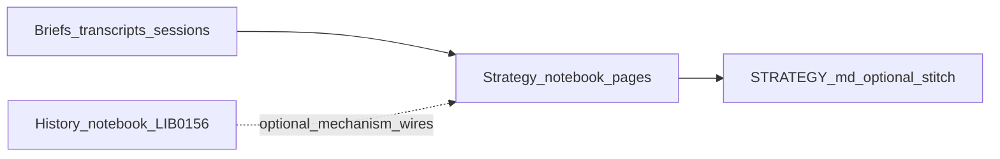
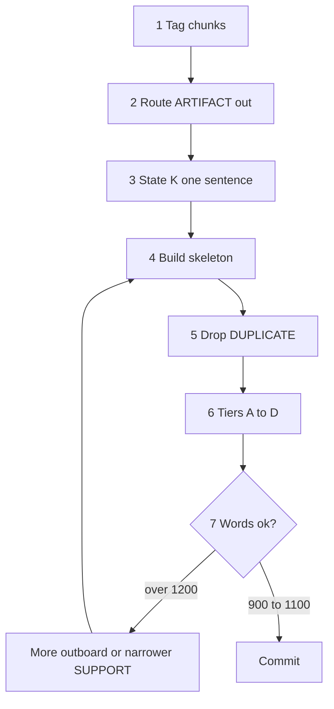

# Strategy notebook — architecture

**Project:** Operator strategy notebook (grace-mar work-strategy)

**Relation to `skill-strategy`:** [`.cursor/skills/skill-strategy/SKILL.md`](../../../../.cursor/skills/skill-strategy/SKILL.md) is the **activation surface** for **`strategy`**. **This document**, [NOTEBOOK-PREFERENCES.md](NOTEBOOK-PREFERENCES.md), and [daily-strategy-inbox.md](daily-strategy-inbox.md) (paste-ready line SSOT) are **incorporated by reference** into that skill — **one contract**, split across files for readability and maintenance, **not** a parallel “architecture-only” track beside the skill.

<a id="current-canonical-model"></a>

## Current canonical model

**One-sentence model:** **experts** = who; **watches** = what (evolving situation); **days** = when (`chapters/YYYY-MM/days.md` chronology and continuity); **minds** = interpretive lens ([`minds/`](minds/) and optional Links-only lines); **pages** = primary analytical unit — **`strategy-page`** marker blocks stored in expert **`thread.md`** files (and optionally duplicated across experts with the same `id=`). **Threads** are containers and continuity lanes; **pages** are the portable analytical objects. Older standalone files under `chapters/…/knots/` (git history) are **not** the current model; inventory is page-based. **Link hub** (pointers, not duplicate spec): [PAGE-CONTRACT.md](PAGE-CONTRACT.md).

<a id="default-operating-path-ssot"></a>

## Default operating path (SSOT)

**Canonical long-form sequence** for work-strategy judgment (inbox-first; complements the three-move minimum in [DEFAULT-PATH.md](../DEFAULT-PATH.md)):

1. **Accumulate** through the day in [`daily-strategy-inbox.md`](daily-strategy-inbox.md) (paste-ready stubs) and **[`raw-input/`](raw-input/README.md)** (full verbatim when needed) — see [Split ingest model](#split-ingest-model) and [raw input archive](#raw-input-archive-7d).
2. **Once per local day (default): end-of-day strategy session** — **compose or revise** thread-embedded pages (`<!-- strategy-page:start` … in `experts/<expert_id>/thread.md` under `## YYYY-MM`) and the matching `chapters/YYYY-MM/days.md` continuity block. **Inputs:** that day’s **`raw-input/`** files (primary bulk), inbox lines, briefs, and (after operator **`thread`**) expert **`transcript.md`** / machine layer — **synthesis** (required **Chronicle / Reflection / Foresight** prose; **`### Appendix`** optional — see [strategy-page-template.md](strategy-page-template.md)), **not** an inbox or raw-input mirror. **Breaking glass:** rare intra-day notebook compose only when the operator explicitly overrides — same synthesis discipline.
3. **Optionally mark** reusable material with lightweight escalation cues (`[watch]`, `[decision]`, `[promote]`) — definitions and sparing-use rules: [NOTEBOOK-PREFERENCES.md#escalation-marker-preference](NOTEBOOK-PREFERENCES.md#escalation-marker-preference).
4. **Escalate artifacts** — watch support, analogy audit, or a **decision point** — only when a signal is maturing and **real options** are needed.
5. **Touch [STRATEGY.md](../STRATEGY.md)** only when a watch, analogy line, operator log arc, or doctrine note has **stabilized** (promotion ladder).
6. **Do not** update Record, SELF, EVIDENCE, or Voice from this lane.

**Expert predictions ledger (optional):** Falsifiable **`pred_id`** adjudication rows and the **`topic_slug` registry** live in [`strategy-expert-predictions.md`](strategy-expert-predictions.md). Run [`validate_expert_predictions.py`](../../../../scripts/validate_expert_predictions.py) from repo root to check roster **`expert_id`**s and registry slugs; CI runs the same check (**Tests** workflow — *Validate strategy expert predictions ledger*).

**Rule of thumb:** **Inbox + `raw-input/`** = capture; **pages** (marker-fenced blocks in expert **`thread.md`** files) = judgment after the **end-of-day strategy session**; **`days.md`** = chronology and continuity.

**Default output path (chat / assistant):** chat → inbox / **`raw-input/`** → **expert-thread pages + `days.md` continuity only in the end-of-day strategy session** (unless breaking glass) — same discipline as [Expert choreography](#expert-choreography) *Output path (default)* below.

<a id="weave-terminology"></a>
<a id="end-of-day-strategy-session-terminology"></a>

## End-of-day strategy session (terminology)

**End-of-day strategy session** (abbrev. **EOD strategy session**) is the **default sole window** for composing or revising **strategy pages** (thread-embedded `strategy-page` blocks in `experts/<expert_id>/thread.md`) and updating **`chapters/YYYY-MM/days.md`**. **Primary evidence pile:** that calendar day’s **[`raw-input/YYYY-MM-DD/`](raw-input/README.md)** files, plus inbox stubs, **`batch-analysis`** rows, and (after operator **`thread`**) expert **`transcript.md`** / machine extraction — **synthesized**, not copied.

**Invocation (canonical):** Say **`strategy page`** or **`strategy page compose`** in chat to start the **notebook page construction** pass — i.e. run **`strategy`** with intent to compose or revise **`strategy-page`** fences and the matching **`days.md`** block. **Disambiguation:** **`strategy page`** / **`strategy page compose`** = operator phrases (the three-word form stresses **compose**); **`strategy-page`** = HTML fence token in `thread.md` ([strategy-page-template.md](strategy-page-template.md)). **Aliases:** **notebook compose**, **EOD strategy session**, **“close the strategy day,”** **“compose from today’s raw-input.”** **`weave` is deprecated** as the operator trigger — do **not** use it in new assistant menus or docs; keep **`python3 scripts/strategy_weave.py`** as the **read-only** cross-expert analysis tool name ([watches/README.md](watches/README.md)), distinct from notebook **page composition**.

**Read-only variant:** Say **`strategy page read`** to run **`strategy`** with **frontier read** intent only — orient on [STATUS.md](STATUS.md), [daily-strategy-inbox.md](daily-strategy-inbox.md), the active **`chapters/YYYY-MM/days.md`** tail, and (if useful) today’s daily-brief lead — **no** edits to `days.md`, **no** new or revised **`strategy-page`** blocks, **no** default inbox append **unless** the operator **also** asks to **capture** / **`strategy ingest`**. Summarize in chat; optional **`strategy-context`** ([work-strategy README](../README.md#strategy-session-helpers-skill-strategy)) for a compact file-grounded readout. Same disambiguation: **`strategy page read`** is an operator phrase; **`strategy-page`** remains the fence token.

Older grep/git and JSONL fields may keep `fold` (e.g. `fold_kind` in [FOLD-LEARNING.md](FOLD-LEARNING.md)). **Long-horizon “weaving”** language in § *Daily strategy inbox* (Rome, Putin, §1 watches) means **integrating a watch channel over months** — **not** the EOD compose session.

**Legacy:** Standalone files under `chapters/…/knots/` were **superseded** in favor of pages; git may retain them. See [strategy-page-template.md](strategy-page-template.md).

## Thread (terminology)

**Page vs thread (short, link hub):** [PAGE-CONTRACT.md](PAGE-CONTRACT.md) — *pages* are analytical units; *thread* files are containers (full layers below).

**`thread`** (operator command — use backticks in prose so it is **not** confused with the inbox verify tail **`thread:<expert_id>`**) runs the expert pipeline via **`bin/thread`** or **`python3 scripts/strategy_thread.py`** (same flags; from repo root):

1. **Triage** (internal, not operator-facing) — routes **`thread:<expert_id>`** lines from **`daily-strategy-inbox.md`** to per-expert **`experts/<expert_id>/transcript.md`** files (append-only, 7-day rolling window, auto-pruned). Operator may lightly edit transcripts for clarity; edits are preserved across runs.
2. **Extraction** — reads each expert's **`transcript.md`** (what the expert said recently) and lists **`strategy-page`** blocks already in that expert's **thread file(s)**, then writes **machine-maintained** material **between** the HTML comment markers (see below). **Default path:** **`experts/<expert_id>/thread.md`**. **Monthly layout:** one file per calendar month — **`experts/<expert_id>/<expert_id>-thread-YYYY-MM.md`** (optional flat **`strategy-expert-<expert_id>-thread-YYYY-MM.md`**); transcript lines are partitioned by date into the matching month file; optional legacy **index** file rows (if any) attach to the **current UTC month** file only. **Human narrative** lives **outside** that block.

**`-thread.md` is layered (in order top to bottom).** **Do not** overload the word **Segment** for these layers — reserve **Segment 1–4** for the **2026 month index** (below).

| Layer | Location in file | Who maintains | Purpose |
|-------|------------------|----------------|---------|
| **Journal layer — Narrative** | **Above** `<!-- strategy-expert-thread:start -->` | Operator / assistant | **Verbatim-forward (default):** the **expert’s voice** in bulk lives in **`transcript.md`** (SSOT) and in the **machine layer** echo below — **not** as long paraphrase in the journal. The journal holds **light gloss** only: month stubs, source/date pins, optional **short** cross-check scope lines, pointers, tension notes — **not** a full analytical rewrite of what the expert said. Heading **`## Journal layer — Narrative (operator)`**; dated **`## YYYY-MM`** segments. The **`thread`** script **never overwrites** this layer. If empty, a one-line stub is fine. |
| **Machine layer — Extraction** | **Between** `<!-- strategy-expert-thread:start -->` and `<!-- strategy-expert-thread:end -->` | `strategy_expert_corpus.py` on each **`thread`** run | **`## Machine layer — Extraction (script-maintained)`** with **`### Recent transcript material`** and **`### Page references`** (and optional **Legacy file-index rows** if `knot-index.yaml` still lists rows). Overwritten each run. |
| **Optional ledger** | **After** `<!-- strategy-expert-thread:end -->` | Operator or future tooling | Optional fenced **`thread-ledger`** YAML/JSON — **not** touched by the default extractor unless a future script is added. |

**2026 month segments (operator index — inside the journal layer):** **`Segment 1`** = **January 2026** (`## 2026-01`); **`Segment 2`** = **February 2026** (`## 2026-02`); **`Segment 3`** = **March 2026** (`## 2026-03`); **`Segment 4`** = **April 2026** (`## 2026-04`, **ongoing**). Later months continue as **`## YYYY-MM`** headings in order. These **month segments** are **not** the machine layer.

<a id="expert-thread-month-segments"></a>

### Expert-thread month segments (parse contract + scripts)

Within the **journal layer**, each **`## YYYY-MM`** heading opens **one month-segment** of the narrative (see [strategy-expert-template.md](strategy-expert-template.md)). Treat boundaries as a **parse contract** for validators and batch-analysis handoff — not decorative.

- **Where a month body ends:** tooling stops the segment at the **next** `## YYYY-MM` **or** at the first line matching `<!-- backfill:` (start of the HTML backfill block). A month segment must **not** include the backfill region; otherwise word counts and segment text for that month are wrong.
- **Backfill placement:** prefer listing **all** calendar `## YYYY-MM` segments **before** `<!-- backfill:<expert_id>:start -->`, with **`## YYYY-MM`** for the partial current month **after** the backfill block if you use one — or keep a single consistent order in-repo; the terminator rule above stays the source of truth.
- **Prose / verbatim minimum:** default expectation is **≥ ~500 words of substantive text per `## YYYY-MM` block** — **either** running prose **or** **markdown blockquotes** (`>`) of the expert (quote-led months are valid under **verbatim-forward** policy), **or** words inside **`<!-- strategy-page:`** … **`end`** --> fences (thread-embedded pages). `python3 scripts/validate_strategy_expert_threads.py` counts **prose lines + blockquote words + strategy-page fence words** toward that threshold; list lines alone do not count. It warns when below threshold or when a month is bullets-only without prose or quotes. To scaffold from roster **Role** / **Typical pairings** (WORK-only; not Record): `python3 scripts/expand_strategy_expert_segment_prose.py --apply` from repo root.
- **After you edit journal-layer month prose materially:** re-run **`python3 scripts/strategy_historical_expert_context.py --expert-id <id> --start-segment … --end-segment … --apply`** when you rely on `artifacts/skill-work/work-strategy/historical-expert-context/` per-month or rollup files for that window — so batch-analysis and prompts see updated stance text.

**Legacy:** Older docs called the split **Segment 1** (journal) vs **Segment 2** (machine). That collided with **month** “segments.” Current wording: **journal layer** / **machine layer** for file structure; **Segment 1–4** = **2026-01–04** month index only.

**Assistant default after `thread`:** Refine the **narrative journal** (above markers) **without** replacing **machine extraction** with summary-only narrative. Prefer **light framing + pointers** to **`transcript.md`** and to the machine block; where the operator wants **continuous** text, keep it **verbatim-forward** (quote-led or short gloss), not a paraphrase of the expert that duplicates the corpus. **Do not** replace the journal with bullets-only stubs unless the operator asks.

**Legacy:** Older **`-thread.md`** files may still hold long prose **inside** the markers; on the next **`thread`** run that prose can be **replaced** by raw extraction. **Migration:** move journal paragraphs **above** the start marker when editing those files.

**What it is not:** **`thread`** does **not** update **`days.md`**, journal-layer **`strategy-page`** blocks, or the inbox **`Accumulator for:`** line. It is **not** a substitute for the **EOD strategy session** (notebook compose). Transcript or aggregator output still lands in the **inbox** first (paste-ready lines + **`thread:`** when the cold line attributes speech to a named indexed expert).

**Per-folder model:** Each expert has its own folder **`experts/<expert_id>/`** with companion files — **`profile.md`** (cognitive profile — operator-authored, stable), **`transcript.md`** (7-day rolling verbatim **from inbox** — first `thread:` line plus optional continuation paragraphs; target **≤ ~2000 words** per block, soft **≤ ~20k words** per file after prune), **thread file(s)** (**journal layer** + **machine layer** + optional ledger; **`strategy-page`** fences live in the journal layer), and optional **`mind.md`** (extended CIV-MIND profile). **Legacy:** a single **`thread.md`** holding multiple **`## YYYY-MM`** segments. **Monthly chapters:** **`experts/<expert_id>/<expert_id>-thread-YYYY-MM.md`** per month (see [strategy-expert-template.md](strategy-expert-template.md)). The **`thread`** command updates transcripts and **only the marked machine block** in each thread file it touches; the profile file is never script-modified. **Templates** are maintained as **one** bundle: [strategy-expert-template.md](strategy-expert-template.md) (jump anchors at top of that file). See [watches/README.md](watches/README.md) for the pages-in-threads model.

**Dual on-disk layout:** [`rebuild_threads`](../../../../scripts/strategy_expert_corpus.py) (via **`thread`**) writes **`experts/<expert_id>/thread.md`** when no monthly **`<expert_id>-thread-YYYY-MM.md`** files exist for that expert; otherwise it updates **each** monthly file’s machine layer. Some trees also keep a flat **`strategy-expert-<expert_id>-thread.md`** or **`strategy-expert-<expert_id>-thread-YYYY-MM.md`** at the notebook root; [`validate_strategy_expert_threads.py`](../../../../scripts/validate_strategy_expert_threads.py) accepts those patterns. Treat **one** layout as canonical for human edits in your workflow; after **`thread`**, confirm which file’s machine block updated so you do not edit a stale duplicate.

**Migration:** `python3 scripts/migrate_thread_md_to_monthly.py --apply` splits a legacy **`thread.md`** journal into **`<expert_id>-thread-YYYY-MM.md`** files; run **`thread`** afterward to refresh machine layers.

<a id="expert-thread-cross-check-blocks"></a>

### Cross-check blocks (hybrid) and tier discipline

Optional **`### Cross-check (…)`** subsections in the **journal layer** (inside a **`## YYYY-MM`** month segment, **above** `<!-- strategy-expert-thread:start -->`) fold one expert’s structured claims against **other named `thread:`** lanes and against **daily-brief §1e / maritime / wire** discipline when the crisis touches those surfaces.

- **Hybrid format:** One **scope** line (sources + tier tags + which **`thread:`** experts the matrix uses). Then **either** a compact **markdown table** (e.g. thesis × Davis × Pape × §1e/wire) **or** **`[strength: …]`** bullets when a table is noisy or columns multiply — operator choice per ingest.
- **Balanced §1e:** State the **seam** in one sentence (material / theory / forecast). Do **not** duplicate full §1e tables or every maritime primary inside every expert file — **point** to the matching **`chapters/YYYY-MM/days.md`** block and **`batch-analysis`** rows for dense falsifiers and instrument-grade detail.
- **`days.md` Links:** When the cross-check is tied to a **major** ingest — long-form essay (e.g. Substack-tier), a **`batch-analysis`** line, or a **page- / compose-facing** seam — add **one** bullet under that day’s **`### References`** pointing back to the expert thread section (journal cross-check or month segment). Routine short ingests do **not** require this unless the operator wants traceability.

Apply **prospectively**; no obligation to backfill older months unless you explicitly schedule it.

<a id="split-ingest-model"></a>

### Split ingest model (operator direction — planned)

**Problem:** Long verbatim belongs in **`experts/<expert_id>/transcript.md`**, but **unified discovery** still needs a **grep-friendly registry** and a **single habitual action** (see operator preference: stub + corpus + one command).

**Policy (target):**

| Layer | Role |
|-------|------|
| **[`daily-strategy-inbox.md`](daily-strategy-inbox.md)** | **Index / stub** — at minimum one paste-ready line per capture: **`thread:<expert_id>`**, **`aired:YYYY-MM-DD`** (or equivalent) when the event has a clear **air/publication date**, short **cold** / **hook**, **URL**, **`verify:`**. Same tags as today so **`rg`** across the inbox stays the primary “what did we file?” sweep. |
| **`experts/<expert_id>/transcript.md`** | **Corpus** — long quoted speech under **`## YYYY-MM-DD`** where that date is the **air/publication day** (not only “the day I typed”). Continuation paragraphs follow the [long-form verbatim](daily-strategy-inbox.md#long-form-verbatim-thread) rules. Triage targets **≤ ~2000 words** per ingest block (soft caps). |
| **[`raw-input/`](raw-input/README.md)** | **Full retention (7 days)** — **unabridged** capture (transcripts, RSS merge targets **`YYYY-MM-DD-<expert_id>.md`**, sidecars, bundles) in **`raw-input/YYYY-MM-DD/`**. **Refined day pages** (e.g. **`experts/mercouris/mercouris-page-YYYY-MM-DD.md`**) are **not** raw-input. Separate from the inbox. Same rolling calendar window as expert transcripts; **prune is operator-initiated** — **`prune_strategy_raw_input.py --apply`** is **blocked** while **[`raw-input/.pruning-suspended`](raw-input/.pruning-suspended)** exists unless **`--override`** (see [raw-input/README.md](raw-input/README.md) § Pruning). |
| **`python3 scripts/strategy_thread.py`** (today) | Triage + extraction from inbox → transcript → machine block; **until** a dedicated command ships, triage still assumes inbox-sourced `thread:` blocks. |

**Unified search:** Treat **inbox + `experts/*/transcript.md` + `raw-input/`** as one habit: grep inbox for stubs; grep **`raw-input`** for full text when the operator stored it there; grep transcripts for triage-sized verbatim — **or** (future) a generated rollup listing pointers only. **Not** Record.

<a id="raw-input-archive-7d"></a>

### Raw input archive (7-day full retention)

When you need the **entire** transcript or **all** pasted inputs on disk for roughly a week — without stuffing the inbox or splitting across **`thread`** word budgets — write under **[`raw-input/`](raw-input/README.md)** and keep **[`daily-strategy-inbox.md`](daily-strategy-inbox.md)** to a **stub** that points at the file (e.g. **`verify:`** tail with `raw-input/YYYY-MM-DD/slug.md`). **Prune** dated folders only when **you** run **`scripts/prune_strategy_raw_input.py`** (no CI automation). While **`raw-input/.pruning-suspended`** is present, **`--apply`** requires **`--override`**. **Git** may still recover pruned paths from history if committed.

**Transition:** Current tooling remains valid; a future **`strategy_ingest`** (name TBD) would implement “one command” below without deleting the inbox as registry.

<a id="planned-strategy-ingest-cli"></a>

### Planned unified ingest command (CLI sketch — not implemented)

Single entry point (working name **`strategy_ingest`** or fold into **`strategy_thread`**) — **one invocation** that updates stub + corpus + runs refresh as needed.

| Flag / arg | Purpose |
|------------|---------|
| **`--expert <expert_id>`** | Required for expert-tagged ingest; must match [strategy-commentator-threads.md](strategy-commentator-threads.md) slug. |
| **`--aired YYYY-MM-DD`** | **Air / publication date** for the segment (drives **`##`** section in **`-transcript.md`**). Optional only if stub-only. |
| **`--stub-only`** | Append/update **inbox** line only (short line + URL + tags); no long body. |
| **`--from-file <path>`** | Body text from file (avoids shell quoting); written to transcript block under **`--aired`**. |
| **`--stdin` / `-`** | Read long body from stdin (optional alternative to **`--from-file`**). |
| **`--inbox-path`** | Override default [`daily-strategy-inbox.md`](daily-strategy-inbox.md) (advanced). |
| **`--dry-run`** | Print planned writes; no file changes. |
| **`--skip-thread`** | Write stub/body only; do **not** run extraction (optional escape hatch). |

**Default behavior (sketch):** With **`--expert`**, **`--aired`**, and body (**`--from-file`** or stdin), write **(1)** stub line to inbox with **`aired:`** + **`thread:`**, **(2)** append verbatim under **`## aired`** in **`-transcript.md`**, **(3)** invoke existing **`thread`** pipeline to refresh machine segments. **`--stub-only`** skips (2)–(3) or runs a minimal path.

**Implementation** is **future `EXECUTE`** — this section is the contract placeholder only.

<a id="verbatim-thesis-scaffold"></a>

### Verbatim thesis scaffold (operator methodology)

**Purpose:** Fit a long expert transcript into the **≤ ~2000 words per ingest** target for `experts/<expert_id>/transcript.md` **without changing any of the expert’s words** — by **dropping whole sentences only**, selected for **argument weight**.

**Pipeline (manual or assisted):**

1. **Ingest** the full transcript (into the dated `~~~text` block or your working copy).
2. **Name 3–6 major theses** — what the episode is *arguing* in distinct threads (not a summary of everything said).
3. **Order** those theses for **coherence** (logical build, narrative arc, or the order that matches how *you* will reuse the material in the **EOD strategy session**).
4. Under each thesis, **paste verbatim sentences** from the transcript — **strongest first** — until the **total** is **≤ 2000 words**. Trim by removing **whole sentences** from the bottom of each thesis block (or deduplicating near-repeats) until under budget.

**Editorial layer:** The **thesis list and order** are interpretive; the **sentences** stay verbatim. Treat the scaffold as **WORK** compression, not a substitute for keeping a fuller verbatim archive elsewhere if you need auditability.

**Optional pass 0 (automated):** `python3 scripts/abridge_verbatim_transcript.py` — **sentence-only** boilerplate trim and length cap — can clear greetings and low-value lines *before* you pick theses. It does **not** replace thesis selection.

**Strong-sentence discipline:** Use the repeatable checklist and tie-break rules in [THESIS-SCAFFOLD-CHECKLIST.md](THESIS-SCAFFOLD-CHECKLIST.md) (printable one-pager).

**Where to put bold theses and separated paragraphs:** [strategy-expert-template.md — Thesis-first verbatim scaffold](strategy-expert-template.md#thesis-scaffold-pattern) (markdown above `~~~text` in the same `transcript.md` date section — not a separate `*-thesis-scaffold-FULL.md` file).

**Full verbatim when the fence is thesis-scaffold only (archive policy):** If the dated `~~~text` block in `experts/<expert_id>/transcript.md` holds a **≤ ~2000 word** scaffold (thesis-selected and/or sentence-trimmed) instead of a full episode paste, **dropped sentences are not recoverable from that fence**. Before relying on a trimmed fence as the only copy, choose **at least one** archive for the longer or full text:

| Archive | Use when |
|--------|----------|
| **Git history** | You committed the long paste earlier; recovery is `git show` / `git log -p` on the transcript path (good for one-off corrections). |
| **Optional full-linear file** | You want an explicit, grep-friendly **full episode** paste in-repo (any stable name). **Thesis layout** (bold labels, `---`, thesis sections) belongs in [`strategy-expert-template.md`](strategy-expert-template.md#thesis-scaffold-pattern) on the **same date** as markdown **above** `~~~text`, not a parallel `*-thesis-scaffold-FULL.md` file per episode. |
| **Out-of-repo** | Original transcript lives in notes, YouTube description, or another store; link it from the inbox stub or the date section if stable. |

**In-file layout:** Prefer **thesis markdown above `~~~text`** per [strategy-expert-template.md — Thesis-first verbatim scaffold](strategy-expert-template.md#thesis-scaffold-pattern) instead of a second notebook file for thesis structure. **Cross-link** to an optional **full-linear** archive only when that file holds material not in the transcript (e.g. uncut paste). Not Record.

#### Worked example — Alexander Mercouris · air date **2026-04-16**

Source: [`experts/mercouris/transcript.md`](experts/mercouris/transcript.md) **`## 2026-04-16`** `~~~text` fence (thesis-scaffold verbatim trimmed to policy). **Shape** for bold theses + separated paragraphs: [strategy-expert-template.md#thesis-scaffold-pattern](strategy-expert-template.md#thesis-scaffold-pattern). Below: **five theses** in narrative order, each with **sample verbatim sentences** (short excerpt table — same episode).

| Order | Thesis (operator label) | Verbatim scaffold (excerpts) |
|------|-------------------------|--------------------------------|
| 1 | **Pakistan–Iran bridge and the Iran theatre** — Munir’s visit, public escort, **falsification** of “destroyed” air force | “At present, the main news concerning this conflict is the arrival in Tehran of the Chief of the Army Staff of the Pakistani armed forces, Field Marshal Asim Munir.” / “There may have been covert visits by officials from countries such as China or Russia, but Field Marshal Munir arrived publicly. His aircraft was escorted by Iranian fighter jets — MiG-29s and F-4 Phantoms — as it landed in Tehran.” / “President Trump has repeatedly claimed that the entire Iranian air force has been destroyed. Clearly, that is not the case.” |
| 2 | **U.S. theory of victory and next escalation** — succession of methods, **regime change** as telos, ceasefire as prep, ground-op rumour | “The story of this conflict since 28 February has been one of the United States trying a succession of different approaches — missile strikes (often in coordination with Israel), assassinations, attacks on ports, and now a sea blockade — in the hope that one will finally unlock regime change in Iran, which I remain convinced is the ultimate objective of both the US administration and Israel.” / “Expectations of what the sea blockade can achieve are, in my view, greatly exaggerated.” / “As I discussed yesterday, the Russian Security Council has issued its own intelligence assessment, which envisages the United States attempting some form of ground operation next week — possibly against Iranian islands in the Strait of Hormuz, Kharg Island, to seize enriched uranium stockpiles near Isfahan, or even the Bushehr nuclear power plant.” |
| 3 | **China and the blockade as precedent** — Malacca / maritime access fears, logistics debate, **Cuban Missile Crisis** analogue | “What worries Beijing most is not just any temporary disruption of Iranian oil supplies, but the precedent of the United States imposing a naval blockade on a country with which China has active and important trade relations.” / “For China — the world’s largest trading nation and a major importer of energy and raw materials — such actions look like a dress rehearsal for a potential future blockade of China itself, perhaps closing the Strait of Malacca or access to the East and South China Seas.” / “Any scenario in which Chinese warships begin escorting Iranian tankers in defiance of a US-declared blockade would represent a major international crisis — one not far removed in danger from the 1962 Cuban Missile Crisis, which also involved a naval blockade challenged at sea.” |
| 4 | **Russia–Gulf diplomacy** — Lavrov–Saudi readout, regional dialogue, **proposals vs. U.S. objection** | “The ministers exchanged views on the situation in the Strait of Hormuz following the US-Israeli attacks on Iran and Tehran’s responses.” / “The Russians and Saudis also called for a broader dialogue involving all interested parties to coordinate long-term stability and security in the region based on a balance of interests.” / “So far, this remains only proposals and ideas. The United States will object strongly.” |
| 5 | **Ukraine / Europe coda** — strikes, **drone production in Europe**, Sumy pressure | “On the military front, the key development in the last 24 hours was another large-scale Russian strike on Ukraine involving Geran drones, Kh-101 cruise missiles, and Iskander ballistic missiles.” / “The Russian Defence Ministry and Dmitry Medvedev have also highlighted that Ukrainian drone production has largely shifted to Europe.” / “There has also been movement on the front lines, particularly in the Sumy region. The Russians have begun leafleting the city of Sumy with political messages questioning Zelensky’s legitimacy.” |

## Thesis

A **cumulative, page-organized record** of how the operator reads signals, weighs analogies, and steers frameworks (Islamabad, Rome, briefs, STRATEGY) — distinct from [work-strategy-history.md](../work-strategy-history.md) (lane events) and from [STRATEGY.md](../STRATEGY.md) (milestone ledger). Under **`skill-strategy`**, this notebook is the **primary surface for governed strategic accumulation** in WORK: **explicit seams**, **explicit promotion** to [STRATEGY.md](../STRATEGY.md) when arcs stabilize, and **explicit distance** from companion **Record** truth ([AGENTS.md](../../../../AGENTS.md)).

### Symphony of Civilization (operator gloss)

**Symphony of Civilization** is the notebook’s **polyphonic** image: **multiple civilizational and expert registers** (voice planes in briefs, indexed commentators in [strategy-commentator-threads.md](strategy-commentator-threads.md)) sound **together** without **collapsing** into one melody. Each **page** (per expert thread) is a **movement** on the **score**; **`batch-analysis`** names **convergence vs tension** between **parts**. **Experts** (indexed voices) supply **instrument lines**; the **operator** sets **balance and tempo** (**EOD strategy session**, Thesis A/B, **`verify:`** discipline)—not the experts.

### Operator as conductor (short pointer)

The operator is the **conductor**, not another instrument: they **do not** replace expert voices or raw inputs; they **shape** **Journal-layer** judgment, **emphasis**, and **promotion** while scripts maintain the **Machine** layer. **Polyphony** (preserved tensions) beats false consensus. Full role contract, orchestra comparison, and **master-conductor technique** shorthand live in [SYNTHESIS-OPERATING-MODEL.md § Operator as conductor](SYNTHESIS-OPERATING-MODEL.md#8-operator-as-conductor) — practical “modes” (precision, expression, economy) under **Techniques inspired by the masters** there. **Derived** multi-expert snapshots: [compiled-views/README.md](compiled-views/README.md).

**Concrete workflow map** (where polyphony vs conducting happen on disk and in session): [SYNTHESIS-OPERATING-MODEL.md § Where this shows up in your workflow](SYNTHESIS-OPERATING-MODEL.md#where-this-shows-up-in-your-workflow).

### Primary output (work-strategy)

**Thread-embedded strategy pages** (`strategy-page` blocks in `experts/<id>/thread.md`) are the **primary written units** of the work-strategy lane: **synthesized judgment** composed in the **EOD strategy session**. `days.md` + `meta.md` provide chronology and month-level state. When you use a calendar block in `days.md`, prefer **one `## YYYY-MM-DD` section per day you actually commit** — not a mandatory stub every day. **Inputs** that feed it — daily briefs, transcript digests, sessions, weak-signal notes, framework drafts — are **not** substitutes for the notebook; they inform **composed** pages after the **EOD session**.

**Operator preferences** (minimum sections, variable length vs default word band, EOD compose rhythm, lens offers, weekly promotion, Thesis A/B splits): [NOTEBOOK-PREFERENCES.md](NOTEBOOK-PREFERENCES.md) — **narrows** practice; architecture below remains the repo spec when no override applies.

<a id="terminology-chapter-day-page"></a>

### Terminology (chapter / day / page)

The word **“page”** is overloaded in this lane. Use the table below as the default map for **structure and evolution** (operator gloss: **one month = one chapter**, **one committed notebook day = one day page** in `days.md`). That gloss refers to the **chronology layer**, not to a count of **`strategy-page`** fences.

| Operator gloss | On-disk unit | Role |
|----------------|--------------|------|
| **Chapter** | One folder `chapters/YYYY-MM/` | One **calendar month**; contains `meta.md` + `days.md`. |
| **Day page** | One `## YYYY-MM-DD` section in that month’s `days.md` | **Chronology / synthesis** for that notebook day when you commit it (Chronicle / Reflection / References / Foresight). You are **not** required to open a dated section for every local calendar day — see § *Entry model* below. |
| **Strategy-page** | `<!-- strategy-page:start` … `<!-- strategy-page:end -->` in `experts/<expert_id>/thread.md` | **Expert-thread judgment** unit (primary written unit for **EOD compose**); **many** per month are normal; multi-expert sessions reuse the same **`id=`** across files. |

**“Day page”** means the **`days.md` dated section** only. **`strategy-page`** is a separate token for expert-thread analysis. Do **not** read “one day = one page” as “one calendar day implies exactly one `strategy-page`.”

**Going forward:** This chapter / day page / **strategy-page** map is the **default vocabulary** for describing strategy-notebook structure in **new and revised** notebook docs, **skill-strategy** / EOD-session explanations, and assistant answers — unless the sentence is specifically about the **`strategy-page`** HTML fence or tooling. It does **not** require a repo-wide search-replace of legacy “page” wording; apply it when adding or editing relevant material.

## Entry model (operator contract)

**Hybrid spine (default):** The notebook uses **`## YYYY-MM-DD`** dated blocks in `days.md` as the **chronology layer** — tracking which **pages** were active, what changed, and what should be resumed tomorrow. Expert-thread **pages** hold the substantive writing. `days.md` also allows **episodic or thematic** top-level sections when one day is not the right unit — e.g. `## Compose — YYYY-MM-DD–YYYY-MM-DD (short label)` or `## Lens pass — Barnes — YYYY-MM-DD`. You are **not** required to produce **exactly one** dated section per local calendar day. Prefer **one substantive block per EOD session** over empty stubs.

**Meta-led retro months:** When contemporaneous capture was thin, a chapter may place the **full monthly narrative** in [`chapters/YYYY-MM/meta.md`](chapters/2026-01/meta.md) with a **short episodic** [`days.md`](chapters/2026-01/days.md) (e.g. `## Chapter synthesis — YYYY-MM`) instead of daily decomposition — see [strategy-notebook README § Chapters](README.md).

**Inbox vs notebook:** [`daily-strategy-inbox.md`](daily-strategy-inbox.md) is the **raw accumulator** (firehose, paste-ready lines); **[`raw-input/`](raw-input/README.md)** holds **full verbatim** for the rolling window. **`days.md` / episodic headings** hold **synthesized** judgment (Chronicle / Reflection / References / Foresight — not a raw dump). **EOD notebook compose** (scratch + **`raw-input/`** → judgment) is a **meaning move**, not a file-sync.

<a id="days-md-date-semantics"></a>

### `days.md` date keys — semantics and anti-split (assistants)

**Three different clocks** often appear in the same **EOD compose pass** — do **not** conflate them:

| Clock | Examples | Implication for `days.md` |
|-------|----------|---------------------------|
| **Operator boundary** | “I have not uploaded anything after **2026-04-16**” | Sets the **latest day block** that should claim **operator-sourced** material unless the operator adds more. **Do not** open **`## 2026-04-17`** solely to park assistant work. |
| **Session / inbox mechanics** | **`Accumulator for: YYYY-MM-DD`** (host clock), assistant session date, **`### Expert X / YT ingest — YYYY-MM-DD`** inside the inbox | **Organizational keys** for scratch and grep — **not** automatic instructions to create a **new** `## YYYY-MM-DD` in `days.md`. |
| **Third-party publication** | Wire dates (WSJ **Apr 15**), **`aired:YYYY-MM-DD`**, air/publication day on **`-transcript.md`** | Belongs in **Signal / Links** and **cite lines** — **not** proof that the **notebook day heading** must match that calendar date. |

**Anti-split defaults (EOD session / `strategy` with notebook write):**

1. **Prefer one consolidated `## YYYY-MM-DD` per EOD session** when the material is one logical pass — extend the existing block for that **notebook day** (see § *Same-day iteration* under [Compose choice and section weighting](#weave-choice-and-section-weighting-inbox--yyyy-mm-dd)) rather than splitting across **successive calendar headings** because the **accumulator** rolled forward or a **batch-analysis** line used a different date.
2. **Never** append a **new** bottom `## YYYY-MM-DD` in `chapters/…/days.md` **only** because: the **`Accumulator for:`** line shows a later local date; an inbox subsection title includes **`2026-04-18`**; or an external article’s byline date is later than the operator’s last upload — **unless** the operator explicitly wants a separate calendar day or the session is genuinely **day-separated** judgment.
3. If one block mixes **operator scope** with **older/newer wire dates**, add a short **compose date note** (legacy: **weave date note** — operator boundary vs publication dates) in **Signal** or **Links** — do **not** imply the heading date is an **upload receipt**.
4. **`STATUS.md` — Last substantive entry:** Must point at a **real** `##` anchor in `days.md` (or episodic heading). After consolidating blocks, **update or remove** stale links to deleted headings.

**Related:** [`daily-strategy-inbox.md`](daily-strategy-inbox.md) header (**Accumulator** vs **`days.md`**); [.cursor/rules/strategy-notebook-days-date-semantics.mdc](../../../../.cursor/rules/strategy-notebook-days-date-semantics.mdc).

**Continuity (light):** [STATUS.md](STATUS.md) tracks **last substantive notebook work** (dated block or episodic compose pass) — a **hint**, not debt enforcement. Update it when you close a real entry; do not bump it for empty placeholders.

**`dream` (night close):** End-of-day maintenance **does not** obligate strategy-notebook production. `auto_dream.py` may still report `strategy_notebook_missing_day_headers` as **FYI**; treat it as optional telemetry unless you adopt calendar-strict habits again. Default **notebook pages** are composed in the **EOD strategy session**; **`dream`** may still **explicitly** direct notebook work in-thread — see [.cursor/skills/dream/SKILL.md](../../../../.cursor/skills/dream/SKILL.md) § *Strategy notebook*.

**SELF-LIBRARY mirror:** Canonical files live here under `docs/skill-work/work-strategy/strategy-notebook/`. A symlink under `users/<id>/SELF-LIBRARY/strategy-notebook` is **convenience** only — keep mirrors in sync with edits to the canonical tree.

<a id="eod-mcq-protocol-v1"></a>

**EOD MCQ protocol (v1) — optional structured path:** When the operator wants **decision-first** routing (**EOD strategy session — MCQ**, paste [EOD-MCQ-PROTOCOL.md](EOD-MCQ-PROTOCOL.md), or equivalent), assistants run **Stage 0** (evidence pile) then **Menus 1–6**: session type → active lanes (canonical **`expert_id`**) → per-lane **promotion threshold** → **page shape** → **page action** (mechanical) → **`days.md` continuity mode** — **before** drafting **`strategy-page`** prose. **Fast path** in that doc skips Menu 5 when append/revise/split is obvious. **Minimal path (still default for speed):** present only the **4–6** thesis-first **page-shape** stubs below — no full MCQ stack — when the operator says **`no menu`**, **`EXECUTE`** with explicit thesis, or asks for the light fork only.

<a id="weave-command-page-shape-menu"></a>

**EOD compose — page-shape menu (assistant behavior):** At the **EOD strategy session** (or **breaking-glass** compose), when the operator runs **`strategy`** with **notebook compose** intent, **before** editing `days.md` or **`strategy-page`** blocks, present **4–6 labeled options** (e.g. **A–F**) that name **distinct page shapes / theses / content emphases** for **today’s** material (inbox + **`raw-input/`** + verified sources)—not a generic work-lane menu (not coffee **A–E**, not “strategy vs dev”). Each option is a **one-line stub**: what the **page argues**, what gets **compressed** into **Judgment**, which **`thread:`** experts get a **duplicated** logical page, or **continuity-only** `days.md` vs **case-index**-thin cite, **verify-first** compress, **tri-mind** summary in chat vs in-page, **batch-analysis** tail only, etc. **Page length:** there is **no** word-count target or ceiling on a single **`strategy-page`**; very long one-file pages are uncommon in practice. When **`### Appendix`** is present, keep **machinery** there (outside readable body weighting). The appendix is **optional** — see [strategy-page-template.md](strategy-page-template.md) § *Machine checks*. Menu stubs should **signal density** (thin vs carry to `days.md`, links-heavy, etc.), not a word band. **Present, don’t pre-develop:** no full prose until the operator picks a letter (or **`no menu`**, or **EXECUTE** with an explicit thesis). If **one** shape is clearly dominant, still list **alternates** so the fork has **at least four** real choices unless the operator forbids the menu. **Do not** add new **`strategy-page`** blocks outside the **EOD session** unless **breaking glass** (see [watches/README.md](watches/README.md)). *Legacy § title:* “Weave command — page-shape menu.”

**Multi-pick EOD options:** When the operator selects **two or more** menu letters (e.g. **C** and **D**) and each implies a **different primary `strategy-expert`**, **different page type**, or **non-mergeable** Judgment, default to **one logical page per letter**, **duplicated** into each involved expert’s **`thread.md`** with the same **`id=`** / date — and **one** matching **`days.md` Signal** line. For **shared** `id=` / date across experts, **Judgment** should differ by **voice** (perspective), not only the **`Also in:`** line — same logical page, distinct reads per lane. **Do not** merge into a **single** expert’s page **unless** the operator explicitly asks. See [.cursor/skills/skill-strategy/SKILL.md](../../../../.cursor/skills/skill-strategy/SKILL.md) (Multi-pick).

<a id="page-design-notebook-use-jobs"></a>

**Page design and notebook-use jobs:** In addition to thesis and section emphasis, each page-shape stub should **signal which analyst job(s)** the resulting page would foreground — align with the seven **Notebook-use** vocations in [strategy-commentator-threads.md](strategy-commentator-threads.md) § *Notebook-use tags (reverse index)* (`orient`, `negotiate`, `validate`, `authorize`, `stress-test`, `narrate`, `historicize`). Examples: a page centered on **throughput and material break points** reads as a **stress-test** move; one on **talks room and sequencing** reads as **negotiate**. Write each option **thesis-first**; add the implied job as a **short clause or parenthetical**, not as a standalone tag picker. A single page may **combine** jobs (e.g. **orient** to open the frame, **validate** to close on falsifiers); that sequence should **inform** Signal vs Judgment vs Open weighting once the operator picks.

**Legacy note:** Older text referred to a “page-shape” menu or the deprecated **`weave`** token; the **page-shape** fork above is the **default** assistant contract for the **EOD session** unless the operator opts out.

**Compose skeletons (S1–S5):** When the operator picks a **primary `strategy-expert`** for the EOD session (or accepts a menu default), [NOTEBOOK-PREFERENCES.md](NOTEBOOK-PREFERENCES.md) § *Weave skeletons (S1–S5)* (name unchanged for grep) defines **five** optional **spines** (operations, power/incentives, legitimacy/room, domestic machinery, markets/macro) and a **failure mode** per spine — **orthogonal** to the **page-shape menu** above; combine both when useful.

**Notebook-use tags (EOD-adjacent, assistant):** Expert profiles carry **Notebook-use tags**; the **reverse index** in [strategy-commentator-threads.md](strategy-commentator-threads.md) § *Notebook-use tags (reverse index)* lists experts by job. When **EOD menu** options or operator intent imply **which indexed voices** to foreground or compare (e.g. diplomatic room-read vs operational plausibility vs media narrative), use tags as a **shortlist aid** alongside **Role**, **Typical pairings**, and correct **`thread:`** attribution. Tags **align** page design with voice selection when the page-shape stub and the profile share the same job family (see § *Page design and notebook-use jobs* above); they are **not** a substitute for the **thesis line** in each menu option or for **S1–S5** primary-expert weighting.

**Shared date key (work-xavier):** The [Xavier journal](../../../work-xavier/xavier-journal/README.md) uses the same **`YYYY-MM-DD`** identifier for daily files (`YYYY-MM-DD.md`). Strategy pages stay in month `days.md` (or `pages/YYYY-MM-DD.md`); Xavier stays in `xavier-journal/` — same calendar key, different folder and purpose.

## Expert choreography

**Two planes:**

1. **Commentator / expert threads** ([strategy-commentator-threads.md](strategy-commentator-threads.md)) — **longitudinal** lanes: what each named voice said over time so you can track **accuracy**, **narrative drift**, and **compare–contrast** across experts. Ingests use **`thread:<expert_id>`** (see that file). This is the **bookkeeping and evidence** plane for *who said what*. **Per-folder model:** each expert has `experts/<expert_id>/profile.md` (cognitive profile), `transcript.md` (7-day rolling verbatim from inbox triage), `thread.md` (analytical thread with journal layer, machine layer, and pages), and optional `mind.md`. Run operator **`thread`** — `python3 scripts/strategy_thread.py` — to auto-triage and extract.

2. **Tri-mind (Barnes → Mearsheimer → Mercouris)** — a **mode of analysis** for high-stakes mechanism and tradeoffs. It is **not** defaulted into the notebook as a full tri-frame wall. Run it in **chat**, [minds/outputs/](minds/outputs/) or [demo-runs/](demo-runs/) as needed; in the **EOD session**, the notebook gets **compressed judgment + Links**, not the raw three-lens essay unless you explicitly want a short in-page summary.

**Offer rule:** When **`strategy`** engages **load-bearing geopolitical** claims, the assistant **may offer** a lens / tri-mind pass — not on every trivial edit.

**Output path (default):** **Chat** → **inbox** / **`raw-input/`** (cold / hook lines per [daily-strategy-inbox.md](daily-strategy-inbox.md)) → **`days.md` + `strategy-page` only in the EOD strategy session** — same synthesized discipline as the rest of the notebook.

**Verify before depth:** On **disputed current facts**, run **verify** (or queue `verify:`) **before** deep tri-mind work — lenses address **mechanism and tradeoffs**, not laundering contested numbers or quotes.

**Operator menu (nested):** **Intent** first (brief / inbox / arc / verify / lens). If the branch warrants it, show a **second** submenu (e.g. lens choice, tri-mind vs single-lens). Avoid a flat five-option wall every session. Details remain in [MINDS-SKILL-STRATEGY-PATTERNS.md](minds/MINDS-SKILL-STRATEGY-PATTERNS.md) and [.cursor/skills/skill-strategy/SKILL.md](../../../../.cursor/skills/skill-strategy/SKILL.md).

**Success (rough):** Clearer **month arc** and **polyphony** in `meta.md`; **more consistent** tri-mind when **stakes are high** — not necessarily more tri-mind pages in total.

<a id="daily-strategy-inbox-accumulator"></a>

### Daily strategy inbox (accumulator)

**Accumulator date:** The inbox’s **`Accumulator for: YYYY-MM-DD`** line tracks the **local calendar day from the system timestamp** (host clock / session “today” when the file is maintained). **EOD notebook compose** does **not** advance that date by policy—only **calendar rollover** (or an edit that syncs the line to the clock) does. See [`daily-strategy-inbox.md`](daily-strategy-inbox.md) header.

**EOD compose timing:** **Default:** **one end-of-day strategy session** per local day composes inbox + **`raw-input/`** (+ briefs, verified sources) into **`days.md`** and **`strategy-page`** blocks — **not** automatic at **`dream`**, and **not** continuous intra-day unless **breaking glass**. When you compose into a **dated** block, align the target **`## YYYY-MM-DD`** with the **calendar day** you intend (timestamp-aligned). Updating **`Accumulator for`** at calendar rollover is unchanged — see [`daily-strategy-inbox.md`](daily-strategy-inbox.md) § *EOD strategy rhythm*.

**File:** [`daily-strategy-inbox.md`](daily-strategy-inbox.md) — **append-only** during the local day for rough captures (bullets, links, paste). **`strategy`** sessions **add** here first if you want separation between scratch and finished page; you may still draft directly in `days.md` when you prefer. The **canonical, grep-friendly line format** for strategy ingests (“paste-ready one-liner”) is specified **only** in that file’s § *Paste-ready one-liner (canonical unit)* — not duplicated here. **Optional two-tier gist** (`cold: … // hook: …`) separates **source paraphrase** from **notebook placement** — same subsection. **Multi-item** capture with optional **common analysis** (one line per excerpt, plus an optional `batch-analysis` note) lives in that file’s § *Multi-item ingest (optional common analysis)*.

**Per-expert rolling mirror:** Ingest lines that carry **`thread:<expert_id>`** are automatically triaged into `experts/<expert_id>/transcript.md` and extracted for thread distillation into `thread.md` via **`python3 scripts/strategy_thread.py`** (operator **`thread`**); crossing rules and optional `verify:` tails stay in [strategy-commentator-threads.md](strategy-commentator-threads.md).

**Batch-analysis (joint pattern line):** Optional single metadata line `batch-analysis | YYYY-MM-DD | <short label> | <body>` stating how **multiple** ingests relate for the **EOD session** (tension, comparison, or *optional weak* convergence—never a substitute for each line’s own `verify:`). The line must **stand alone** when read in isolation: there is **no** `paired-with` field. **Placement** is the membership anchor—the `batch-analysis` line **immediately follows** the **last** ingest in the set whenever the ingests are contiguous in the accumulator; if one ingest must stay **earlier** in the scratch (e.g. a Macgregor line referenced again with later ingests), add a **short inline parenthetical** in the batch body naming that exception so membership stays unambiguous without a second column. **Assistants:** default to **proposing** a draft `batch-analysis` line **in chat** for operator copy or rejection; **append** to the inbox file only when the operator asks (**EXECUTE** or explicit paste). **Success criterion:** less duplicated prose in `days.md` **Judgment** after **EOD compose**, not fewer ingest lines.

**Batch-analysis — machine parse & visual snapshot (`batch_analysis_refs`, optional):** A future **derived** JSON snapshot (WORK-only; **not** Record) may list inbox `batch-analysis` rows for a month or date range so a **visual interface** can navigate **expert pairings** without hand-maintaining a second graph. **Canonical prose remains** [`daily-strategy-inbox.md`](daily-strategy-inbox.md) and [`strategy-commentator-threads.md`](strategy-commentator-threads.md). Each element of **`batch_analysis_refs[]`** should include at minimum: **`date`** (YYYY-MM-DD from the line), **`label`** (short theme column), **`raw`** (full line or mini-block text), **`expert_ids`** (allowlist-validated slugs), **`confidence`** (`high` \| `medium` \| `low` \| `none`), and **`sources`** — an object recording which extraction tier contributed ids, e.g. **`crosses`** (from `crosses:id+id` in the body), **`thread_in_line`** (from `thread:<expert_id>` on the batch line itself), **`upstream_verify`** (from `thread:` on ingest lines **above** the batch line until a break — membership-by-order), **`label_alias`** (display-name → `expert_id` — **low** confidence only). **`seam:`** / **`tri-mind`** tokens are **not** `expert_id`s. **Thematic** batches (e.g. §1d + §1h wires, no `thread:`) legitimately yield **`expert_ids: []`** with **`confidence: none`**. **Duplicate** lines for the same date+label: **merge** ids with union semantics; prefer **`crosses:`** / **`thread:`** over label guessing. **Implementation:** validate `expert_id` values against the same roster as `scripts/strategy_expert_corpus.py` / the commentator table. **Emitter (read-only):** `python3 scripts/parse_batch_analysis.py` reads [`daily-strategy-inbox.md`](daily-strategy-inbox.md) and prints JSON with **`batch_analysis_refs`** (`confidence` + **`sources`**). See [NOTEBOOK-PREFERENCES.md](NOTEBOOK-PREFERENCES.md) summary row **Batch-analysis / visual snapshot**.

**Leo XIV / Holy See as a primary thread (long-horizon integration):** The notebook may track **Pope Leo XIV** and the **Holy See** as a **recurring** moral–diplomatic plane alongside Islamabad, Hormuz, and other work-strategy threads. **Integration** means repeat **links** and **Judgment** pointers in **EOD** blocks—not pasting long encyclicals into `days.md`. **Process hub:** [work-strategy-rome](../work-strategy-rome/README.md) and [ROME-PASS](../work-strategy-rome/ROME-PASS.md) (source order: vatican.va primary, `@Pontifex` as syndication). **Month-level** hypotheses and falsifiers live in `chapters/YYYY-MM/meta.md` (Leo XIV / Rome helix subsection when the month’s theme calls for it). **Operator preferences:** [NOTEBOOK-PREFERENCES.md](NOTEBOOK-PREFERENCES.md) (Leo XIV / Rome row).

**JD Vance / VP channel as a primary thread (long-horizon integration):** The notebook may track the **Vice President** as a **recurring** U.S. executive channel—especially when **Islamabad**, **pause / Hormuz / Lebanon** scope, **war powers**, or **coalition** framing is live. **Integration** means dated **White House** / wire **Links** and explicit **Judgment** on **role** (delegation lead vs rhetorical) in **EOD** blocks—not treating every quote as operational truth. **Process hub:** [daily-brief-jd-vance-watch.md](../daily-brief-jd-vance-watch.md) (coffee **C** fills **§1e** in daily briefs). **Month-level** hypotheses and falsifiers live in `chapters/YYYY-MM/meta.md` (JD Vance thread subsection when the month’s theme calls for it). **Operator preferences:** [NOTEBOOK-PREFERENCES.md](NOTEBOOK-PREFERENCES.md) (JD Vance row).

**Vladimir Putin / Kremlin as a primary thread (long-horizon integration):** The notebook may track the **Russian President** and **Kremlin** messaging as a **recurring** channel—especially when **Ukraine**, **Iran** (Russia as actor), **NATO**, or **ceasefire** diplomacy is live. **Integration** means **Kremlin** / **wire** **Links** and explicit **Judgment** on **signaling** (negotiation vs domestic audience)—not equating every headline with **field** facts. **Process hub:** [daily-brief-putin-watch.md](../daily-brief-putin-watch.md) (coffee **C** fills **§1d** in daily briefs). **Month-level** hypotheses and falsifiers live in `chapters/YYYY-MM/meta.md` (Putin thread subsection when the month’s theme calls for it). **Operator preferences:** [NOTEBOOK-PREFERENCES.md](NOTEBOOK-PREFERENCES.md) (Putin / Kremlin row).

**PRC / Beijing as a primary thread (long-horizon integration):** The notebook may track the **People’s Republic of China** (**MFA** and **party–state** readouts) as a **recurring** channel—especially when **U.S.–China**, **cross-strait**, **Indo-Pacific**, **trade / sanctions**, or **multilateral** stories name **Beijing** as a party. **Integration** means **MFA** / **state wire** **Links** and explicit **Judgment** on **signaling**—not equating **Western** “China” **narratives** with **official** **PRC** text without **bilingual** check where load-bearing. **Process hub:** [daily-brief-prc-watch.md](../daily-brief-prc-watch.md) (coffee **C** fills **§1g** in daily briefs, after **§1f** weak signal in generated files). **Month-level** hypotheses and falsifiers live in `chapters/YYYY-MM/meta.md` (PRC thread subsection when the month’s theme calls for it). **Operator preferences:** [NOTEBOOK-PREFERENCES.md](NOTEBOOK-PREFERENCES.md) (PRC / Beijing row).

**Islamic Republic of Iran as a primary thread (long-horizon integration):** The notebook may track **Tehran’s** **MFA**, **presidency**, and **state wire** messaging as a **recurring** channel—especially when **Islamabad**, **pause**, **Hormuz**, **Lebanon**, or **nuclear** diplomacy is live. **Integration** means **dated** **IRNA** / **MFA** **Links** and explicit **Judgment** on **signaling**—not collapsing **Western** “Iran” **analysis** into **operational** facts without **Persian** or **official English** **check** where load-bearing. **This thread complements, not replaces,** the **Islamabad** **bargaining** **framework** ([islamabad-operator-index.md](../islamabad-operator-index.md), gap matrices). **Process hub:** [daily-brief-iran-watch.md](../daily-brief-iran-watch.md) (coffee **C** fills **§1h** in daily briefs, after **§1g** in generated files). **Month-level** hypotheses and falsifiers live in `chapters/YYYY-MM/meta.md` (IRI thread subsection when the month’s theme calls for it). **Operator preferences:** [NOTEBOOK-PREFERENCES.md](NOTEBOOK-PREFERENCES.md) (IRI row).

**On explicit operator EOD compose (default) or breaking glass:** Compose inbox + **`raw-input/`** into **`days.md`** and **`strategy-page`** blocks — usually under an official **`## YYYY-MM-DD`** block, or under an **episodic** heading if that fits better (synthesize, don’t duplicate raw paste). **`dream`** does **not** require this session; optional night-close reminders may mention notebook gaps — see **Entry model**. **Assistants** treat inbox as the capture target for **`strategy` ingests**; they do **not** merge into `days.md` until the **EOD strategy session** (or **breaking-glass** override). The rolling inbox is **not** automatically cleared each maintenance run — keep scratch across nights if useful, **clear** manually when you want a clean buffer, and **prune** when the scratch section (below the append line) exceeds **~20000 characters** by dropping **oldest** lines first in **~5000-character blocks** until **≤ ~20000 characters** remain. If a new day begins with stale inbox lines, **compose or archive** before appending (merge into the correct dated or episodic page, or move stale lines under a one-line “backlog” note you resolve the same session).

**Contrast:** `days.md` is the **durable dated continuity surface**; the inbox is a **volatile buffer** — like a lab notebook’s tear-off sheet compiled into the bound volume at night.

[STRATEGY.md](../STRATEGY.md) is a **durable ledger** (watches, analogy list, operator log). **Promotion** into STRATEGY when an arc stabilizes is optional; it does **not** replace writing the notebook block.



Dashed edge: operator-authored [history-notebook](../history-notebook/README.md) chapters supply **durable pattern IDs** and arcs; **thread-embedded pages** cite them in **`### History resonance`** (Lineage section) — not a second corpus dump.

## Book promise

- **Pages:** Prefer **at most one `## YYYY-MM-DD` block per calendar day you actually publish** (newest at bottom in `chapters/YYYY-MM/days.md`), **or** optionally one file `chapters/YYYY-MM/pages/YYYY-MM-DD.md` if you split dailies into a `pages/` folder. **Episodic** top-level sections are allowed when a single day is not the right unit — see **Entry model**. Do **not** stack **multiple unrelated calendar dates** inside one dated section; merge, split into another heading, or choose the stronger analysis.
- **Monthly:** Maintain `chapters/YYYY-MM/meta.md` — theme, open questions, optional **bets/watches** lines that may link to STRATEGY §II-A.
- **Optional later:** A small claims list or JSONL if you want machine query; start in markdown only.

## Audience

- **Primary:** the operator (continuity, compression, honest doubt).
- **Secondary:** future you or collaborator stitching months into STRATEGY §IV or public copy.

## Parallel to Predictive History (work-jiang)

| PH | This notebook |
|----|----------------|
| `BOOK-ARCHITECTURE.md` | This file |
| `operator-polyphony.md` | `chapters/YYYY-MM/meta.md` § **Polyphony / lens tension** — same markdown contract (scope label + Mercouris / Mearsheimer / Barnes + tension); **WORK-only**; update **both** when the month’s arc or PH book focus shifts (same session). |
| `STATUS.md` | [STATUS.md](STATUS.md) |
| Chapter = lecture unit | **Chapter = calendar month** (`chapters/YYYY-MM/`) |
| `outline.md` / `draft.md` | `meta.md` (month) + **daily pages** (`days.md` sections or `pages/YYYY-MM-DD.md`) |
| Prediction registry | Optional **Bets / watches** in `meta.md` or month-end box in `days.md` |
| Corpus + adjudication | Links to briefs, `STRATEGY.md`, Islamabad paths — **WORK only** |

**Maintenance:** When you move the active month in this notebook or change Predictive History queue / volume emphasis, update **`chapters/YYYY-MM/meta.md` § Polyphony** and **`research/external/work-jiang/operator-polyphony.md`** in the **same session** so LIB-0153 and LIB-0149 stay parallel. Do **not** put the polyphony overlay only in `work-jiang/STATUS.md` — that file is **generated** by `scripts/work_jiang/render_status_dashboard.py`.

## Parallel to History notebook (LIB-0156)

**North star:** civilization_memory is the **reservoir**; [History Notebook](../history-notebook/README.md) chapters (`hn-*` ids in [book-architecture.yaml](../history-notebook/book-architecture.yaml)) are **operator-distilled** mechanism text; this notebook holds **dated judgment** and **`### History resonance`** pointers (never full HN paste).

**Independence vs routing:** HN prose is **not a mirror** of civ-mem. **Routing priority** is separate: as chapters exist, **`hn-*` is the default cite** for mechanism language in strategy; long MEM walks are **explicit fallback** (see tiers below)—not the silent default.

| History notebook | Strategy notebook |
|------------------|-------------------|
| [book-architecture.yaml](../history-notebook/book-architecture.yaml) chapter ids (`hn-i-v1-04`, …) | **`### History resonance`** — cite id + one mechanism line; link chapter path |
| [cross-book-map.yaml](../history-notebook/cross-book-map.yaml) PH ↔ HN wiring | Optional **Links** to validate coverage; not a substitute for **Judgment** |
| Civilization **arcs** (Persian, Roman, …) | **`meta.md`** may name arcs active this month; daily page picks up **which chapter** grounds today’s warrant |
| [STATUS.md — distillation queue](../history-notebook/STATUS.md) (single SSOT for “next `hn-*` to draft”) | **`chapters/YYYY-MM/meta.md`** — link to that queue (one line); **do not** maintain a second priority list here |
| [STYLE-GUIDE.md](../history-notebook/STYLE-GUIDE.md) compressed chapters | **Do not paste** full chapters into `days.md` — **pointer + warrant** only (~1000w budget) |
| [POLYPHONY-WORKFLOW.md](../history-notebook/POLYPHONY-WORKFLOW.md) | Same **polyphony** habit as PH row: operator drafts HN; strategy cites **finished or in-flight** chapter ids when judgment depends on them |

**Tier contract (normative):** When judgment uses historical / civilizational mechanism language, state which tier applies.

| Tier | When | Strategy behavior |
|------|------|-------------------|
| **1** | Chapter exists or in-scope draft | **`### History resonance`:** `hn-*` id + one mechanism line + link |
| **2** | MEM/STATE read needed before HN exists | **`### History resonance`** or inbox: name Tier 2; include **`HN gap: <mechanism> → hn-… (stub)`** so drafting backlog is visible |
| **3** | No HN hook yet | [civilizational-strategy-surface.md](../civilizational-strategy-surface.md) / [case-index.md](../case-index.md) only — **name Tier 3 in prose** (not a hidden long MEM walk) |

**Recursive loop:** **`HN gap:`** lines feed the single queue in [STATUS.md](../history-notebook/STATUS.md). **Monthly strip** (manual): count `hn-*` cites vs deferred vs HN gap lines; reorder the queue. **Coverage coupling:** when [cross-book-map.yaml](../history-notebook/cross-book-map.yaml) bumps a thesis/concept row from **`stub` → `partial`**, add **at least one** **`### History resonance`** line in strategy that month so “HN advanced” and “strategy used” stay linked.

**Volume priority:** Pick **one** primary drafting lane first (e.g. Vol V contemporary for same-day relevance, or Vol I problem spine for comparative mechanisms)—not all five eras at once. Record the choice in [STATUS.md](../history-notebook/STATUS.md).

**Differentiator:** Most “strategic intelligence” stacks aggregate **news**; this pair aggregates **dated judgment** (here) + **operator-owned mechanism library** (HN). See [history-notebook README](../history-notebook/README.md).

**Civilizational bridge:** [civilizational-strategy-surface.md](../civilizational-strategy-surface.md) — thin operator bridge converting civilization_memory material into reusable strategy-grade objects (8 lenses, 12 case families, fit/mismatch/falsifier discipline). Prefer Tier 1–2 routing into HN over permanent reliance on this surface; cite case families and lenses when Tier 3 applies; keep this notebook's pages as **thin citations**, not duplicated case essays.

**Case catalog:** [case-index.md](../case-index.md) — concrete instance catalog (15 initial cases) with required fit/mismatch/falsifier template. Cite cases by `CASE-XXXX` id in daily judgment and **EOD** entries; keep richer treatment in the History Notebook.

**Promotion path:** [promotion-ladder.md](../promotion-ladder.md) — standard 7-stage path (case hit → resonance note → analogy audit → watch support → decision point → doctrine note → optional gate candidate) for moving civilizational and historical material into reusable strategy artifacts. Shortcuts and demotion allowed; minimum reasoning standard (mechanism, fit, mismatch, falsifier) at every stage above case hit.

**Event-to-judgment workflow:** [current-events-analysis.md](../current-events-analysis.md) — standard pipeline for converting live events, transcripts, and brief items into disciplined strategy analysis (neutral summary → verify seam → classification → case-index check → analyst → analogy audit → three minds → synthesis). Preserves the seam between fact, framing, comparison, and recommendation.

## Daily entry template

Paste under `## YYYY-MM-DD` in `days.md` (newest at bottom), **or** create `chapters/YYYY-MM/pages/YYYY-MM-DD.md` with the same headings if using one file per day. For **episodic** entries, keep the same heading set under a non-date `## …` title. One **dated** day → at most one **published** `## YYYY-MM-DD` block for that date (when you use dates at all).

```markdown
## YYYY-MM-DD

### Chronicle
- What moved (brief, news, gate, session) — short.

### Reflection
- What you think it implies for strategy (not KY-4 tactics unless you choose).

### Analogy / tension
- Optional. Flag if needs [analogy-audit](../analogy-audit-template.md) before reuse in public copy.

### References
- e.g. `daily-brief-YYYY-MM-DD.md`, [STRATEGY.md](../STRATEGY.md) §…, framework path.

### Jiang resonance (optional)
- One line: lecture id or “none.”

### History resonance (optional)
- **Tier 1:** **chapter id(s)** from [history-notebook](../history-notebook/README.md) (e.g. `hn-i-v1-04`) + **mechanism or arc** (Persian, Roman, …) + link. **Tier 2:** MEM/STATE needed first — add **`HN gap: <mechanism> → hn-… (stub)`** (feeds [STATUS queue](../history-notebook/STATUS.md)). **Tier 3:** surface / case-index only — label the tier. If the parallel is load-bearing for public or Islamabad copy, flag [analogy-audit](../analogy-audit-template.md). Use **none** or **deferred** if no wire this pass — same honesty rule as Jiang.

### Foresight
- One line carrying to tomorrow.

### Bets / watches (optional)
- 1–3 bullets testable against STRATEGY §II-A or future review.
```

## Daily length and prose (operator target)

- **Daily page target:** **~1000 words** per dated page (all sections of that day combined: Signal through Bets) — **consolidated best analysis**, not a full dump of every source. Prefer judgment, warrants, and what changed; park raw quotes and long extracts in linked briefs or digests.
- **Compress if over ~1200 words** before committing; **hard ceiling ~1500 words** for routine practice (if you hit it, you are still carrying too much raw material in-page).
- **Register:** **Academic prose** — explicit theses, defined terms where needed, qualified claims when evidence is partial; avoid filler and conversational throat-clearing unless you are deliberately archiving tone in a linked artifact.

## Condense-to-target mechanism (fit ~1000 words)

**Goal:** A daily page of **~1000 words** (band **~900–1100**) that keeps **strategic** content and drops **bulk** — by **routing** long work elsewhere, then **tiers A–D** on what stays.

**Two paths (pick one per session):**

| Path | When to use | What you run |
|------|-------------|----------------|
| **Fast** | Draft is already a single spine (Signal → Judgment → Links); no DEMO blocks, no full lens essays in-page. | **Tiers A → D** only — table below. |
| **Full** | Draft mixes **core day** with **DEMO phases**, **Recipe A/B lens walls**, **web snapshot tables**, or **multiple competing theses**. | **Summarize-and-condense** (steps 1–7) **first**, then **tiers A → D** on the skeleton. |

**Failure modes:** **Full** on a clean draft wastes time; **Fast** on a bloated draft leaves **ARTIFACT** bulk in the page.

---

### Tiers A → D (mechanical pass; always in this order)

**Do not** reorder: **A**/**B** are cheap; **D** rewrites Judgment and should run on lean text.

| Tier | Move | What to do | Typical savings |
|------|------|------------|-----------------|
| **A — Outboard** | Verbatim bulk | Remove **block quotes**, long excerpts, pasted transcript lines; replace with **one** **Links** line (`…/digest-…md`, § anchor if useful). | High |
| **A — Outboard** | Duplicate narrative | If **Signal** repeats **Judgment**, **cut overlap from Signal** (keep the sharper formulation — usually Judgment). | Medium |
| **A — Outboard** | In-page lens / DEMO | Long Recipe-style blocks (Barnes/Mearsheimer essays), **DEMO Phase 1–5** bodies → `demo-runs/…`, digest, or formal doc; daily page = **Links** only. | High |
| **B — Merge** | Same point twice | Collapse bullets/paragraphs that answer the **same** question; **one** clearest line. | Medium |
| **B — Merge** | Multi-source agreement | Three wires, one fact → **one** warrant + **Links**. | Medium |
| **C — Cut** | Throat-clearing | Drop “It’s worth noting…”, “To be clear…” unless they add a **new** qualification. | Low–medium |
| **C — Cut** | Hedging stacks | One honest uncertainty line + optional **Links** to verify — not four hedges. | Low |
| **D — Tighten in place** | Judgment bloat | Rewrite as **claim → because → so what**; drop examples that only repeat the claim. | Variable |

**If you must cut past tier D:** Protect **Judgment** and **Open** first; shrink **Signal** to the minimum that **forces** Judgment; keep **Links** paths complete. Trim **Analogy / tension**, **History resonance** (keep ids, drop prose), **Jiang resonance**, and **Bets** before deleting core Judgment.

**Word count:** Run `wc -w` on **today’s block only** (copy the `## YYYY-MM-DD` section to a scratch buffer), not on the whole month `days.md`.

**One-sentence check:** After condensing, the day’s **operative thesis** fits **one sentence** (strategic read, not headline noise). If not, compress **Signal**, not Judgment’s core claim.

**Agent (`strategy` pass):** Over **~1200 words**, run **A → D** — or **Full** algorithm if DEMO/lens bulk is present. **No new analysis** while condensing — only move, merge, cut, tighten.

---

### Summarize-and-condense algorithm (coherent daily page)

**After** exploratory drafting or when the day **merges** notebook + lens + DEMO + web. **Output:** one `## YYYY-MM-DD` section, [daily template](#daily-entry-template) headings, long work **linked**.



| Step | Name | Action |
|------|------|--------|
| **1** | **Tag** | Per paragraph/bullet: **THESIS**, **SUPPORT** (wire fact or minimum expert claim the day needs), **ARTIFACT** (DEMO, full Recipe lens blocks, quote walls, flashpoint **tables** longer than ~10 lines), **DUPLICATE**, **SCAFFOLD**. **ORPHAN** (interesting but serves no thesis yet) → **Open** or outboard. |
| **2** | **Route ARTIFACT** | Persist bodies under stable paths (`demo-runs/`, digests, `us-iran-*-formal.md`). Daily page: **Links** lines only — **no** second full summary of the same artifact in-page. |
| **3** | **State K** | **K** = one sentence. **K tests:** (a) Not headline-only — includes **so what** for strategy or copy. (b) Two claims conflict → **one K**; other → **Open** / **Analogy / tension**. (c) **No threshold today** is valid — **K** says so plainly. |
| **4** | **Skeleton** | **Signal:** SUPPORT bullets that **force K** only. **Judgment:** **K** + shortest **because** + **so what** (framework / outreach / risk). **Links:** union + outboard. **Open / Bets:** live threads only. |
| **5** | **Drop DUPLICATE** | Merge DUPLICATE (often Signal re-stating Judgment). |
| **6** | **Tiers A → D** | Run the **Tiers A → D** table on the skeleton. |
| **7** | **Stop rule** | Target **~1000**; if **> ~1200**, loop to **2** or **4** — **not** new research. If **< ~700** on a heavy day, check you did not outboard **K** itself. |

**Bind test:** For each **Signal** bullet and **Judgment** sentence, ask: *How does this support or qualify **K**?* If it cannot, **Links** or **Open**.

**Invariants:** **Verify** → **Open** (`verify: …`). Incompatible claims → **Analogy / tension**, not merge. **Tri-frame one-liners** in chat stay optional; **in-page lens essays** are **ARTIFACT** unless **K** explicitly states that the day’s deliverable *is* the lens pass.

---

### Condense checklist (operator / agent)

- [ ] **Fast** vs **Full** chosen correctly?
- [ ] **ARTIFACT** routed; daily page has **Links**, not duplicate bodies?
- [ ] **K** passes (a)(b)(c)?
- [ ] **Tiers A → D** in order?
- [ ] Words in **900–1100** (or **Open** explains a heavy verify day)?
- [ ] **Open** holds verifies; nothing load-bearing deleted to save words?

## Daily synthesis (briefs, transcripts, other work-strategy)

**Ergonomic entry:** For a **systematic synthesis workflow** (levels, session types, where each kind of content goes, minds defaults), start with [SYNTHESIS-OPERATING-MODEL.md](SYNTHESIS-OPERATING-MODEL.md). The following subsection is the **division-of-labor** reference; the operating model is the **pick-your-path** layer on top.

Synthesis **compresses and routes** sources into the notebook; it does **not** duplicate the full daily brief or full transcript.

**Division of labor** (same section headings as above):

| Section | Role |
|---------|------|
| **Signal** | Cross-source bullets (brief + transcript + session): agreement, tension, or explicitly **nothing crossed the strategy threshold today**. |
| **Judgment** | Cross-cutting inference only — **not** a second brief recap. |
| **Links** | Paths to that day’s brief file (if any), transcript digest, framework docs, [STRATEGY.md](../STRATEGY.md) section when relevant. |
| **History resonance (optional)** | Chapter id(s) from [history-notebook](../history-notebook/README.md) when judgment uses durable mechanism language — not a second book dump. |
| **Open / Bets** | Falsifiable lines and promotion candidates; optional. |

<a id="weave-choice-and-section-weighting-inbox--yyyy-mm-dd"></a>

### Compose choice and section weighting (inbox → `## YYYY-MM-DD`)

*Legacy § title:* “Weave choice and section weighting …”

An **EOD compose pass** is a **promotion decision**: which scratch lines (and **`raw-input/`** bodies) become **`### Chronicle`**, **`### Reflection`**, **`### References`**, and **`### Foresight`** — **not** a mirror of ingest order, inbox length, or equal padding in every section.

| Question the session answers | Typical landing |
|---------------------------|-----------------|
| What should a reader **know happened** or **see sourced** today? | **Signal** (spine, cross-source or explicit “nothing crossed the strategy threshold”). |
| What do I **endorse as synthesis** this session? | **Judgment** only; everything else stays **inbox** / **`raw-input/`** / **Links** / **Open** until a later day’s session. |
| What must be **citable** without pasting bodies? | **Links** (briefs, primaries, framework paths, paste-grade pointers). |
| What did compose **surface as unstable** (pins, verify, next tests)? | **Open** — may grow if you run an **early** draft pass inside the same EOD block (rare). |

**Same-day iteration:** Within **one** EOD strategy session, **one** consolidated **`## YYYY-MM-DD`** block in `days.md` is the default: later edits **merge into** the same heading (edit in place; tighten **Judgment**) unless you need a rare **Update (later pass):** trace; avoid **two parallel essays** for the same calendar day **in that single block**. **`strategy-page` blocks (atomic analysis):** the primary written units live in **`experts/<expert_id>/thread.md`** inside **`## YYYY-MM`** month segments—marker-fenced **`<!-- strategy-page:start … -->`** … **`<!-- strategy-page:end -->`**. **Multiple pages per calendar day** are normal when shapes differ—distinguished by **`id="…"`** on the page marker; **multi-expert** sessions **duplicate** the same logical **`id`** into each involved expert’s thread (see [watches/README.md](watches/README.md)). **Template:** [strategy-page-template.md](strategy-page-template.md). **Page body length:** **no** word-count target or ceiling—prefer readable density (machinery in **`### Appendix`** when used). If a page grows unwieldy, **route** long quotes, inventories, or alternate theses to **`days.md`**, a second page **`id`**, or **Links**. **Short** pages are fine for **router / case / link-hub** stubs that explicitly **defer** narrative to `days.md`. **Cadence:** default **one EOD session per local day** for **`strategy-page`** composition—do **not** add or extend **`strategy-page`** blocks continuously through the day unless **breaking glass** (daytime capture stays in inbox + **`raw-input/`**). The dated `days.md` block is the **chronology and continuity** layer; it should **name** active page **`id`s** and expert lanes so readers can find threads.


**Anti-patterns:** **Judgment** bloat (every `batch-analysis` line promoted); **empty ritual** EOD passes; page structure that **mirrors inbox ordering**; duplicating raw paste across sections.

**Operator test (one screen):** If someone read **only** this day block, what would they **know**, **believe with what caveats**, and **still need to check**? — **Signal** / **Judgment** / **Open** carry those three loads; **Links** carry **how to check**.

**Optional compose ledger (recursive learning):** *Legacy:* “weave ledger”. Append-only JSONL + CLI under `users/<id>/strategy-fold-events.jsonl` — compression proxies and optional self-ratings; **not** Record. CLI filenames still use **`fold`** for backward compatibility. See [FOLD-LEARNING.md](FOLD-LEARNING.md).

**Legacy index file:** [knot-index.yaml](knot-index.yaml) is **not** used for live inventory (typically empty). **Machine inventory** of pages is derived from expert threads (`discover_pages` / **`### Page references`** in the machine layer) and optional **`validate_strategy_pages.py`**.

**Optional tag pass (mental shorthand, not schema):** `watch`, `analogy`, `framework`, `defer` — operator labels only; not machine-enforced.

**Light patterns:** convergence vs divergence across sources; assumptions / ledger; spoiler map; trigger [analogy-audit](../analogy-audit-template.md) if the **same** parallel appears in multiple sources; an **empty** Signal (“no strategic threshold today”) is valid.

**Anti-patterns:** triple narrative (brief + transcript + notebook each a full summary); treating STRATEGY.md as a **diary** (update it only on promotion, not every notebook refinement); citing hot numbers from transcripts in Judgment without a **verify** tier when those numbers may ship publicly.

**Source governance:** [brief-source-registry.md](../brief-source-registry.md) — artifact-by-artifact source-class policy, corroboration expectations by claim strength, transcript discipline, and historical/civilizational use bounds for work-strategy outputs.

**STRATEGY cadence:** Notebook entries can be daily; **STRATEGY.md** updates when stable (weekly or arc-close), aligned with [STATUS.md](STATUS.md) “stitch to STRATEGY §IV” when you choose.

## skill-strategy modes and verification passes

[`.cursor/skills/skill-strategy/SKILL.md`](../../../../.cursor/skills/skill-strategy/SKILL.md) defines how agents run a **strategy pass**. **Notebook remains primary**; three ideas belong in this architecture:

**Modes**

- **Default** — append or extend the dated block (`Signal` … `Bets`) from the last committed frontier.
- **+ verify** — when the operator asks for **web**, **wires**, or **fact-check** tier: add a subsection such as **`### Web verification (YYYY-MM-DD)`** with **claim → source URL → correction if needed**; put secondary URLs in **`### References`**. Hot numbers (casualties, ship counts, **oil**) need a **date** or they should not ship to public copy.
- **Promote** — only when the operator asks: **STRATEGY.md** watches / §IV log; not every volatile news day.

**Transcript / expert sources (video, long-form paste, commentator monologue):** Treat **proper nouns** — **delegation rosters**, **titles**, **dates**, **statistics** — as **verify-first** for **`### References`** and **composed** **Judgment**. **`strategy ingest`** lines should carry **`verify:`** flags; corrections and **Primary pulls** belong in the **accumulator** (and, on **EOD compose**, **`### Web verification`**), not as silent upgrades to **Signal**. Full procedure: [.cursor/skills/fact-check/SKILL.md](../../../../.cursor/skills/fact-check/SKILL.md); triggers and roster discipline: [.cursor/skills/skill-strategy/SKILL.md](../../../../.cursor/skills/skill-strategy/SKILL.md) (§ **+ verify**, **Transcript / expert capture**).

**Dual-track verification seam (optional — web fact-check + civ-mem pattern pass):** When running a **retro** or **pilot** that combines **(A)** wire / primary **triage** on empirical claims with **(B)** [civilization_memory](../../../../research/repos/civilization_memory/README.md) **MEM / relevance** reads (see [CIV-MEM-TRI-FRAME-ROUTING.md](../minds/CIV-MEM-TRI-FRAME-ROUTING.md), `scripts/suggest_civ_mem_from_relevance.py`), **keep layers visible** — do **not** merge into one undifferentiated “verified” paragraph. **Recommended shape** for a dated block under load:

1. **`### Web verification (YYYY-MM-DD)`** (or **Primary pulls** in the accumulator pre-**EOD compose**) — **claim → URL → correction** where applicable; **tier-A** for disputed **current** facts **before** civ-mem pulls ([skill-strategy](../../../../.cursor/skills/skill-strategy/SKILL.md) order). Include **native-language / official** sources when the claim is about **what a foreign government or Holy See said** (e.g. **Persian** MFA / presidency for Iran — [fact-check](../../../../.cursor/skills/fact-check/SKILL.md) § *Native / foreign-language primaries*; [daily-brief-iran-watch.md](../daily-brief-iran-watch.md) triangulation guardrails).
2. **`### References`** — civ-mem paths, entity **X**, and **tension / alignment** notes (pattern consistency, not wire substitution).
3. **`### Chronicle` / `### Reflection`** — **unchanged** unless the operator explicitly edits interpretive prose; verification **spillway** stays in Support / Links.

This preserves **liability traceability** (what was settled by **wires** vs **slow corpus**) and avoids civ-mem **laundering** stale headlines.

**Multi-month notebook — retro fact-check scale policy:** A **full** sentence-by-sentence fact-check of **every** past `days.md` block is **not** proportionate as the corpus grows. Use **phased** coverage instead:

| Mode | When to use | Method |
|------|-------------|--------|
| **Targeted week / crisis thread** | Pilot or operator-named arc (e.g. Islamabad → Hormuz) | Extract **checkable** claims from **Signal** + **Open**; run [fact-check](../../../../.cursor/skills/fact-check/SKILL.md) triage; land **`### Web verification (YYYY-MM-DD)`** or **Primary pulls** in the accumulator — **append-only**; do **not** rewrite **Judgment** as wire copy. |
| **Sampling** | Multi-month backlog without full-time audit | Prioritize **high-stakes** dates, **meta** § open questions, or threads with **verify:** / stale **URLs**. |
| **Grep-first passes** | Quick hygiene before deeper work | Search `verify:` in [`daily-strategy-inbox.md`](daily-strategy-inbox.md); `### Web verification` / `Primary pulls` in `days.md`; **http(s)** URLs for link rot; **proper nouns** (rosters, titles) aligned with **+ verify** / transcript capture rules in [skill-strategy](../../../../.cursor/skills/skill-strategy/SKILL.md). |
| **Out of scope (budget)** | Interpretive **Judgment**, analogies, weak-signal theory | Classify **before** web spend — [fact-check](../../../../.cursor/skills/fact-check/SKILL.md) **Out of scope** / **interpretation** rows. |

**Month-level trace:** Optional one line in `chapters/YYYY-MM/meta.md` when a **retro verify pilot** runs (scope, deferred, or complete) — see **Optional — retro verify pilot** under **Month-level state** below.

**Flashpoint / gap-rank pattern** (Iran–U.S. and similar)

- Short chain: **claim → wire check → operative move** (what to draft, what to defer).
- When using a **ranked gap matrix** (e.g. [us-iran-bargaining-gaps-matrix.md](../us-iran-bargaining-gaps-matrix.md)), **link** it in **Links** so notebook judgment stays tied to the operator file.

**Jiang / PH** — optional **`### Jiang resonance`**: if no lecture applies, one honest **deferred** line beats empty filler. Headlines are not ingested PH thesis.

**History notebook (LIB-0156)** — optional **`### History resonance`**: cite **chapter id(s)** and mechanism when judgment leans on [history-notebook](../history-notebook/README.md) patterns; **never** paste full HN chapters in-page. If no chapter applies, **none** or **deferred** beats filler. Validates against **cross-book-map** / arcs when the operator cares about coverage — **WORK only**, not Record.

#### Cross-artifact alignment (planes and layers)

- [Transcript digest planes](../transcript-analysis-haiphong-ritter-johnson-iran-2026-04.md) (**A** negotiation scope · **B** material / Hormuz · **C** narrative) and [work-strategy-rome notes](../work-strategy-rome/notes/2026-04-03-modern-rome-papacy-thesis-stub.md) (**two layers — do not collapse**) share one habit: **document coupling** between registers, do not **merge planes in one sentence** without tagging (same discipline as **dual-register** Lebanon lines in `days.md`).
- [Template three lenses](../../work-politics/analytical-lenses/template-three-lenses.md) maps **S/O/I** lenses to **A/B/C** and adds **Verify tier** + **(W)/(A)/(R)** margin legend — reuse when stitching notebook judgment to campaign or triangulation stubs.

## Accumulation and evolution

**Persistent frontier:** The notebook is **checkpointed state**: `days.md` (and `meta.md` when the month’s story shifts) holds the **running edge** of judgment. Each **`strategy`** pass—see [`.cursor/skills/skill-strategy/SKILL.md`](../../../../.cursor/skills/skill-strategy/SKILL.md)—**reads** that edge and **writes** the next block so the following pass starts from **git**, not chat memory. Informal CS analogy: **memoized** strategy state—the frontier updates **deterministically** from the last committed block.

**Daily chain**

- **`### Foresight`** is the explicit wire to the **next** day: unresolved questions, deferred analogy audits, “check wire on X.” The next day’s **`### Chronicle`** should **pick up** at least one Open line while it is still live, or **close** it (“Open from YYYY-MM-DD: resolved because …”).
- **`### References`** is the **back-pointer**: briefs, transcripts, frameworks, and optional anchors to earlier `days.md` blocks (“continues 2026-04-08 Judgment”) so threads stay traceable without rewriting history.

**Dream (`dream`) — end-of-day production closeout:** The night-close ritual **initiates** accountable **production closeout** for that calendar day’s page (ensure `## YYYY-MM-DD` exists, condense or defer per [Condense-to-target](#condense-to-target-mechanism-fit-1000-words), align [STATUS.md](STATUS.md)). Daytime **`strategy`** still supplies judgment; **`dream`** closes the loop — see [.cursor/skills/dream/SKILL.md](../../../../.cursor/skills/dream/SKILL.md) § *Strategy notebook*.

**Month-level state**

- **`meta.md`** holds slow-moving logic: **Theme**, **Open questions** spanning weeks, **Bets / watches** for month-end review, optional **Polyphony / lens tension** (see below), optional **one line** linking [History Notebook STATUS — distillation queue](../history-notebook/STATUS.md) (single queue SSOT — do not duplicate a second HN priority list here). Touch `meta.md` when the **month’s story** shifts, not necessarily every day.
- **Optional — retro verify pilot:** One short line when you run a **dual-track** backlog (web + civ-mem) for that month — e.g. scope (dates / entities), **deferred**, or **complete** — so **verification work** leaves a **month-level** trace without rewriting daily **Judgment** by default.

**Polyphony / lens tension (optional `meta.md` section)**

Wire **cognitive polyphony** at month scale without flattening voices:

#### Ensemble metaphor (chamber group gloss)

Pedagogical shorthand only — **fingerprint rules** and section contracts above are authoritative.

- **Score** — The month’s arc (and on daily pages, **K** / L0 intent) that every **part** interprets; not three pasted summaries of the same wire file.
- **Parts** — Three lines (Mercouris / Mearsheimer / Barnes in the **spirit** of `strategy-notebook/minds/CIV-MIND-*.md`).
- **Conductor** — Operator: 0–3 lenses, [SYNTHESIS-OPERATING-MODEL.md](SYNTHESIS-OPERATING-MODEL.md) session types A–D, when to **promote** vs leave **dissonance** open; full **Operator as conductor** + **Techniques inspired by the masters** in [SYNTHESIS-OPERATING-MODEL.md § 8](SYNTHESIS-OPERATING-MODEL.md#8-operator-as-conductor).
- **Dissonance** — The **tension line** (below): Mercouris vs Mearsheimer disagreement **by design**; unresolved until a `strategy` pass **promotes** a settled watch to STRATEGY.md.
- **Rehearsal vs performance** — Notebook + `meta` § Polyphony are accountable **rehearsal**; public or ship-risk claims follow **Web verification** and **analogy-audit** where this architecture flags them.

- **`## Polyphony / lens tension (month)`** — three short sublines (or bullets), each in the **spirit** of that mind’s fingerprint (see `strategy-notebook/minds/CIV-MIND-*.md`), not generic labels:
  - **Mercouris:** legitimacy, institutional continuity, narrative/diplomatic frame — *what structure makes this event intelligible?*
  - **Mearsheimer:** power distribution, incentives, security competition — *what structural forces make outcomes likely?*
  - **Barnes (optional):** liability, mechanism, who pays / who’s exposed — *what’s binding in budgets, law, and domestic price?*
- **Tension line (one sentence):** Where the Mercouris and Mearsheimer readings **disagree by design** this month — leave unresolved unless a `strategy` pass **promotes** a settled watch to STRATEGY.md.
- **Update cadence:** When the month’s arc shifts (ceasefire scope, Hormuz metrics, Islamabad round) or after a **tri-frame** / heavy lens week — not necessarily every day.
- **Parallel PH overlay:** Keep in sync with [`research/external/work-jiang/operator-polyphony.md`](../../../../research/external/work-jiang/operator-polyphony.md) (same section structure); see **Parallel to Predictive History** table above.
- **[STATUS.md](STATUS.md):** operator-maintained pointer to the **last daily entry** for quick re-entry.

**Month boundaries**

- Optional: one short paragraph when the month turns (new `meta.md` or first day in `days.md`): what carried forward, what closed, what (if anything) promoted to STRATEGY.md.

**Durable vs narrative**

- **Notebook** = chronological narrative and judgment (tension across days may remain visible).
- **STRATEGY.md** = stabilized watches and log lines when you **promote** — not every refinement from every day.

**Named threads (optional convention)**

- Reuse a **short bold label** for a recurring arc (**Islamabad scope**) so search across `days.md` reconstructs the arc.

**Anti-wiring:** If it matters tomorrow, put a line in **Open** or **meta** Open questions — do not rely on chat memory alone.

## Compiled views (derived)

The directory [`compiled-views/`](compiled-views/) holds **refreshable, non-authoritative** markdown snapshots for browsing (e.g. Obsidian) and handoff. They **do not** replace the source of truth: [`daily-strategy-inbox.md`](daily-strategy-inbox.md), [`raw-input/`](raw-input/README.md), expert [`transcript.md`](strategy-expert-template.md) files, journal-layer **`strategy-page`** blocks in expert thread files, or [`chapters/YYYY-MM/days.md`](chapters/2026-04/days.md) / `meta.md`.

- **Polyphony + conductor discipline** — [SYNTHESIS-OPERATING-MODEL.md § Polyphony synthesis rules](SYNTHESIS-OPERATING-MODEL.md#7-polyphony-synthesis-rules) and § [Operator as conductor](SYNTHESIS-OPERATING-MODEL.md#8-operator-as-conductor).
- **Recipes** live under [`compiled-views/recipes/`](compiled-views/recipes/).
- **Outputs** such as `compiled-views/expert-polyphony-synthesis-YYYY-MM-DD.md` — **do not hand-edit**; fix sources and regenerate.
- **Tooling:** `python3 scripts/compile_strategy_view.py` produces a deterministic **source bundle** (and optional skeleton). Narrative synthesis per the recipe is **operator- or assistant-governed**; the operator remains the **conductor** — see [compiled-views/README.md](compiled-views/README.md).
- **Promotion:** WORK only; not recursion-gate/Record unless explicitly escalated.

First recipe: [`compiled-views/recipes/expert-polyphony-synthesis.md`](compiled-views/recipes/expert-polyphony-synthesis.md).

## Related

- **Strategy session helpers** — compact index in [work-strategy README](../README.md#strategy-session-helpers-skill-strategy): Grok daily-brief layer, Trump–religion–papacy arc, Rome–Persia legitimacy signal check, narrative-escalation stub, [skill-strategy SKILL](../../../../.cursor/skills/skill-strategy/SKILL.md).

## Boundaries

- **Not** Voice knowledge, **not** SELF — promote only via RECURSION-GATE if something should enter Record.
- CMC `MEM–*` shards live in civilization_memory; this notebook may **cite** paths, not duplicate corpus authority.
