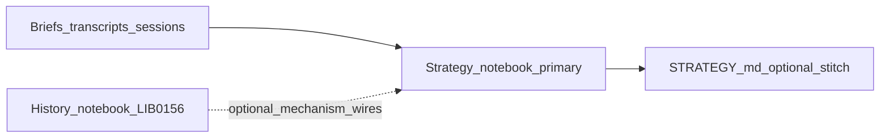
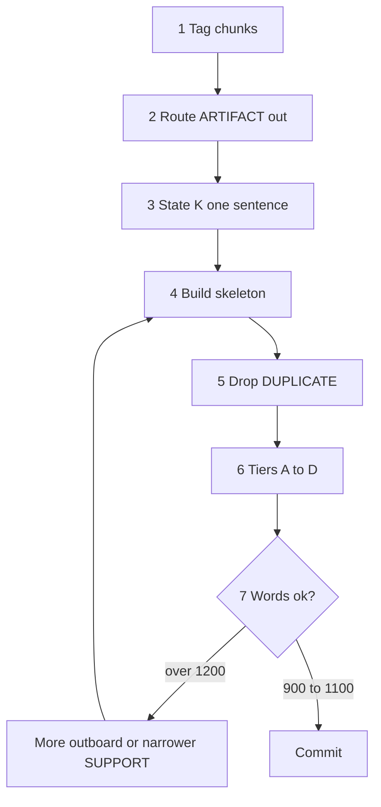

# Strategy notebook — architecture

**Project:** Operator strategy notebook (grace-mar work-strategy)

## Thesis

A **cumulative, dated record** of how the operator reads signals, weighs analogies, and steers frameworks (Islamabad, Rome, briefs, STRATEGY) — distinct from [work-strategy-history.md](../work-strategy-history.md) (lane events) and from [STRATEGY.md](../STRATEGY.md) (milestone ledger).

### Primary output (work-strategy)

The **strategy-notebook** (`chapters/YYYY-MM/days.md` + `meta.md`) is the **primary work output** of the work-strategy lane: **one dated page per calendar day** (one `## YYYY-MM-DD` block) consolidating that day’s best analysis, plus links. **Inputs** that feed it — daily briefs, transcript digests, sessions, weak-signal notes, framework drafts — are **not** substitutes for the notebook; they inform the daily page.

**Operator preferences** (minimum sections, variable length vs default word band, fold rhythm, lens offers, weekly promotion, Thesis A/B splits): [NOTEBOOK-PREFERENCES.md](NOTEBOOK-PREFERENCES.md) — **narrows** practice; architecture below remains the repo spec when no override applies.

**Shared date key (work-xavier):** The [Xavier journal](../../../work-xavier/xavier-journal/README.md) uses the same **`YYYY-MM-DD`** identifier for daily files (`YYYY-MM-DD.md`). Strategy pages stay in month `days.md` (or `pages/YYYY-MM-DD.md`); Xavier stays in `xavier-journal/` — same calendar key, different folder and purpose.

### Daily strategy inbox (accumulator)

**File:** [`daily-strategy-inbox.md`](daily-strategy-inbox.md) — **append-only** during the local day for rough captures (bullets, links, paste). **`strategy`** sessions **add** here first if you want separation between scratch and finished page; you may still draft directly in `days.md` when you prefer. The **canonical, grep-friendly line format** for strategy ingests (“paste-ready one-liner”) is specified **only** in that file’s § *Paste-ready one-liner (canonical unit)* — not duplicated here. **Optional two-tier gist** (`cold: … // hook: …`) separates **source paraphrase** from **notebook placement** — same subsection. **Multi-item** capture with optional **common analysis** (one line per excerpt, plus an optional `batch-analysis` note) lives in that file’s § *Multi-item ingest (optional common analysis)*.

**Batch-analysis (joint pattern line):** Optional single metadata line `batch-analysis | YYYY-MM-DD | <short label> | <body>` stating how **multiple** ingests relate for fold (tension, comparison, or *optional weak* convergence—never a substitute for each line’s own `verify:`). The line must **stand alone** when read in isolation: there is **no** `paired-with` field. **Placement** is the membership anchor—the `batch-analysis` line **immediately follows** the **last** ingest in the set whenever the ingests are contiguous in the accumulator; if one ingest must stay **earlier** in the scratch (e.g. a Macgregor line referenced again with later ingests), add a **short inline parenthetical** in the batch body naming that exception so membership stays unambiguous without a second column. **Assistants:** default to **proposing** a draft `batch-analysis` line **in chat** for operator copy or rejection; **append** to the inbox file only when the operator asks (**EXECUTE** or explicit paste). **Success criterion:** less duplicated prose in `days.md` **Judgment** after fold, not fewer ingest lines.

**Leo XIV / Holy See as a primary thread (weaving):** The notebook may track **Pope Leo XIV** and the **Holy See** as a **recurring** moral–diplomatic plane alongside Islamabad, Hormuz, and other work-strategy threads. **Weaving** means repeat **links** and **Judgment** pointers—not pasting long encyclicals into `days.md`. **Process hub:** [work-strategy-rome](../work-strategy-rome/README.md) and [ROME-PASS](../work-strategy-rome/ROME-PASS.md) (source order: vatican.va primary, `@Pontifex` as syndication). **Month-level** hypotheses and falsifiers live in `chapters/YYYY-MM/meta.md` (Leo XIV / Rome helix subsection when the month’s theme calls for it). **Operator preferences:** [NOTEBOOK-PREFERENCES.md](NOTEBOOK-PREFERENCES.md) (Leo XIV / Rome row).

**JD Vance / VP channel as a primary thread (weaving):** The notebook may track the **Vice President** as a **recurring** U.S. executive channel—especially when **Islamabad**, **pause / Hormuz / Lebanon** scope, **war powers**, or **coalition** framing is live. **Weaving** means dated **White House** / wire **Links** and explicit **Judgment** on **role** (delegation lead vs rhetorical)—not treating every quote as operational truth. **Process hub:** [daily-brief-jd-vance-watch.md](../daily-brief-jd-vance-watch.md) (coffee **C** fills **§1e** in daily briefs). **Month-level** hypotheses and falsifiers live in `chapters/YYYY-MM/meta.md` (JD Vance thread subsection when the month’s theme calls for it). **Operator preferences:** [NOTEBOOK-PREFERENCES.md](NOTEBOOK-PREFERENCES.md) (JD Vance row).

**Vladimir Putin / Kremlin as a primary thread (weaving):** The notebook may track the **Russian President** and **Kremlin** messaging as a **recurring** channel—especially when **Ukraine**, **Iran** (Russia as actor), **NATO**, or **ceasefire** diplomacy is live. **Weaving** means **Kremlin** / **wire** **Links** and explicit **Judgment** on **signaling** (negotiation vs domestic audience)—not equating every headline with **field** facts. **Process hub:** [daily-brief-putin-watch.md](../daily-brief-putin-watch.md) (coffee **C** fills **§1d** in daily briefs). **Month-level** hypotheses and falsifiers live in `chapters/YYYY-MM/meta.md` (Putin thread subsection when the month’s theme calls for it). **Operator preferences:** [NOTEBOOK-PREFERENCES.md](NOTEBOOK-PREFERENCES.md) (Putin / Kremlin row).

**PRC / Beijing as a primary thread (weaving):** The notebook may track the **People’s Republic of China** (**MFA** and **party–state** readouts) as a **recurring** channel—especially when **U.S.–China**, **cross-strait**, **Indo-Pacific**, **trade / sanctions**, or **multilateral** stories name **Beijing** as a party. **Weaving** means **MFA** / **state wire** **Links** and explicit **Judgment** on **signaling**—not equating **Western** “China” **narratives** with **official** **PRC** text without **bilingual** check where load-bearing. **Process hub:** [daily-brief-prc-watch.md](../daily-brief-prc-watch.md) (coffee **C** fills **§1g** in daily briefs, after **§1f** weak signal in generated files). **Month-level** hypotheses and falsifiers live in `chapters/YYYY-MM/meta.md` (PRC thread subsection when the month’s theme calls for it). **Operator preferences:** [NOTEBOOK-PREFERENCES.md](NOTEBOOK-PREFERENCES.md) (PRC / Beijing row).

**Islamic Republic of Iran as a primary thread (weaving):** The notebook may track **Tehran’s** **MFA**, **presidency**, and **state wire** messaging as a **recurring** channel—especially when **Islamabad**, **pause**, **Hormuz**, **Lebanon**, or **nuclear** diplomacy is live. **Weaving** means **dated** **IRNA** / **MFA** **Links** and explicit **Judgment** on **signaling**—not collapsing **Western** “Iran” **analysis** into **operational** facts without **Persian** or **official English** **check** where load-bearing. **This thread complements, not replaces,** the **Islamabad** **bargaining** **framework** ([islamabad-operator-index.md](../islamabad-operator-index.md), gap matrices). **Process hub:** [daily-brief-iran-watch.md](../daily-brief-iran-watch.md) (coffee **C** fills **§1h** in daily briefs, after **§1g** in generated files). **Month-level** hypotheses and falsifiers live in `chapters/YYYY-MM/meta.md` (IRI thread subsection when the month’s theme calls for it). **Operator preferences:** [NOTEBOOK-PREFERENCES.md](NOTEBOOK-PREFERENCES.md) (IRI row).

**At `dream` (or explicit operator direction):** Fold inbox content into the official **`## YYYY-MM-DD`** block in `chapters/YYYY-MM/days.md` (synthesize, don’t duplicate raw paste). **Assistants** treat inbox as the capture target for **`strategy` ingests**; they do **not** merge into `days.md` unless **`dream`** runs or the operator **manually** directs a fold. The rolling inbox is **not** automatically cleared each dream — keep scratch across nights if useful, **clear** manually when you want a clean buffer, and **prune** when the scratch section (below the append line) exceeds **~20000 characters** by dropping **oldest** lines first in **~5000-character blocks** until **≤ ~20000 characters** remain. If **`dream`** was skipped and a new day begins, **fold or archive** the stale inbox before appending (merge into the correct dated page, or move stale lines under a one-line “backlog” note you resolve the same session).

**Contrast:** `days.md` is the **durable dated journal**; the inbox is a **volatile buffer** — like a lab notebook’s tear-off sheet compiled into the bound volume at night.

[STRATEGY.md](../STRATEGY.md) is a **durable ledger** (watches, analogy list, operator log). **Promotion** into STRATEGY when an arc stabilizes is optional; it does **not** replace writing the notebook block.



Dashed edge: operator-authored [history-notebook](../history-notebook/README.md) chapters supply **durable pattern IDs** and arcs; the daily page cites them in **`### History resonance`** — not a second corpus dump.

## Book promise

- **Daily page:** Add **exactly one** top-level dated entry per calendar day — a **page** = one `## YYYY-MM-DD` section in `chapters/YYYY-MM/days.md` (newest at bottom), **or** optionally one file `chapters/YYYY-MM/pages/YYYY-MM-DD.md` if you split dailies into a `pages/` folder. Do **not** stack multiple dates in one day’s “page”; merge or choose the stronger analysis.
- **Monthly:** Maintain `chapters/YYYY-MM/meta.md` — theme, open questions, optional **bets/watches** lines that may link to STRATEGY §II-A.
- **Optional later:** A small claims list or JSONL if you want machine query; start in markdown only.

## Audience

- **Primary:** the operator (continuity, compression, honest doubt).
- **Secondary:** future you or collaborator stitching months into STRATEGY §IV or public copy.

## Parallel to Predictive History (work-jiang)

| PH | This notebook |
|----|----------------|
| `BOOK-ARCHITECTURE.md` | This file |
| `operator-polyphony.md` | `chapters/YYYY-MM/meta.md` § **Polyphony / lens tension** — same markdown contract (scope label + Mercouris / Mearsheimer / Barnes + tension); **WORK-only**; update **both** when the month’s arc or PH book focus shifts (same session). |
| `STATUS.md` | [STATUS.md](STATUS.md) |
| Chapter = lecture unit | **Chapter = calendar month** (`chapters/YYYY-MM/`) |
| `outline.md` / `draft.md` | `meta.md` (month) + **daily pages** (`days.md` sections or `pages/YYYY-MM-DD.md`) |
| Prediction registry | Optional **Bets / watches** in `meta.md` or month-end box in `days.md` |
| Corpus + adjudication | Links to briefs, `STRATEGY.md`, Islamabad paths — **WORK only** |

**Maintenance:** When you move the active month in this notebook or change Predictive History queue / volume emphasis, update **`chapters/YYYY-MM/meta.md` § Polyphony** and **`research/external/work-jiang/operator-polyphony.md`** in the **same session** so LIB-0153 and LIB-0149 stay parallel. Do **not** put the polyphony overlay only in `work-jiang/STATUS.md` — that file is **generated** by `scripts/work_jiang/render_status_dashboard.py`.

## Parallel to History notebook (LIB-0156)

| History notebook | Strategy notebook |
|------------------|-------------------|
| [book-architecture.yaml](../history-notebook/book-architecture.yaml) chapter ids (`hn-i-v1-04`, …) | **`### History resonance`** — cite id + one mechanism line; link chapter path |
| [cross-book-map.yaml](../history-notebook/cross-book-map.yaml) PH ↔ HN wiring | Optional **Links** to validate coverage; not a substitute for **Judgment** |
| Civilization **arcs** (Persian, Roman, …) | **`meta.md`** may name arcs active this month; daily page picks up **which chapter** grounds today’s warrant |
| [STYLE-GUIDE.md](../history-notebook/STYLE-GUIDE.md) compressed chapters | **Do not paste** full chapters into `days.md` — **pointer + warrant** only (~1000w budget) |
| [POLYPHONY-WORKFLOW.md](../history-notebook/POLYPHONY-WORKFLOW.md) | Same **polyphony** habit as PH row: operator drafts HN; strategy cites **finished or in-flight** chapter ids when judgment depends on them |

**Differentiator:** Most “strategic intelligence” stacks aggregate **news**; this pair aggregates **dated judgment** (here) + **operator-owned mechanism library** (HN). Keep HN **independent** of CIV-MEM per [history-notebook README](../history-notebook/README.md).

## Daily entry template

Paste under `## YYYY-MM-DD` in `days.md` (newest at bottom), **or** create `chapters/YYYY-MM/pages/YYYY-MM-DD.md` with the same headings if using one file per day. One date = one page.

```markdown
## YYYY-MM-DD

### Signal
- What moved (brief, news, gate, session) — short.

### Judgment
- What you think it implies for strategy (not KY-4 tactics unless you choose).

### Analogy / tension
- Optional. Flag if needs [analogy-audit](../analogy-audit-template.md) before reuse in public copy.

### Links
- e.g. `daily-brief-YYYY-MM-DD.md`, [STRATEGY.md](../STRATEGY.md) §…, framework path.

### Jiang resonance (optional)
- One line: lecture id or “none.”

### History resonance (optional)
- One to three tight lines: **chapter id(s)** from [history-notebook](../history-notebook/README.md) (e.g. `hn-i-v1-04`) + **mechanism or arc** (Persian, Roman, …) when today’s judgment leans on that pattern language. Link the chapter file or `book-architecture.yaml` id. If the parallel is load-bearing for public or Islamabad copy, flag [analogy-audit](../analogy-audit-template.md). Use **none** or **deferred** if no HN wire this pass — same honesty rule as Jiang.

### Open
- One line carrying to tomorrow.

### Bets / watches (optional)
- 1–3 bullets testable against STRATEGY §II-A or future review.
```

## Daily length and prose (operator target)

- **Daily page target:** **~1000 words** per dated page (all sections of that day combined: Signal through Bets) — **consolidated best analysis**, not a full dump of every source. Prefer judgment, warrants, and what changed; park raw quotes and long extracts in linked briefs or digests.
- **Compress if over ~1200 words** before committing; **hard ceiling ~1500 words** for routine practice (if you hit it, you are still carrying too much raw material in-page).
- **Register:** **Academic prose** — explicit theses, defined terms where needed, qualified claims when evidence is partial; avoid filler and conversational throat-clearing unless you are deliberately archiving tone in a linked artifact.

## Condense-to-target mechanism (fit ~1000 words)

**Goal:** A daily page of **~1000 words** (band **~900–1100**) that keeps **strategic** content and drops **bulk** — by **routing** long work elsewhere, then **tiers A–D** on what stays.

**Two paths (pick one per session):**

| Path | When to use | What you run |
|------|-------------|----------------|
| **Fast** | Draft is already a single spine (Signal → Judgment → Links); no DEMO blocks, no full lens essays in-page. | **Tiers A → D** only — table below. |
| **Full** | Draft mixes **core day** with **DEMO phases**, **Recipe A/B lens walls**, **web snapshot tables**, or **multiple competing theses**. | **Summarize-and-condense** (steps 1–7) **first**, then **tiers A → D** on the skeleton. |

**Failure modes:** **Full** on a clean draft wastes time; **Fast** on a bloated draft leaves **ARTIFACT** bulk in the page.

---

### Tiers A → D (mechanical pass; always in this order)

**Do not** reorder: **A**/**B** are cheap; **D** rewrites Judgment and should run on lean text.

| Tier | Move | What to do | Typical savings |
|------|------|------------|-----------------|
| **A — Outboard** | Verbatim bulk | Remove **block quotes**, long excerpts, pasted transcript lines; replace with **one** **Links** line (`…/digest-…md`, § anchor if useful). | High |
| **A — Outboard** | Duplicate narrative | If **Signal** repeats **Judgment**, **cut overlap from Signal** (keep the sharper formulation — usually Judgment). | Medium |
| **A — Outboard** | In-page lens / DEMO | Long Recipe-style blocks (Barnes/Mearsheimer essays), **DEMO Phase 1–5** bodies → `demo-runs/…`, digest, or formal doc; daily page = **Links** only. | High |
| **B — Merge** | Same point twice | Collapse bullets/paragraphs that answer the **same** question; **one** clearest line. | Medium |
| **B — Merge** | Multi-source agreement | Three wires, one fact → **one** warrant + **Links**. | Medium |
| **C — Cut** | Throat-clearing | Drop “It’s worth noting…”, “To be clear…” unless they add a **new** qualification. | Low–medium |
| **C — Cut** | Hedging stacks | One honest uncertainty line + optional **Links** to verify — not four hedges. | Low |
| **D — Tighten in place** | Judgment bloat | Rewrite as **claim → because → so what**; drop examples that only repeat the claim. | Variable |

**If you must cut past tier D:** Protect **Judgment** and **Open** first; shrink **Signal** to the minimum that **forces** Judgment; keep **Links** paths complete. Trim **Analogy / tension**, **History resonance** (keep ids, drop prose), **Jiang resonance**, and **Bets** before deleting core Judgment.

**Word count:** Run `wc -w` on **today’s block only** (copy the `## YYYY-MM-DD` section to a scratch buffer), not on the whole month `days.md`.

**One-sentence check:** After condensing, the day’s **operative thesis** fits **one sentence** (strategic read, not headline noise). If not, compress **Signal**, not Judgment’s core claim.

**Agent (`strategy` pass):** Over **~1200 words**, run **A → D** — or **Full** algorithm if DEMO/lens bulk is present. **No new analysis** while condensing — only move, merge, cut, tighten.

---

### Summarize-and-condense algorithm (coherent daily page)

**After** exploratory drafting or when the day **merges** notebook + lens + DEMO + web. **Output:** one `## YYYY-MM-DD` section, [daily template](#daily-entry-template) headings, long work **linked**.



| Step | Name | Action |
|------|------|--------|
| **1** | **Tag** | Per paragraph/bullet: **THESIS**, **SUPPORT** (wire fact or minimum analyst claim the day needs), **ARTIFACT** (DEMO, full Recipe lens blocks, quote walls, flashpoint **tables** longer than ~10 lines), **DUPLICATE**, **SCAFFOLD**. **ORPHAN** (interesting but serves no thesis yet) → **Open** or outboard. |
| **2** | **Route ARTIFACT** | Persist bodies under stable paths (`demo-runs/`, digests, `us-iran-*-formal.md`). Daily page: **Links** lines only — **no** second full summary of the same artifact in-page. |
| **3** | **State K** | **K** = one sentence. **K tests:** (a) Not headline-only — includes **so what** for strategy or copy. (b) Two claims conflict → **one K**; other → **Open** / **Analogy / tension**. (c) **No threshold today** is valid — **K** says so plainly. |
| **4** | **Skeleton** | **Signal:** SUPPORT bullets that **force K** only. **Judgment:** **K** + shortest **because** + **so what** (framework / outreach / risk). **Links:** union + outboard. **Open / Bets:** live threads only. |
| **5** | **Drop DUPLICATE** | Merge DUPLICATE (often Signal re-stating Judgment). |
| **6** | **Tiers A → D** | Run the **Tiers A → D** table on the skeleton. |
| **7** | **Stop rule** | Target **~1000**; if **> ~1200**, loop to **2** or **4** — **not** new research. If **< ~700** on a heavy day, check you did not outboard **K** itself. |

**Bind test:** For each **Signal** bullet and **Judgment** sentence, ask: *How does this support or qualify **K**?* If it cannot, **Links** or **Open**.

**Invariants:** **Verify** → **Open** (`verify: …`). Incompatible claims → **Analogy / tension**, not merge. **Tri-frame one-liners** in chat stay optional; **in-page lens essays** are **ARTIFACT** unless **K** explicitly states that the day’s deliverable *is* the lens pass.

---

### Condense checklist (operator / agent)

- [ ] **Fast** vs **Full** chosen correctly?
- [ ] **ARTIFACT** routed; daily page has **Links**, not duplicate bodies?
- [ ] **K** passes (a)(b)(c)?
- [ ] **Tiers A → D** in order?
- [ ] Words in **900–1100** (or **Open** explains a heavy verify day)?
- [ ] **Open** holds verifies; nothing load-bearing deleted to save words?

## Daily synthesis (briefs, transcripts, other work-strategy)

**Ergonomic entry:** For a **systematic synthesis workflow** (levels, session types, where each kind of content goes, minds defaults), start with [SYNTHESIS-OPERATING-MODEL.md](SYNTHESIS-OPERATING-MODEL.md). The following subsection is the **division-of-labor** reference; the operating model is the **pick-your-path** layer on top.

Synthesis **compresses and routes** sources into the notebook; it does **not** duplicate the full daily brief or full transcript.

**Division of labor** (same section headings as above):

| Section | Role |
|---------|------|
| **Signal** | Cross-source bullets (brief + transcript + session): agreement, tension, or explicitly **nothing crossed the strategy threshold today**. |
| **Judgment** | Cross-cutting inference only — **not** a second brief recap. |
| **Links** | Paths to that day’s brief file (if any), transcript digest, framework docs, [STRATEGY.md](../STRATEGY.md) section when relevant. |
| **History resonance (optional)** | Chapter id(s) from [history-notebook](../history-notebook/README.md) when judgment uses durable mechanism language — not a second book dump. |
| **Open / Bets** | Falsifiable lines and promotion candidates; optional. |

**Optional tag pass (mental shorthand, not schema):** `watch`, `analogy`, `framework`, `defer` — operator labels only; not machine-enforced.

**Light patterns:** convergence vs divergence across sources; assumptions / ledger; spoiler map; trigger [analogy-audit](../analogy-audit-template.md) if the **same** parallel appears in multiple sources; an **empty** Signal (“no strategic threshold today”) is valid.

**Anti-patterns:** triple narrative (brief + transcript + notebook each a full summary); treating STRATEGY.md as a **diary** (update it only on promotion, not every notebook refinement); citing hot numbers from transcripts in Judgment without a **verify** tier when those numbers may ship publicly.

**STRATEGY cadence:** Notebook entries can be daily; **STRATEGY.md** updates when stable (weekly or arc-close), aligned with [STATUS.md](STATUS.md) “stitch to STRATEGY §IV” when you choose.

## skill-strategy modes and verification passes

[`.cursor/skills/skill-strategy/SKILL.md`](../../../../.cursor/skills/skill-strategy/SKILL.md) defines how agents run a **strategy pass**. **Notebook remains primary**; three ideas belong in this architecture:

**Modes**

- **Default** — append or extend the dated block (`Signal` … `Bets`) from the last committed frontier.
- **+ verify** — when the operator asks for **web**, **wires**, or **fact-check** tier: add a subsection such as **`### Web verification (YYYY-MM-DD)`** with **claim → source URL → correction if needed**; put secondary URLs in **`### Links`**. Hot numbers (casualties, ship counts, **oil**) need a **date** or they should not ship to public copy.
- **Promote** — only when the operator asks: **STRATEGY.md** watches / §IV log; not every volatile news day.

**Flashpoint / gap-rank pattern** (Iran–U.S. and similar)

- Short chain: **claim → wire check → operative move** (what to draft, what to defer).
- When using a **ranked gap matrix** (e.g. [us-iran-bargaining-gaps-matrix.md](../us-iran-bargaining-gaps-matrix.md)), **link** it in **Links** so notebook judgment stays tied to the operator file.

**Jiang / PH** — optional **`### Jiang resonance`**: if no lecture applies, one honest **deferred** line beats empty filler. Headlines are not ingested PH thesis.

**History notebook (LIB-0156)** — optional **`### History resonance`**: cite **chapter id(s)** and mechanism when judgment leans on [history-notebook](../history-notebook/README.md) patterns; **never** paste full HN chapters in-page. If no chapter applies, **none** or **deferred** beats filler. Validates against **cross-book-map** / arcs when the operator cares about coverage — **WORK only**, not Record.

#### Cross-artifact alignment (planes and layers)

- [Transcript digest planes](../transcript-analysis-haiphong-ritter-johnson-iran-2026-04.md) (**A** negotiation scope · **B** material / Hormuz · **C** narrative) and [work-strategy-rome notes](../work-strategy-rome/notes/2026-04-03-modern-rome-papacy-thesis-stub.md) (**two layers — do not collapse**) share one habit: **document coupling** between registers, do not **merge planes in one sentence** without tagging (same discipline as **dual-register** Lebanon lines in `days.md`).
- [Template three lenses](../../work-politics/analytical-lenses/template-three-lenses.md) maps **S/O/I** lenses to **A/B/C** and adds **Verify tier** + **(W)/(A)/(R)** margin legend — reuse when stitching notebook judgment to campaign or triangulation stubs.

## Accumulation and evolution

**Persistent frontier:** The notebook is **checkpointed state**: `days.md` (and `meta.md` when the month’s story shifts) holds the **running edge** of judgment. Each **`strategy`** pass—see [`.cursor/skills/skill-strategy/SKILL.md`](../../../../.cursor/skills/skill-strategy/SKILL.md)—**reads** that edge and **writes** the next block so the following pass starts from **git**, not chat memory. Informal CS analogy: **memoized** strategy state—the frontier updates **deterministically** from the last committed block.

**Daily chain**

- **`### Open`** is the explicit wire to the **next** day: unresolved questions, deferred analogy audits, “check wire on X.” The next day’s **`### Signal`** should **pick up** at least one Open line while it is still live, or **close** it (“Open from YYYY-MM-DD: resolved because …”).
- **`### Links`** is the **back-pointer**: briefs, transcripts, frameworks, and optional anchors to earlier `days.md` blocks (“continues 2026-04-08 Judgment”) so threads stay traceable without rewriting history.

**Dream (`dream`) — end-of-day production closeout:** The night-close ritual **initiates** accountable **production closeout** for that calendar day’s page (ensure `## YYYY-MM-DD` exists, condense or defer per [Condense-to-target](#condense-to-target-mechanism-fit-1000-words), align [STATUS.md](STATUS.md)). Daytime **`strategy`** still supplies judgment; **`dream`** closes the loop — see [.cursor/skills/dream/SKILL.md](../../../../.cursor/skills/dream/SKILL.md) § *Strategy notebook*.

**Month-level state**

- **`meta.md`** holds slow-moving logic: **Theme**, **Open questions** spanning weeks, **Bets / watches** for month-end review, optional **Polyphony / lens tension** (see below). Touch `meta.md` when the **month’s story** shifts, not necessarily every day.

**Polyphony / lens tension (optional `meta.md` section)**

Wire **cognitive polyphony** at month scale without flattening voices:

#### Ensemble metaphor (chamber group gloss)

Pedagogical shorthand only — **fingerprint rules** and section contracts above are authoritative.

- **Score** — The month’s arc (and on daily pages, **K** / L0 intent) that every **part** interprets; not three pasted summaries of the same wire file.
- **Parts** — Three lines (Mercouris / Mearsheimer / Barnes in the **spirit** of `strategy-notebook/minds/CIV-MIND-*.md`).
- **Conductor** — Operator: 0–3 lenses, [SYNTHESIS-OPERATING-MODEL.md](SYNTHESIS-OPERATING-MODEL.md) session types A–D, when to **promote** vs leave **dissonance** open.
- **Dissonance** — The **tension line** (below): Mercouris vs Mearsheimer disagreement **by design**; unresolved until a `strategy` pass **promotes** a settled watch to STRATEGY.md.
- **Rehearsal vs performance** — Notebook + `meta` § Polyphony are accountable **rehearsal**; public or ship-risk claims follow **Web verification** and **analogy-audit** where this architecture flags them.

- **`## Polyphony / lens tension (month)`** — three short sublines (or bullets), each in the **spirit** of that mind’s fingerprint (see `strategy-notebook/minds/CIV-MIND-*.md`), not generic labels:
  - **Mercouris:** legitimacy, institutional continuity, narrative/diplomatic frame — *what structure makes this event intelligible?*
  - **Mearsheimer:** power distribution, incentives, security competition — *what structural forces make outcomes likely?*
  - **Barnes (optional):** liability, mechanism, who pays / who’s exposed — *what’s binding in budgets, law, and domestic price?*
- **Tension line (one sentence):** Where the Mercouris and Mearsheimer readings **disagree by design** this month — leave unresolved unless a `strategy` pass **promotes** a settled watch to STRATEGY.md.
- **Update cadence:** When the month’s arc shifts (ceasefire scope, Hormuz metrics, Islamabad round) or after a **tri-frame** / heavy lens week — not necessarily every day.
- **Parallel PH overlay:** Keep in sync with [`research/external/work-jiang/operator-polyphony.md`](../../../../research/external/work-jiang/operator-polyphony.md) (same section structure); see **Parallel to Predictive History** table above.
- **[STATUS.md](STATUS.md):** operator-maintained pointer to the **last daily entry** for quick re-entry.

**Month boundaries**

- Optional: one short paragraph when the month turns (new `meta.md` or first day in `days.md`): what carried forward, what closed, what (if anything) promoted to STRATEGY.md.

**Durable vs narrative**

- **Notebook** = chronological narrative and judgment (tension across days may remain visible).
- **STRATEGY.md** = stabilized watches and log lines when you **promote** — not every refinement from every day.

**Named threads (optional convention)**

- Reuse a **short bold label** for a recurring arc (**Islamabad scope**) so search across `days.md` reconstructs the arc.

**Anti-wiring:** If it matters tomorrow, put a line in **Open** or **meta** Open questions — do not rely on chat memory alone.

## Related

- **Strategy session helpers** — compact index in [work-strategy README](../README.md#strategy-session-helpers-skill-strategy): Grok daily-brief layer, Trump–religion–papacy arc, Rome–Persia legitimacy signal check, narrative-escalation stub, [skill-strategy SKILL](../../../../.cursor/skills/skill-strategy/SKILL.md).

## Boundaries

- **Not** Voice knowledge, **not** SELF — promote only via RECURSION-GATE if something should enter Record.
- CMC `MEM–*` shards live in civilization_memory; this notebook may **cite** paths, not duplicate corpus authority.
