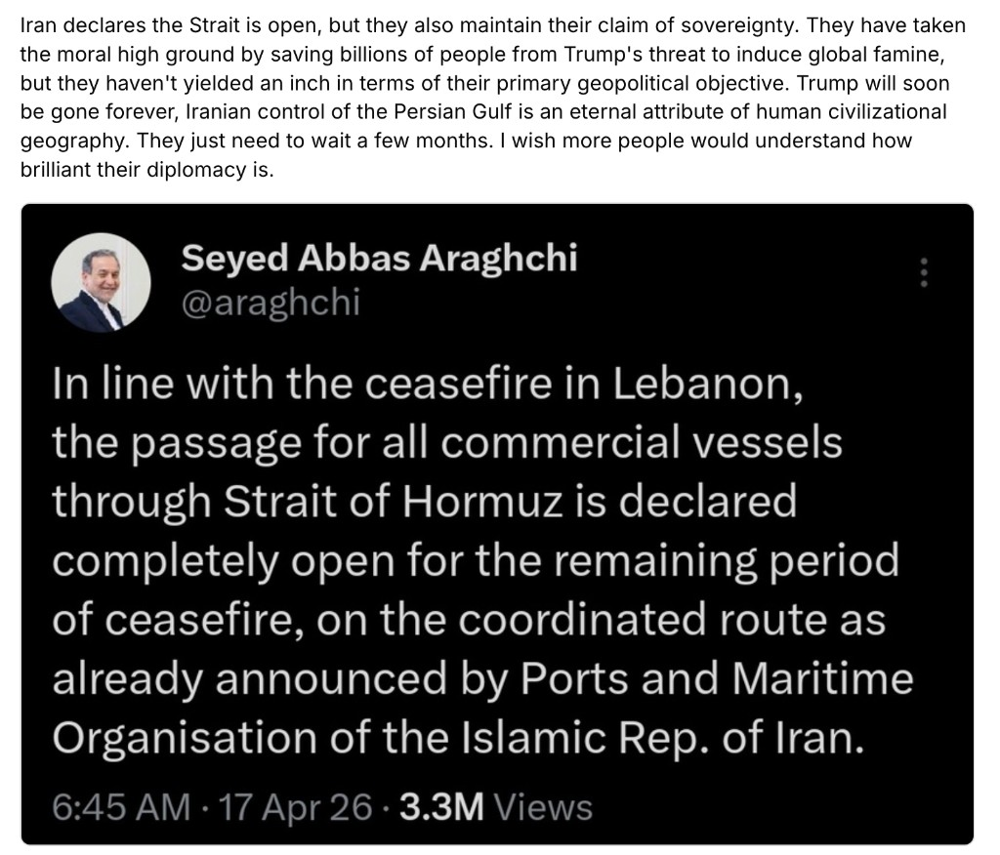
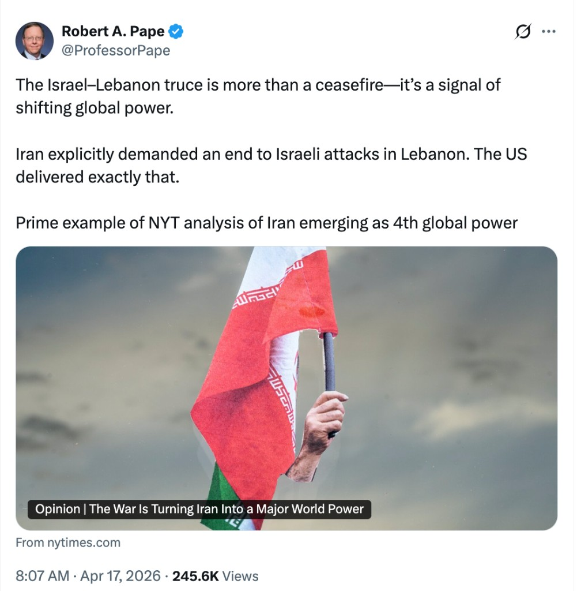
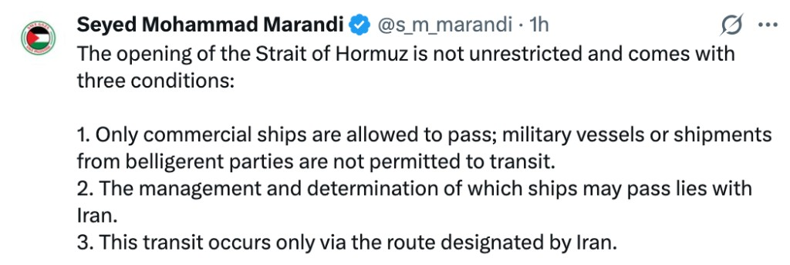
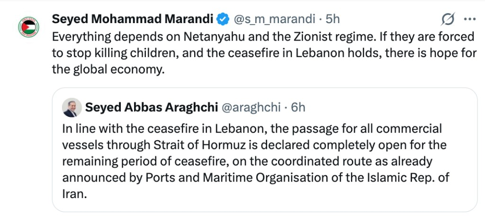

# X screenshot index — 2026-04-17

Embedded from strategy-notebook `assets/` (single SSOT; no PNG duplication).

## `x-2026-04-17-araghchi-card-with-commentary.png`

## `x-2026-04-17-truce-nyt-power.png`

## `x-2026-04-17-hormuz-three-conditions.png`

## `x-2026-04-17-marandi-qt-araghchi-hormuz-lebanon.png`

