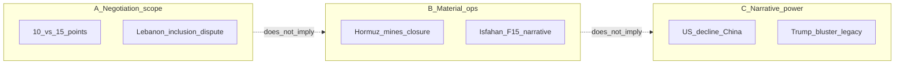

# Transcript analysis — Haiphong / Ritter / Johnson (Iran, Hormuz, ceasefire)

**WORK only** — operator analytic digest; not wire-verified fact, not Record. **Cleaned transcript** as provided; closing super-chats omitted in source.

**Skill-strategy processing:** Three **orthogonal** analytic dimensions (below) + **quantitative** tags. Cross-links: [strategy-notebook April 2026](strategy-notebook/chapters/2026-04/meta.md), [flashpoint / Hormuz metrics discipline](strategy-notebook/chapters/2026-04/days.md), [Islamabad intake commentary](../../../research/external/work-jiang/intake/Islamabad-5-point-reconciliation-plan-with-jiang-commentary.md).

---

## Orthogonality (why these three)

| Dimension | Answers | Independent of |
|-----------|---------|----------------|
| **A — Negotiation & scope** | What is said to be agreed, disputed, or mediated (text, parties, geography) | Does not require B’s order-of-battle to be true, or C’s “paper tiger” thesis |
| **B — Material military & Hormuz** | Hardware, geography, feasibility, timelines (sorties, closure, raid narrative) | Does not settle A’s diplomatic scope or C’s political interpretation |
| **C — Strategic narrative** | How speakers frame power, risk, and audience (US domestic, China, “victory”) | Logically separable from A’s “what’s on the table” and B’s technical claims |

---

## A — Negotiation and scope architecture

**Signal (what the transcript asserts about the diplomatic object)**

- **“No ceasefire” (Ritter):** precursors only; mess expected from day one (Beirut, UAE strikes on Iran).
- **Lebanon scope conflict:** Iran/Pakistani line that Lebanon included vs U.S./Israel exclusion; Ritter: U.S. had accepted Iranian points as precursor including Lebanon; Israel games separate Lebanon track. **Johnson:** Trump “reversed” after domestic/Zionist pressure; Wednesday Beirut escalation then alleged external pressure to scale back.
- **Process:** Iran 10 points vs U.S. 15 on table; two-week reconciliation; **not** all agreed upfront.
- **Talks:** Islamabad-area timing (arrive Friday, talk Saturday); **Johnson** stresses **same-room** vs shuttle as seriousness test.
- **Iran retaliation deferred:** Haiphong — deputy FM, Pakistan mediation, Trump–Netanyahu call (NBC) framing.

**Quantitative (transcript-internal)**

| Metric | Count / note |
|--------|----------------|
| Explicit **10 vs 15** point framing | **≥4** distinct mentions (Ritter, Johnson, Haiphong cluster) |
| **Lebanon** as scope keyword | **High** (throughout; exact line count omitted — dense in first third) |
| **Pakistan** mediator mentions | **≥6** |
| **China** in negotiation context | **≥3** (Johnson: pressure/energy; Haiphong: global impact) |
| **“Ceasefire” negated** (“no ceasefire” / precursors) | **≥3** (Ritter lead) |

**Judgment (skill-strategy):** Aligns with notebook **dual-register** Lebanon/Hormuz split: same words (“ceasefire”) **map to different scopes** by party — transcript **performs** that ambiguity rather than resolving it.

---

## B — Material military, Hormuz, and special-operations narrative

**Signal (operational claims — treat as analyst assertions pending verify)**

- **Hormuz:** Iran control; closure/throttle; mines → need coordination (Haiphong); **Johnson** closing: insurance + missile reach ⇒ not “open” even if troops on Oman/Qeshm.
- **US capacity limits:** Ritter — expended “good targets”; JDAM/B-52 pull-back; Iranian AD/electro-optical; mines by Iranian navy; **Tripoli** cannot do amphibious seizure; long **order-of-battle** for any Hormuz seizure (Jordan–Iraq LOCs, 60–80k Marines + Army echelons — framed as **infeasible**).
- **Johnson** — legacy force structure (tanks, carriers within missile range, Red Sea/Houthis, army headcount vs Vietnam peak).
- **F-15 / Isfahan / rescue narrative:** Extended **Johnson** then **Ritter** reconstruction — deployment uptick ~**March 10–11**, WSO colonel seniority, C-130/Little Bird load math (~**30** then **26** then **11** personnel scenarios), deception vs public Votel-type stories, alternative hypothesis: **failed raid repurposed** as rescue (Ritter); **Johnson** agrees official story unreliable.

**Quantitative (numeric strings extracted from dialogue)**

| Number / figure | Context (speaker) |
|-----------------|-------------------|
| **200+** killed Lebanon 24h | Haiphong (reporting) |
| **~300** Lebanese | Ritter |
| **160–170** schoolgirls Minab | Ritter (atrocity claim) |
| **31** autonomous military districts (Iran) | Ritter |
| **40** days since shooting started | Ritter (Trump bluster) |
| **47**-year promise (Iran economy) | Ritter |
| **452k** / **140k** Army / Marines | Johnson |
| **165k** 2003 Iraq buildup | Johnson |
| **500–600** nm F-35 radius, **700** nm offshore, **1000** nm China | Johnson |
| **100k** troop drawdown Europe | Ritter (Rubio) |
| **March 10–11** deployment window | Johnson |
| **30 / 26 / 11** personnel math Little Birds | Johnson |
| **153** JC exercises | Johnson |
| **120** miles vs coast disinfo vs map | Johnson |
| **3** Little Birds (Trump) | Ritter |
| **60–80k** Marines + **120–200k** Army (hypothetical Hormuz op) | Ritter |
| **2** million mobilization hypothetical | Ritter |
| **Seven** weeks war (Johnson closing) | Johnson |

**Count of distinct numeric tokens (approximate):** **≥35** separate numeric claims in transcript body.

**Judgment (skill-strategy):** Matches notebook **Hormuz = metrics ledger**: transcript mixes **reported** shipping counts (Haiphong: **one vessel / 24h**) with **analyst** closure thesis — **verify tier** differs by sentence.

---

## C — Strategic narrative, domestic politics, and second-order geopolitics

**Signal**

- **Trump:** narcissism/legacy/election (Ritter); bluster as substitute for dominance; **Game of Thrones** / “if you say you’re king…”; Hegseth “dominance” parallel.
- **US strategic decline:** “Paper tiger,” NATO/Europe pullback, **China/Taiwan** inference from Iran war, **South China Sea** — Ritter extended arc; **Johnson** Grenada/1983 tank anecdote, Red Sea failure, “pretend victory.”
- **Iran:** survival + **Strait leverage** as **economic chokepoint**; **Johnson** closes “**control over the global economy**” (Haiphong echoes in outro); **Hezbollah** coordination.
- **Establishment pushback** on unlawful orders (Ritter — generals, unlawful orders narrative).

**Quantitative**

| Metric | Count / note |
|--------|----------------|
| Named **China** (not just passing) | **≥8** substantive mentions |
| **Trump** by name (clustered) | **Very high** — central to C-dimension |
| Historical analogies (**Vietnam, Grenada, Desert One, Game of Thrones, Gone with the Wind** butterfly McQueen ref) | **≥10** analogy hooks |
| **Victory / defeat / dominance** lexeme cluster | **≥15** (rough) |

**Judgment:** **Orthogonal to A and B:** same facts about Hormuz (B) can be read without accepting **US terminal decline** thesis (C); **Lebanon scope** (A) can be disputed without adopting **raid-repurposing** story (B).

---

## Cross-dimension synthesis (skill-strategy)

**Risk:** **Dimensional bleed** in rhetoric (e.g. Hormuz facts + “global economy” slogan) — notebook **ledger** discipline: **separate verified shipping metrics** from **interpretive** claims.

---

## Suggested follow-ups (WORK)

1. **Verify tier:** NBC Trump–Netanyahu; single-vessel / 24h Hormuz reporting; casualty bands for Lebanon (compare to prior [web verification](strategy-notebook/chapters/2026-04/days.md) block).
2. **Notebook:** Link from [days.md](strategy-notebook/chapters/2026-04/days.md) (2026-04-10 **Links**) is in place; optional **Jiang resonance** chord remains (Geo-Strategy Hormuz cluster in intake Point 2 commentary).
3. **Promote:** No **STRATEGY.md** update unless operator asks.

---

## Source

Operator-provided cleaned transcript: *Scott Ritter & Larry Johnson on Iran Retaliation, Strait of Hormuz, and the Israel Ceasefire Situation* (Danny Haiphong host).
